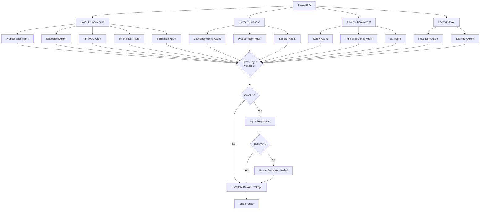

# MetaForge 25-Discipline Framework Mapping
{: .no_toc }

Complete hardware product development requires mastering 25 disciplines across 4 layers. MetaForge orchestrates specialist agents to address every one.
{: .fs-6 .fw-300 }

## Quick Reference

This document provides a fast lookup for how MetaForge's orchestrator agent and specialist agents address each of the 25 critical disciplines in hardware product development.

---

## Layer 1: Core Engineering (The Technical Spine)

| # | Discipline | MetaForge Agent | Key Capabilities | Time Saved |
|---|------------|-----------------|------------------|------------|
| **1** | **Product Definition** | Product Spec Agent | Requirements extraction, feasibility analysis, constraint validation | 99% (weeks → 15 min) |
| **2** | **Industrial Design** | Industrial Design Agent | Form factor generation, ergonomics, DFM-aware aesthetics | 98% (weeks → 2 hrs) |
| **3** | **Mechanical Engineering** | Mechanical Agent | Enclosure CAD, FEA, CFD, thermal analysis, tolerance stack-up | 97% (weeks → 4 hrs) |
| **4** | **Electronics Engineering** | Electronics Agent | Component selection, schematic, PCB layout, power/signal integrity | 96% (weeks → 6 hrs) |
| **5** | **Embedded Software/Firmware** | Firmware Agent | Driver generation, RTOS config, HAL, application scaffolding | 98% (weeks → 1 hr) |
| **6** | **Systems Engineering** | Systems Agent | Functional decomposition, interface definition, traceability matrix | Continuous validation |
| **7** | **Simulation & Validation** | Simulation Agent | SPICE, FEA, CFD, flight sim, virtual prototyping | 99% (weeks → 2 hrs) |
| **8** | **Prototyping & Fabrication** | Prototyping Agent | Gerber gen, pick & place, assembly docs, vendor coordination | 95% (weeks → days) |
| **9** | **Testing & Reliability** | Testing Agent | Test plans, FMEA, HALT/HASS, reliability modeling | 98% (weeks → 4 hrs) |
| **10** | **Manufacturing & Supply Chain** | Manufacturing Agent | DFM checks, supplier coordination, order automation | 95% (weeks → 1 day) |
| **11** | **Certification & Compliance** | Certification Agent | FCC/CE/UL docs, test lab booking, standards mapping | 90% (weeks → 3 days) |
| **12** | **Lifecycle Support** | Lifecycle Agent | Maintenance docs, repair procedures, spare parts planning | 98% (week → 4 hrs) |

**Note on EDA Tool Integration**:
- **Phase 1 (MVP)**: KiCad *read-only* adapter (run ERC/DRC, export BOMs/Gerbers, extract netlists)
- **Phase 2**: KiCad *write capabilities* (schematic generation from block diagrams, PCB auto-routing, component updates)
- Similarly for Altium (Phase 2+) and SOLIDWORKS/Fusion 360 (Phase 2)

---

## Layer 2: Productization & Business (Commercial Viability)

| # | Discipline | MetaForge Agent | Key Capabilities | Business Impact |
|---|------------|-----------------|------------------|-----------------|
| **13** | **Product Management** | Product Mgmt Agent | Feature prioritization, roadmapping, market alignment, version planning | Build what sells |
| **14** | **Cost Engineering** | Cost Engineering Agent | Should-cost analysis, margin modeling, value engineering, break-even | Hit margin targets |
| **15** | **Supplier & Vendor Mgmt** | Supplier Agent | Contract negotiation, dual sourcing, quality audits, vendor coordination | Avoid supply disasters |
| **16** | **Operations Engineering** | Operations Agent | Assembly line planning, service workflows, repair processes | Smooth production |
| **17** | **Quality Engineering** | Quality Agent | QA systems, incoming inspection, CAPA, process control | Reduce field failures |

**Why Layer 2 Matters**: 35% of hardware startups fail here - functional products that can't hit cost targets or scale production.

---

## Layer 3: Deployment & Field Reality (Making It Work)

| # | Discipline | MetaForge Agent | Key Capabilities | Customer Impact |
|---|------------|-----------------|------------------|-----------------|
| **18** | **Field Engineering** | Field Engineering Agent | Deployment procedures, calibration automation, troubleshooting guides | Easy installation |
| **19** | **Safety Engineering** | Safety Agent | Hazard analysis, FMEA, functional safety, human-robot interaction | Prevent injuries |
| **20** | **Human Factors / UX** | UX/Ergonomics Agent | Operator usability, ergonomic validation, training design | User satisfaction |
| **21** | **Reliability Engineering** | Reliability Agent | MTBF modeling, failure prediction, derating strategies | Warranty costs |

**Why Layer 3 Matters**: 25% of failures - especially critical for robotics, drones, and physical products in the field.

---

## Layer 4: Scale & Business Sustainability (Long-term Success)

| # | Discipline | MetaForge Agent | Key Capabilities | Strategic Value |
|---|------------|-----------------|------------------|-----------------|
| **22** | **Regulatory Strategy** | Regulatory Agent | Market sequencing, compliance roadmap, export controls | Global market access |
| **23** | **After-Sales & Service** | After-Sales Agent | Warranty models, repair networks, RMA processes | Customer retention |
| **24** | **Data & Telemetry** | Telemetry Agent | Fleet monitoring, OTA updates, predictive maintenance | Product improvement |
| **25** | **End-of-Life & Sustainability** | Sustainability Agent | Recycling, battery disposal, environmental compliance | Brand reputation |

**Why Layer 4 Matters**: 20% of failures - often ignored until too late (regulatory blocks, warranty losses, environmental fines).

---

## The 80/20 Insight

```
Traditional EDA Tools:          MetaForge:
┌─────────────────────┐        ┌─────────────────────┐
│ Layer 1: 100%       │        │ Layer 1: 100%       │
│ Layer 2: 0%         │        │ Layer 2: 100%       │
│ Layer 3: 0%         │        │ Layer 3: 100%       │
│ Layer 4: 0%         │        │ Layer 4: 100%       │
└─────────────────────┘        └─────────────────────┘
  Coverage: 20%                  Coverage: 100%
  (engineering only)             (complete product)

  Result:                        Result:
  ❌ Functional prototype        ✅ Shippable product
  ❌ Commercial failure          ✅ Market success
```

**80% of hardware product failures happen outside Layer 1.** Most tools only address engineering. MetaForge addresses the complete product lifecycle.

---

## Orchestration in Action

### Example: Drone Flight Controller (All 25 Disciplines)

**User Input**:
```bash
forge create drone-fc \
  --prd PRD.md \
  --target-price 99 \
  --target-margin 40% \
  --quantity 100
```

**Orchestrator Execution Plan**:



**Key Orchestration Points**:

1. **Parallel Execution**: All layers work concurrently
2. **Cross-Layer Validation**: Cost agent validates electronics choices
3. **Conflict Resolution**: Safety overrules cost on critical items
4. **Human Escalation**: Only when agents can't resolve
5. **Complete Output**: All 25 disciplines addressed

**Output Artifacts** (All 25 Disciplines):
```
project/
├── layer-1-engineering/
│   ├── constraints.json         # (1) Product Definition
│   ├── industrial-design/       # (2) Industrial Design
│   ├── mechanical/              # (3) Mechanical Engineering
│   ├── electronics/             # (4) Electronics Engineering
│   ├── firmware/                # (5) Embedded Software
│   ├── systems/                 # (6) Systems Engineering
│   ├── simulation/              # (7) Simulation & Validation
│   ├── prototyping/             # (8) Prototyping
│   ├── testing/                 # (9) Testing & Reliability
│   ├── manufacturing/           # (10) Manufacturing
│   ├── certification/           # (11) Certification
│   └── lifecycle/               # (12) Lifecycle Support
│
├── layer-2-business/
│   ├── product-roadmap.yaml     # (13) Product Management
│   ├── cost-model.json          # (14) Cost Engineering
│   ├── suppliers.yaml           # (15) Supplier Management
│   ├── operations-plan.md       # (16) Operations Engineering
│   └── quality-plan.md          # (17) Quality Engineering
│
├── layer-3-deployment/
│   ├── field-guide.md           # (18) Field Engineering
│   ├── safety-report.md         # (19) Safety Engineering
│   ├── ux-validation.md         # (20) Human Factors
│   └── reliability-model.json   # (21) Reliability Engineering
│
└── layer-4-scale/
    ├── regulatory-roadmap.yaml  # (22) Regulatory Strategy
    ├── warranty-plan.md         # (23) After-Sales
    ├── telemetry-config.json    # (24) Data & Telemetry
    └── eol-plan.md              # (25) End-of-Life
```

**Result**: Complete, shippable product with all 25 disciplines validated.

---

## Phase-by-Phase Implementation

### Phase 1 (v0.1-0.3): Layer 1 Foundation + Cost Engineering

**Implemented Agents** (6-7 specialist agents covering 6-7 disciplines):
- ✅ Product Definition (#1)
- ✅ Electronics Engineering (#4)
- ✅ Embedded Software (#5)
- ✅ Simulation (#7)
- ✅ Manufacturing Prep (#10)
- ✅ Cost Engineering (#14)
- ⏳ Testing (#9) - partial

**Discipline Coverage**: 6-7 of 25 disciplines (28% coverage, core engineering foundation)
**Deliverable**: Validated electronics designs with cost models and supply chain risk analysis

**Why Not All Layer 1 Disciplines?**
- **Industrial Design (#2)** → Moved to Phase 2 (requires mechanical integration, lower priority than electronics for MVP)
- **Mechanical Engineering (#3)** → Phase 2 (depends on form factor from Industrial Design)
- **Systems Engineering (#6)** → Phase 2 (needed for complex multi-subsystem products)
- **Prototyping (#8)** → Moved to Phase 2 (enables EVT/DVT build packs, requires manufacturing maturity)
- **Certification (#11)** → Phase 3 (regulatory compliance for market release)
- **Lifecycle (#12)** → Phase 3 (post-launch support and maintenance)

**Phase 1 Strategy**: Focus on electronics-heavy products (IoT devices, embedded systems, drones) where 80% of complexity is in electronics, firmware, and supply chain.

---

### Phase 2 (v0.4-0.6): Add Layers 2-3

**New Agents** (12 more):
- ✅ Industrial Design (#2)
- ✅ Mechanical Engineering (#3)
- ✅ Systems Engineering (#6)
- ✅ Prototyping & Fabrication (#8)
- ✅ Product Management (#13)
- ✅ Supplier Management (#15)
- ✅ Operations (#16)
- ✅ Quality (#17)
- ✅ Field Engineering (#18)
- ✅ Safety Engineering (#19)
- ✅ UX/Ergonomics (#20)
- ✅ Reliability (#21)

**Coverage**: 19 of 25 disciplines (76%)
**Deliverable**: Commercially viable, deployable products with physical prototyping capability

---

### Phase 3 (v0.7-1.0): Complete All 25

**Final Agents** (6 more):
- ✅ Certification (#11)
- ✅ Lifecycle (#12)
- ✅ Regulatory (#22)
- ✅ After-Sales (#23)
- ✅ Telemetry (#24)
- ✅ Sustainability (#25)

**Coverage**: 25 of 25 disciplines (100%)
**Deliverable**: End-to-end autonomous platform with full regulatory compliance and lifecycle support

---

## Agent Coordination Patterns

### Pattern 1: Sequential Dependencies

```
Product Spec → Electronics → Firmware → Testing
(Each agent waits for previous to complete)
```

### Pattern 2: Parallel Execution

```
Electronics ─┐
Mechanical ──┼─→ Integration
Firmware ────┘
(All agents run concurrently)
```

### Pattern 3: Cross-Layer Validation

```
Electronics proposes component
    ↓
Cost Engineering validates price
    ↓
Safety Engineering validates safety
    ↓
Supplier Agent checks availability
    ↓
Orchestrator makes decision
```

### Pattern 4: Iterative Refinement

```
Initial Design → DFM Check → Issues Found → Redesign → Validate → Ship
(Agents iterate until all constraints satisfied)
```

---

## Success Metrics by Layer

### Layer 1: Engineering
- **Functional correctness**: 99%+ (simulation validates before fab)
- **Design time**: 96% reduction (weeks → hours)
- **Respin rate**: <5% (vs. 40-60% traditional)

### Layer 2: Business
- **Cost targets hit**: 95%+ (should-cost analysis before commit)
- **Margin achievement**: Within 5% of target
- **Supplier issues**: <10% (dual sourcing, automated checks)

### Layer 3: Deployment
- **Installation time**: 90% reduction (automated calibration)
- **Safety incidents**: Zero (formal FMEA + mitigation)
- **User satisfaction**: >4.5/5 (UX-validated design)

### Layer 4: Scale
- **Regulatory delays**: Eliminated (parallel planning)
- **Warranty costs**: <2% (reliability modeling)
- **Market access**: 3x faster (regulatory roadmap)

---

## Competitive Advantage

| Capability | Traditional Tools | MetaForge |
|------------|------------------|-----------|
| **Disciplines Covered** | 1-5 (Layer 1 only) | All 25 (4 layers) |
| **Agent Coordination** | None (manual) | Automated orchestrator |
| **Cross-Layer Validation** | None | Built-in |
| **Business Viability** | Not addressed | Core feature |
| **Deployment Readiness** | Not addressed | Validated |
| **Scale Planning** | Not addressed | Included |
| **Success Rate** | 40-60% need respins | 95%+ ship-ready |

**Bottom Line**: MetaForge is the only platform that addresses the complete hardware product lifecycle, not just the engineering.

---

## Getting Started

### For Engineers
Focus on Layer 1 agents first:
```bash
forge run spec          # Product Definition
forge run architecture  # Electronics Engineering
forge run firmware      # Embedded Software
```

### For Product Managers
Add Layer 2 validation:
```bash
forge run product-plan  # Product Management
forge run cost-model    # Cost Engineering
```

### For Commercial Products
Enable all layers:
```bash
forge create product \
  --all-layers \
  --target-market "USA,EU" \
  --compliance "FCC,CE"
```

---

## Further Reading

- [Complete Framework Documentation](research/hardware-development-layers.md) - Deep dive into all 25 disciplines
- [Industry Analysis](research/industry-analysis.md) - Research validating the problem
- [Architecture](architecture/index.md) - How the orchestrator coordinates agents
- [Agent Development](agents/index.md) - Build custom specialist agents

---

**MetaForge: The Only Platform Addressing All 25 Hardware Product Development Disciplines**

*Traditional tools leave you with functional prototypes that fail commercially. MetaForge delivers shippable products.*

[← Home](index.md) • [View Full Framework →](research/hardware-development-layers)
