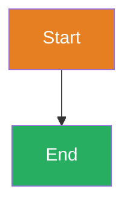

# MetaForge Documentation

Jekyll-based documentation site with Mermaid diagrams and MetaForge brand styling.

## Running Locally

### Docker (Recommended)

```bash
cd docs
docker-compose up

# Visit http://localhost:4000
```

The site will auto-reload when you edit files.

### Native Ruby

```bash
cd docs
bundle install
bundle exec jekyll serve --livereload

# Visit http://localhost:4000
```

## Structure

```
docs/
  _config.yml          # Jekyll configuration
  _layouts/
    default.html       # Main layout with Mermaid
  assets/
    css/
      style.css        # MetaForge brand theme
    images/
      logo.png         # MetaForge logo
  index.md             # Homepage
  quickstart.md        # Quick start guide
  architecture.md      # Architecture docs
  Dockerfile           # Docker image for docs
  docker-compose.yml   # Docker Compose setup
```

## MetaForge Brand Colors

```css
--forge-orange: #E67E22   /* Primary - flame */
--forge-amber: #F39C12    /* Secondary - flame gradient */
--forge-dark: #2C3E50     /* Dark gray - anvil */
--forge-light: #BDC3C7    /* Silver - highlights */
--forge-accent: #E74C3C   /* Red-orange - spark */
--forge-bg: #1A1A1A       /* Near black background */
```

## Adding Pages

1. Create `your-page.md` in `docs/`
2. Add frontmatter:

```yaml
---
layout: default
title: Your Page Title
description: Page description
---

# Your Content
```

3. Add to navigation in `_config.yml`

## Using Mermaid Diagrams

Just use fenced code blocks:

````markdown

````

Mermaid is automatically themed with MetaForge brand colors.

## Deployment Options

### GitHub Pages

```bash
# In _config.yml, set:
baseurl: "/forge"

# Deploy
git subtree push --prefix docs origin gh-pages
```

### Docker Production

```bash
# Build from project root
docker build -t metaforge-docs:latest docs/

# Run
docker run -p 4000:4000 metaforge-docs:latest
```

### Netlify/Vercel

- Build command: `jekyll build`
- Publish directory: `_site`
- Base directory: `docs`

## Development

```bash
# Install dependencies
cd docs
bundle install

# Serve with live reload
bundle exec jekyll serve --livereload

# Build for production
JEKYLL_ENV=production bundle exec jekyll build
```

## License

MIT
