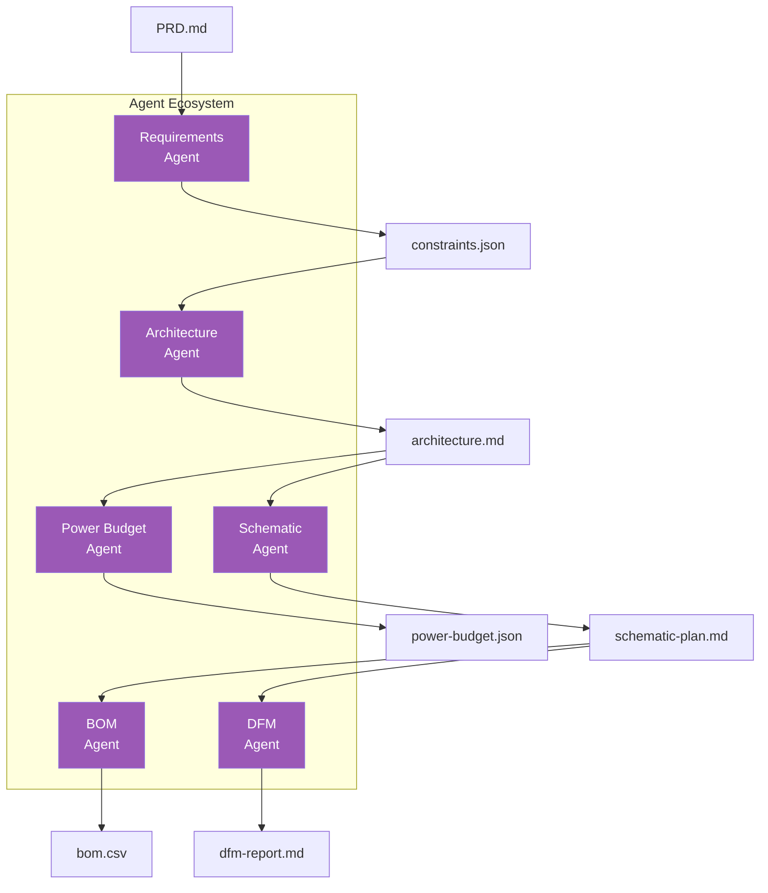
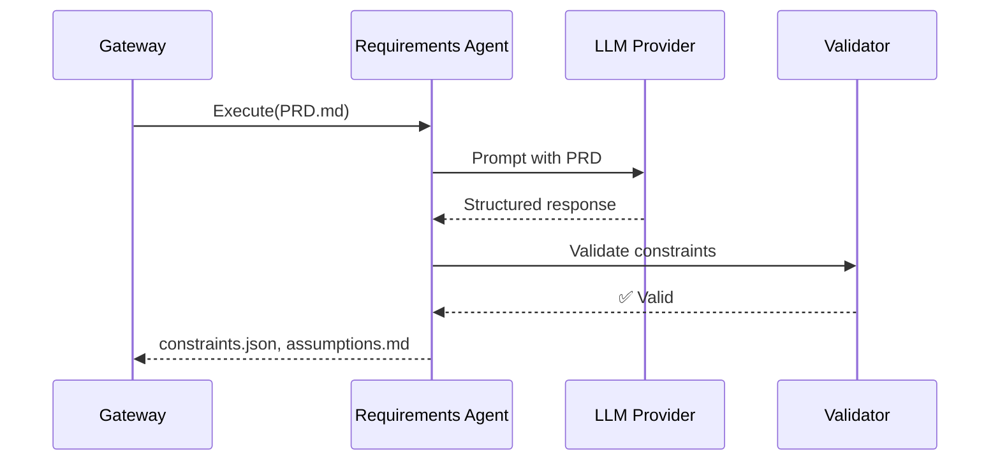
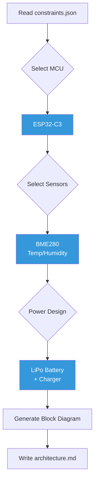
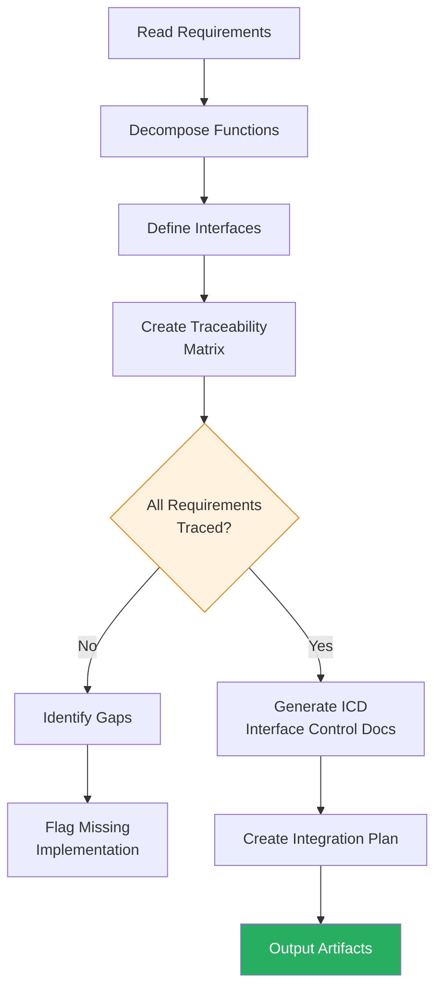
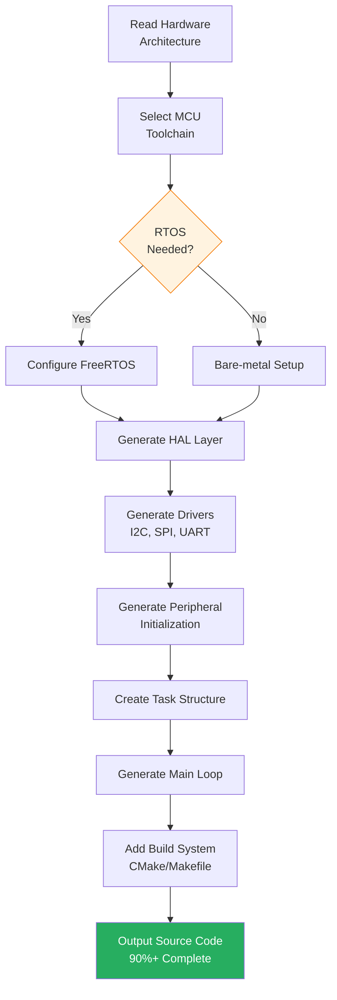
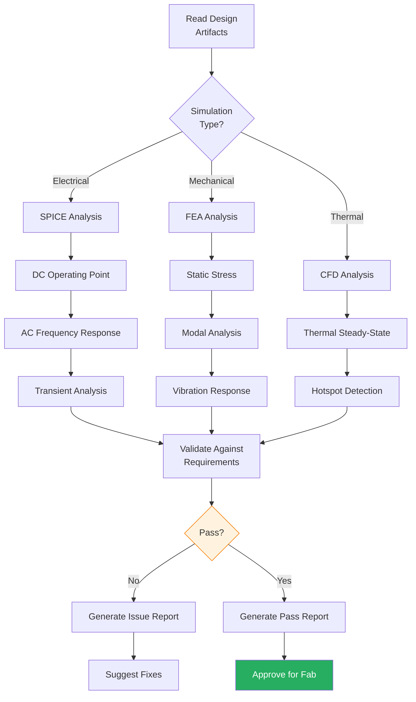
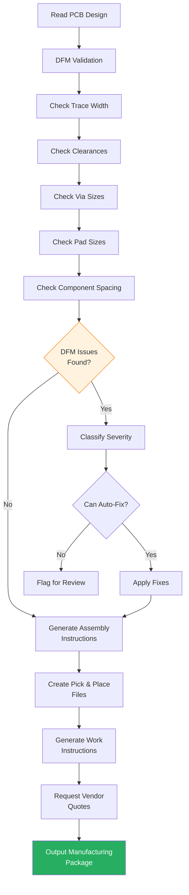
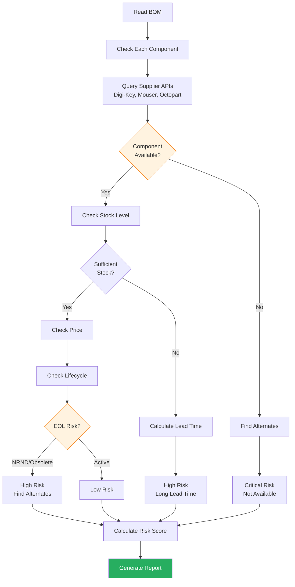
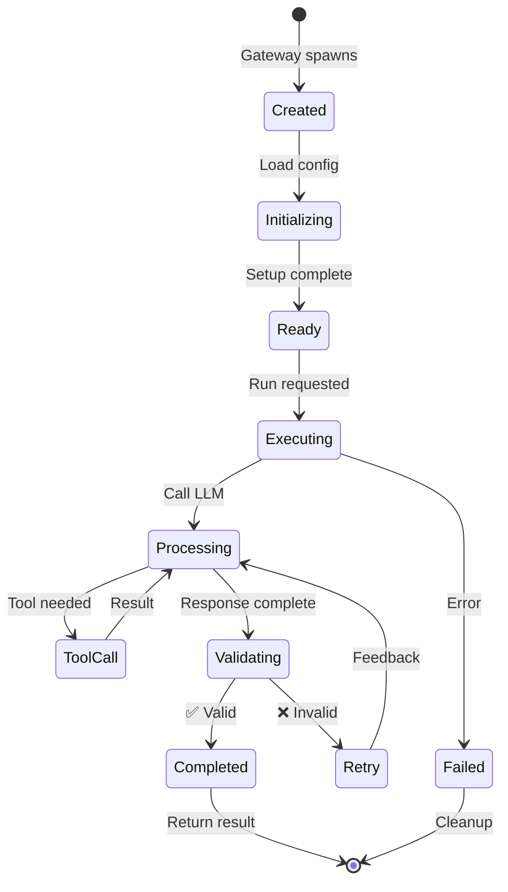

# Agent System
{: .no_toc }

Building and extending MetaForge specialist agents
{: .fs-6 .fw-300 }

## Table of contents
{: .no_toc .text-delta }

1. TOC
{:toc}

---

## Overview

MetaForge uses **specialist agents** rather than a single general-purpose AI. Each agent has:

- **Clear responsibility**: Focused on one aspect of hardware design
- **Defined inputs/outputs**: Structured data contracts
- **Tool access**: Specific tools and APIs needed for its task
- **Validation logic**: Output verification and safety checks



---

## Agent Naming Reference

**Canonical Agent Names**: MetaForge uses consistent naming across documentation. Abbreviations are used in technical architecture docs, full names in user-facing documentation.

| Code | Full Name | Alternative Names | Phase Introduced | Disciplines Covered |
|------|-----------|-------------------|------------------|---------------------|
| **PMO** | Programme Orchestration Agent | Project Manager Agent | Phase 2 | Product management, roadmapping |
| **PRD** | Product Definition Agent | Product Manager Agent | Phase 1 | Market analysis, feature prioritization |
| **REQ** | Requirements Agent | Product Spec Agent, Constraints Agent | Phase 1 | Requirements extraction, traceability |
| **SYS** | Systems Agent | Architecture Agent, Integration Agent | Phase 1 | Systems engineering, MBSE, interfaces |
| **ID** | Industrial Design Agent | HF Agent, UX Design Agent | Phase 2 | Form factor, ergonomics, aesthetics |
| **ME** | Mechanical Agent | Mechanical Engineering Agent | Phase 2 | CAD, FEA, thermal, tolerance analysis |
| **EE** | Electronics Agent | Electronics Engineering Agent | Phase 1 | Schematics, PCB, power/signal integrity |
| **FW** | Firmware Agent | Embedded Software Agent | Phase 1 | Drivers, RTOS, HAL, application code |
| **ROB** | Robotics Agent | Autonomy Agent, AI Agent | Phase 2 | Motion planning, perception, controls |
| **SIM** | Simulation Agent | Digital Twin Agent | Phase 1 | SPICE, FEA, CFD, virtual prototyping |
| **TST** | Test Engineering Agent | Validation Agent, QA Agent | Phase 1 | Test plans, automation, coverage |
| **REL** | Reliability Agent | FMEA Agent, Safety Agent | Phase 2 | FMEA, FTA, HALT/HASS, MTBF |
| **MFG** | Manufacturing Agent | NPI Agent, Production Agent | Phase 1 | DFM, DFA, work instructions, yield |
| **SC** | Supply Chain Agent | Supplier Agent, Procurement Agent | Phase 1 | Sourcing, alternates, EOL tracking |
| **QA** | Quality Agent | QMS Agent, CAPA Agent | Phase 2 | Quality systems, CAPA, audits |
| **REG** | Regulatory Agent | Compliance Agent, Certification Agent | Phase 1 | UKCA, FCC, CE, standards mapping |
| **SEC** | Cybersecurity Agent | Security Agent, InfoSec Agent | Phase 2 | Threat modeling, SBOM, vulnerabilities |
| **FIELD** | Field Engineering Agent | Deployment Agent, Service Agent | Phase 2 | Installation, calibration, RMA |

**Usage Guidelines**:
- **User Documentation** (`README.md`, `docs/index.md`): Use full names (e.g., "Requirements Agent")
- **Technical Architecture** (`docs/architecture/`): Use abbreviations with legend (e.g., "REQ Agent")
- **Code/APIs**: Use lowercase codes (e.g., `req_agent`, `ee_agent`)

**Phase-Based Agent Count**:
- **Phase 1 (v0.1-0.3)**: 6-8 core agents (REQ, SYS, EE, FW, SIM, TST, MFG, SC, REG)
- **Phase 2 (v0.4-0.6)**: +6-7 agents (ID, ME, ROB, REL, QA, SEC, FIELD)
- **Phase 3 (v0.7-1.0)**: +3-5 agents (PMO, PRD, advanced specializations)

**Total**: 15-20 specialized agents by Phase 3, covering all 25 hardware product development disciplines.

---

## Agent Types

### 1. Requirements Agent

**Purpose**: Transforms unstructured PRD into structured constraints

```typescript
interface RequirementsAgent {
  input: {
    prd: string;           // PRD.md content
  };

  output: {
    constraints: {
      electrical: ElectricalConstraints;
      mechanical: MechanicalConstraints;
      environmental: EnvironmentalConstraints;
      cost: CostConstraints;
    };
    assumptions: Assumption[];
  };
}
```

**Workflow**:



**Example Output**:

```json
{
  "electrical": {
    "supply_voltage": { "min": 2.7, "max": 3.6, "unit": "V" },
    "current_budget": { "active": 50, "sleep": 5, "unit": "mA" },
    "interfaces": ["I2C", "SPI", "GPIO"]
  },
  "mechanical": {
    "max_dimensions": { "x": 50, "y": 50, "z": 10, "unit": "mm" },
    "pcb_layers": 2,
    "mounting": "4x M3 holes"
  }
}
```

---

### 2. Architecture Agent

**Purpose**: Selects components and creates system architecture

```typescript
interface ArchitectureAgent {
  input: {
    constraints: Constraints;
  };

  output: {
    architecture: {
      microcontroller: Component;
      sensors: Component[];
      communication: Component[];
      power: PowerArchitecture;
      blockDiagram: MermaidDiagram;
    };
  };
}
```

**Workflow**:



---

### 3. Power Budget Agent

**Purpose**: Calculates power consumption and battery life

```typescript
interface PowerBudgetAgent {
  input: {
    architecture: Architecture;
    usage_profile: UsageProfile;
  };

  output: {
    budget: {
      components: PowerBreakdown[];
      total_active: number;
      total_sleep: number;
      battery_life: BatteryLifeEstimate;
    };
  };
}
```

---

### 4. BOM Agent

**Purpose**: Generates bill of materials with pricing and availability

```typescript
interface BOMAgent {
  input: {
    architecture: Architecture;
    schematic: SchematicPlan;
  };

  output: {
    bom: BOMEntry[];
    alternates: AlternateComponent[];
    costing: CostAnalysis;
  };

  tools: [
    "OctopartAPI",
    "MouserAPI",
    "DigiKeyAPI"
  ];
}
```

---

### 5. Systems Engineering Agent

**Purpose**: Manages requirements traceability, interface definitions, and cross-subsystem integration

```typescript
interface SystemsAgent {
  input: {
    requirements: Constraints;
    architecture: Architecture;
  };

  output: {
    traceability: {
      matrix: TraceabilityEntry[];
      coverage: number; // percentage of requirements traced
    };
    interfaces: InterfaceDefinition[];
    integration: IntegrationPlan;
    verification: VerificationPlan;
  };
}

interface TraceabilityEntry {
  requirement_id: string;
  requirement_text: string;
  implementation: {
    file: string;
    component: string;
    function?: string;
  };
  verification: {
    test_id: string;
    test_procedure: string;
  };
  status: 'traced' | 'partial' | 'not_traced';
}
```

**Workflow**:



**Example Output**:

```json
{
  "traceability": {
    "matrix": [
      {
        "requirement_id": "REQ-001",
        "requirement_text": "System shall stabilize attitude within 2 seconds",
        "implementation": {
          "file": "firmware/src/attitude_control.c",
          "component": "PID Controller",
          "function": "pid_loop()"
        },
        "verification": {
          "test_id": "TC-012",
          "test_procedure": "Impulse response test on test stand"
        },
        "status": "traced"
      }
    ],
    "coverage": 95
  },
  "interfaces": [
    {
      "name": "IMU_SPI",
      "type": "SPI",
      "subsystem_a": "Flight Control",
      "subsystem_b": "IMU Sensor",
      "signals": ["MOSI", "MISO", "SCK", "CS"],
      "protocol": "SPI Mode 3, 10MHz",
      "data_format": "16-bit big-endian"
    }
  ]
}
```

---

### 6. Firmware Agent

**Purpose**: Generates embedded software scaffolding, drivers, and application logic

```typescript
interface FirmwareAgent {
  input: {
    architecture: Architecture;
    pinout: PinoutDefinition;
    requirements: FirmwareRequirements;
  };

  output: {
    firmware: {
      hal: HardwareAbstractionLayer;
      drivers: Driver[];
      rtos_config: RTOSConfig;
      application: ApplicationScaffold;
      build_system: BuildConfig;
    };
    completeness: number; // percentage ready to compile
  };
}

interface Driver {
  peripheral: string; // "I2C", "SPI", "UART", "PWM"
  files: string[]; // ["i2c_driver.c", "i2c_driver.h"]
  api: Function[];
  dependencies: string[];
}
```

**Workflow**:



**Example Output** (STM32F4 Drone FC):

```c
// Auto-generated firmware/src/drivers/icm42688_driver.c

#include "icm42688_driver.h"
#include "spi_hal.h"

// Driver generated from component selection + pinout
static SPI_Handle_t imu_spi = {
    .instance = SPI1,
    .cs_pin = GPIOA_PIN4,
    .mode = SPI_MODE3,
    .speed = 10000000 // 10 MHz
};

int32_t icm42688_init(void) {
    // Initialize SPI peripheral
    spi_init(&imu_spi);

    // Verify WHO_AM_I register
    uint8_t who_am_i;
    icm42688_read_reg(ICM42688_WHO_AM_I, &who_am_i);

    if (who_am_i != ICM42688_ID) {
        return -1; // IMU not found
    }

    // Configure accelerometer: ±16g, 1kHz ODR
    icm42688_write_reg(ICM42688_ACCEL_CONFIG0, 0x06);

    // Configure gyroscope: ±2000dps, 1kHz ODR
    icm42688_write_reg(ICM42688_GYRO_CONFIG0, 0x06);

    return 0;
}

int32_t icm42688_read_accel(float accel[3]) {
    uint8_t data[6];
    icm42688_read_regs(ICM42688_ACCEL_DATA_X1, data, 6);

    // Convert to m/s^2
    int16_t raw_x = (data[0] << 8) | data[1];
    int16_t raw_y = (data[2] << 8) | data[3];
    int16_t raw_z = (data[4] << 8) | data[5];

    accel[0] = raw_x * ACCEL_SCALE_16G;
    accel[1] = raw_y * ACCEL_SCALE_16G;
    accel[2] = raw_z * ACCEL_SCALE_16G;

    return 0;
}
```

**Firmware Completeness**: 90-95% ready to compile and test

---

### 7. Simulation Agent

**Purpose**: Validates designs through virtual prototyping before physical fabrication

```typescript
interface SimulationAgent {
  input: {
    schematic: SchematicNetlist;
    mechanical: CADModel;
    requirements: SimulationRequirements;
  };

  output: {
    spice: SPICEResults;
    fea: FEAResults;
    cfd: CFDResults;
    reports: SimulationReport[];
    passed: boolean;
  };
}

interface SPICEResults {
  dc_analysis: DCOperatingPoint;
  ac_analysis: FrequencyResponse;
  transient: TransientResponse;
  issues: Issue[];
}
```

**Workflow**:



**Example SPICE Simulation** (Power Supply):

```yaml
simulation_results:
  circuit: "5V Buck Converter"

  dc_analysis:
    output_voltage: 5.02V
    output_current: 1.5A
    efficiency: 89.3%
    ripple_voltage: 12mV (spec: <50mV)

  transient_analysis:
    startup_time: 2.3ms
    overshoot: 3.2% (spec: <5%)
    load_step_response:
      settling_time: 450us
      voltage_dip: 180mV

  issues:
    - severity: warning
      message: "Output capacitor ESR high (120mΩ) - consider lower ESR cap"
      impact: "Ripple could increase with aging"

  recommendation: "PASS - meets all critical requirements"
```

---

### 8. Manufacturing Agent

**Purpose**: Validates manufacturability and coordinates production preparation

```typescript
interface ManufacturingAgent {
  input: {
    pcb_design: PCBFiles;
    bom: BillOfMaterials;
    quantity: number;
  };

  output: {
    dfm_report: DFMValidation;
    assembly_instructions: AssemblyDoc;
    work_instructions: WorkInstruction[];
    vendor_quotes: VendorQuote[];
    issues: ManufacturingIssue[];
  };
}

interface DFMValidation {
  checks: DFMCheck[];
  score: number; // 0-100
  manufacturability: 'excellent' | 'good' | 'fair' | 'poor';
  estimated_yield: number; // percentage
}
```

**Workflow**:



**Example DFM Report**:

```yaml
dfm_validation:
  score: 87
  manufacturability: "good"
  estimated_yield: 94%

  checks:
    - name: "Minimum trace width"
      status: pass
      value: 0.15mm
      spec: ">0.10mm"

    - name: "Minimum clearance"
      status: pass
      value: 0.18mm
      spec: ">0.15mm"

    - name: "Via aspect ratio"
      status: warning
      value: 8.2
      spec: "<10:1"
      message: "High aspect ratio may reduce yield"

    - name: "Component spacing"
      status: fail
      location: "U3, U4"
      value: 0.8mm
      spec: ">1.0mm"
      message: "Insufficient spacing for pick-and-place"
      fix: "Move U4 1.5mm to right"

  issues:
    - severity: critical
      type: "component_spacing"
      components: ["U3", "U4"]
      description: "Components too close for automated assembly"
      recommendation: "Increase spacing to 1.2mm minimum"
      impact: "Manual assembly required, +$5/board"

  assembly_complexity: "medium"
  recommended_process: "SMT with selective hand-assembly"
  estimated_assembly_time: "12 minutes/board"
```

---

### 9. Test Engineering Agent

**Purpose**: Generates comprehensive test plans and validation procedures

```typescript
interface TestEngineeringAgent {
  input: {
    requirements: Requirements;
    architecture: Architecture;
    risk_analysis: FMEA;
  };

  output: {
    test_plan: TestPlan;
    test_cases: TestCase[];
    fmea: FMEAAnalysis;
    coverage: TestCoverage;
  };
}

interface TestCase {
  id: string;
  name: string;
  objective: string;
  requirements_traced: string[];
  procedure: TestStep[];
  acceptance_criteria: AcceptanceCriteria;
  equipment_needed: Equipment[];
}
```

**Example Test Plan** (Drone Flight Controller):

```yaml
test_plan:
  product: "Drone Flight Controller v1.0"

  test_phases:
    unit_testing:
      - test_id: "UT-001"
        name: "IMU Communication Test"
        requirements: ["REQ-005"]
        procedure:
          - "Power on DUT"
          - "Read WHO_AM_I register"
          - "Verify response = 0x47"
        acceptance: "WHO_AM_I returns correct value"
        equipment: ["Oscilloscope", "Logic Analyzer"]

      - test_id: "UT-002"
        name: "PWM Output Test"
        requirements: ["REQ-008"]
        procedure:
          - "Configure PWM for 50Hz"
          - "Set duty cycle 5-10%"
          - "Measure output frequency"
        acceptance: "Frequency = 50Hz ±1Hz, Duty cycle accurate ±0.5%"

    integration_testing:
      - test_id: "IT-001"
        name: "Sensor Fusion Test"
        requirements: ["REQ-012", "REQ-013"]
        procedure:
          - "Apply known rotation"
          - "Record attitude estimate"
          - "Compare to ground truth"
        acceptance: "Attitude error <2 degrees RMS"

    system_testing:
      - test_id: "ST-001"
        name: "Stabilization Performance"
        requirements: ["REQ-001"]
        procedure:
          - "Mount on test stand"
          - "Apply impulse disturbance"
          - "Measure settling time"
        acceptance: "Stabilizes within 2 seconds"

  fmea_summary:
    - failure_mode: "IMU sensor failure"
      effect: "Loss of attitude estimate"
      severity: 9
      occurrence: 2
      detection: 3
      rpn: 54
      mitigation: "Dual IMU with voting"

    - failure_mode: "Power supply brownout"
      effect: "MCU reset"
      severity: 7
      occurrence: 3
      detection: 2
      rpn: 42
      mitigation: "Voltage supervisor + brownout detection"

  test_coverage:
    requirements_coverage: 95%
    code_coverage: 78%
    branch_coverage: 65%
```

---

### 10. Supply Chain Agent

**Purpose**: Extended BOM management with risk analysis, lifecycle tracking, and alternate sourcing

```typescript
interface SupplyChainAgent {
  input: {
    bom: BillOfMaterials;
    quantity: number;
    target_date: Date;
  };

  output: {
    bom_with_risk: BOMWithRisk;
    alternates: AlternateComponents;
    eol_warnings: EOLWarning[];
    sourcing_strategy: SourcingStrategy;
    lead_time_analysis: LeadTimeAnalysis;
  };
}

interface BOMWithRisk {
  entries: BOMEntry[];
  overall_risk: 'low' | 'medium' | 'high' | 'critical';
  risk_score: number; // 0-100
  availability_score: number; // 0-100
}

interface EOLWarning {
  component: string;
  mpn: string;
  status: 'active' | 'nrnd' | 'obsolete';
  last_time_buy?: Date;
  recommended_action: string;
  alternates: Component[];
}
```

**Workflow**:



**Example Supply Chain Analysis**:

```yaml
bom_risk_analysis:
  overall_risk: "medium"
  risk_score: 65
  availability_score: 78

  components:
    - mpn: "STM32F405RGT6"
      manufacturer: "STMicroelectronics"
      quantity_needed: 100

      availability:
        digi_key:
          stock: 2450
          lead_time: "in stock"
          price_100: "$8.32"
        mouser:
          stock: 1890
          lead_time: "in stock"
          price_100: "$8.45"

      lifecycle:
        status: "active"
        nrnd_risk: "low"

      risk_assessment:
        availability_risk: "low"
        price_risk: "medium" # increased 12% vs 6mo ago
        eol_risk: "low"
        overall: "low"

    - mpn: "ICM-42688-P"
      manufacturer: "TDK InvenSense"
      quantity_needed: 100

      availability:
        digi_key:
          stock: 45
          lead_time: "18 weeks"
          price_100: "$2.85"
        mouser:
          stock: 0
          lead_time: "22 weeks"

      lifecycle:
        status: "active"

      risk_assessment:
        availability_risk: "high" # insufficient stock
        lead_time_risk: "critical" # 18-22 weeks
        overall: "critical"

      recommended_action: "Consider alternate: ICM-20948 (in stock)"

      alternates:
        - mpn: "ICM-20948"
          stock_digi_key: 1250
          lead_time: "in stock"
          price_100: "$3.12"
          compatibility: "drop-in replacement"

  eol_warnings:
    - mpn: "LP2985-33DBVR"
      status: "NRND" # Not Recommended for New Designs
      last_time_buy: "2026-12-31"
      message: "LDO regulator approaching EOL"
      recommended_alternate: "TPS7A2033PDBVR"

  sourcing_strategy:
    recommended: "dual_source"
    primary_supplier: "Digi-Key"
    secondary_supplier: "Mouser"
    critical_components:
      - "ICM-42688-P: Pre-order 150 units (50% buffer)"
      - "STM32F405RGT6: Standard ordering OK"
```

---

## Agent Architecture

### Base Agent Interface

```typescript
interface Agent {
  // Metadata
  name: string;
  version: string;
  description: string;

  // Lifecycle
  initialize(config: AgentConfig): Promise<void>;
  execute(context: ExecutionContext): Promise<AgentResult>;
  cleanup(): Promise<void>;

  // Tools
  registerTools(registry: ToolRegistry): void;

  // Validation
  validateInput(input: any): ValidationResult;
  validateOutput(output: any): ValidationResult;
}
```

### Agent Lifecycle



---

## Creating a Custom Agent

### Step 1: Define Agent Class

```typescript
import { Agent, AgentConfig, ExecutionContext } from '@metaforge/core';

export class CustomAgent implements Agent {
  name = 'custom-agent';
  version = '1.0.0';
  description = 'Your agent description';

  private llm: LLMProvider;
  private tools: ToolRegistry;

  async initialize(config: AgentConfig): Promise<void> {
    this.llm = config.llmProvider;
    this.tools = config.toolRegistry;
  }

  async execute(context: ExecutionContext): Promise<AgentResult> {
    // 1. Load input
    const input = await this.loadInput(context);

    // 2. Validate input
    const validation = this.validateInput(input);
    if (!validation.valid) {
      throw new Error(`Invalid input: ${validation.errors}`);
    }

    // 3. Build prompt
    const prompt = this.buildPrompt(input);

    // 4. Call LLM
    const response = await this.llm.complete(prompt, {
      tools: this.getTools(),
      temperature: 0.3,
      maxTokens: 4000
    });

    // 5. Parse response
    const output = this.parseResponse(response);

    // 6. Validate output
    const outputValidation = this.validateOutput(output);
    if (!outputValidation.valid) {
      throw new Error(`Invalid output: ${outputValidation.errors}`);
    }

    // 7. Return artifacts
    return {
      artifacts: output.artifacts,
      metadata: output.metadata,
      traces: this.getTraces()
    };
  }

  validateInput(input: any): ValidationResult {
    // Implement input validation
  }

  validateOutput(output: any): ValidationResult {
    // Implement output validation
  }

  private buildPrompt(input: any): string {
    return `
You are a specialist agent for ${this.description}.

Input:
${JSON.stringify(input, null, 2)}

Task:
[Your specific task description]

Output Format:
[Expected JSON schema]
    `.trim();
  }
}
```

### Step 2: Register Tools

```typescript
export class CustomAgent implements Agent {
  registerTools(registry: ToolRegistry): void {
    registry.register({
      name: 'read_datasheet',
      description: 'Read component datasheet',
      parameters: {
        component: { type: 'string', required: true }
      },
      execute: async (params) => {
        // Tool implementation
      }
    });
  }

  private getTools(): Tool[] {
    return this.tools.getByNames([
      'read_datasheet',
      'search_components'
    ]);
  }
}
```

### Step 3: Add Validation

```typescript
import { z } from 'zod';

const InputSchema = z.object({
  constraints: z.object({
    voltage: z.number().positive(),
    current: z.number().positive()
  })
});

const OutputSchema = z.object({
  components: z.array(z.object({
    part_number: z.string(),
    manufacturer: z.string(),
    price: z.number()
  }))
});

export class CustomAgent implements Agent {
  validateInput(input: any): ValidationResult {
    try {
      InputSchema.parse(input);
      return { valid: true };
    } catch (error) {
      return {
        valid: false,
        errors: error.errors
      };
    }
  }

  validateOutput(output: any): ValidationResult {
    try {
      OutputSchema.parse(output);
      return { valid: true };
    } catch (error) {
      return {
        valid: false,
        errors: error.errors
      };
    }
  }
}
```

---

## Agent Testing

### Unit Tests

```typescript
import { describe, it, expect } from 'vitest';
import { CustomAgent } from './custom-agent';

describe('CustomAgent', () => {
  it('validates input correctly', () => {
    const agent = new CustomAgent();
    const result = agent.validateInput({
      constraints: { voltage: 3.3, current: 0.5 }
    });

    expect(result.valid).toBe(true);
  });

  it('generates valid output', async () => {
    const agent = new CustomAgent();
    await agent.initialize(mockConfig);

    const result = await agent.execute(mockContext);

    expect(result.artifacts).toBeDefined();
    expect(agent.validateOutput(result).valid).toBe(true);
  });
});
```

### Integration Tests

```typescript
describe('CustomAgent Integration', () => {
  it('integrates with gateway', async () => {
    const gateway = await startGateway();
    const result = await gateway.runSkill('custom-skill');

    expect(result.status).toBe('completed');
    expect(result.artifacts).toHaveLength(2);
  });
});
```

---

## Best Practices

### 1. Clear Prompts

```typescript
// ❌ Bad: Vague prompt
const prompt = "Analyze this design";

// ✅ Good: Specific prompt
const prompt = `
Analyze the power consumption of this hardware design.

Given:
- Components: ${components}
- Usage profile: ${usage}

Calculate:
1. Active current (mA)
2. Sleep current (µA)
3. Battery life (days) for ${batteryCapacity}mAh battery

Output as JSON with schema:
{
  "active_ma": number,
  "sleep_ua": number,
  "battery_life_days": number
}
`;
```

### 2. Structured Output

```typescript
// ✅ Use JSON schema validation
const response = await llm.complete(prompt, {
  response_format: { type: "json_object" },
  schema: OutputSchema
});
```

### 3. Error Handling

```typescript
async execute(context: ExecutionContext): Promise<AgentResult> {
  try {
    return await this.executeInternal(context);
  } catch (error) {
    if (error instanceof ValidationError) {
      // Retry with feedback
      return await this.retryWithFeedback(context, error);
    }

    if (error instanceof ToolError) {
      // Log and fail gracefully
      this.logger.error('Tool execution failed', error);
      throw new AgentError('Tool failure', { cause: error });
    }

    throw error;
  }
}
```

### 4. Tracing

```typescript
class CustomAgent implements Agent {
  private traces: Trace[] = [];

  private trace(action: string, data: any): void {
    this.traces.push({
      timestamp: new Date(),
      agent: this.name,
      action,
      data,
      level: 'info'
    });
  }

  async execute(context: ExecutionContext): Promise<AgentResult> {
    this.trace('execution_started', { input: context.input });

    const result = await this.executeInternal(context);

    this.trace('execution_completed', {
      artifacts: result.artifacts.map(a => a.path)
    });

    return { ...result, traces: this.traces };
  }
}
```

---

## Next Steps

- [Tool Adapters](../tools/) - Integrating external tools
- [API Reference](../api/) - Gateway API documentation
- [Architecture](../architecture/) - System internals
- [Examples](../examples/) - Real agent implementations

---

[← Home](../) • [Tools →](../tools/)
