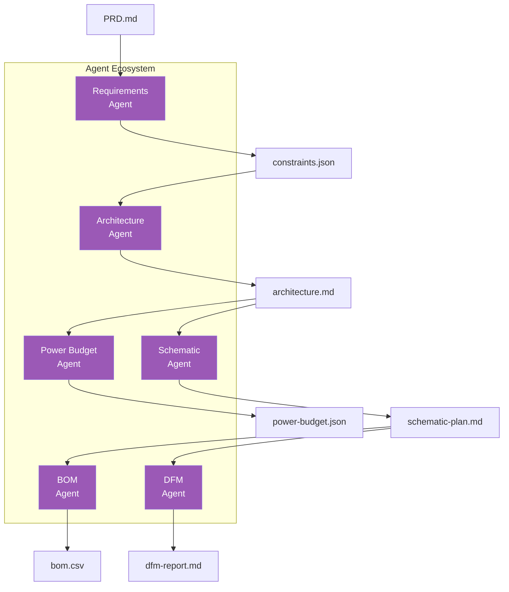
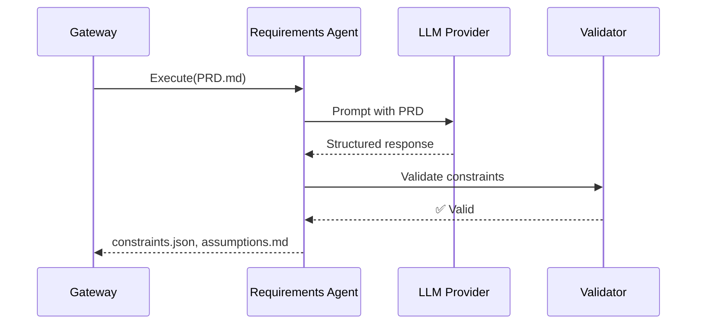
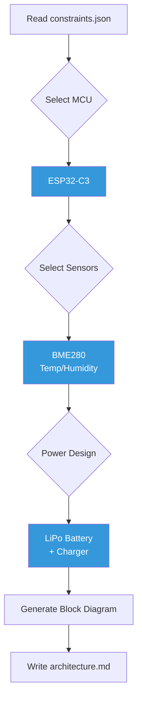
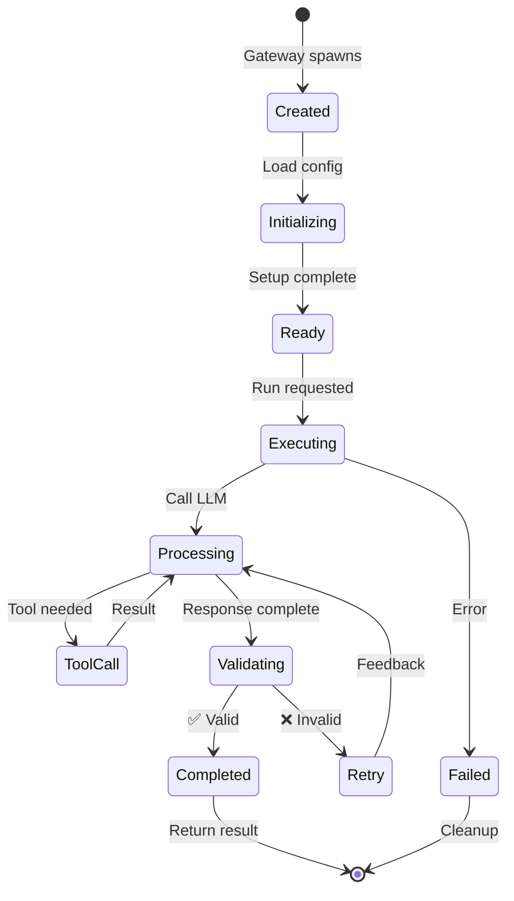

# Agent System
{: .no_toc }

Building and extending MetaForge specialist agents
{: .fs-6 .fw-300 }

## Table of contents
{: .no_toc .text-delta }

1. TOC
{:toc}

---

## Overview

MetaForge uses **specialist agents** rather than a single general-purpose AI. Each agent has:

- **Clear responsibility**: Focused on one aspect of hardware design
- **Defined inputs/outputs**: Structured data contracts
- **Tool access**: Specific tools and APIs needed for its task
- **Validation logic**: Output verification and safety checks



---

## Agent Naming Reference

**Canonical Agent Names**: MetaForge uses consistent naming across documentation. Abbreviations are used in technical architecture docs, full names in user-facing documentation.

| Code | Full Name | Alternative Names | Phase Introduced | Disciplines Covered |
|------|-----------|-------------------|------------------|---------------------|
| **PMO** | Programme Orchestration Agent | Project Manager Agent | Phase 2 | Product management, roadmapping |
| **PRD** | Product Definition Agent | Product Manager Agent | Phase 1 | Market analysis, feature prioritization |
| **REQ** | Requirements Agent | Product Spec Agent, Constraints Agent | Phase 1 | Requirements extraction, traceability |
| **SYS** | Systems Agent | Architecture Agent, Integration Agent | Phase 1 | Systems engineering, MBSE, interfaces |
| **ID** | Industrial Design Agent | HF Agent, UX Design Agent | Phase 2 | Form factor, ergonomics, aesthetics |
| **ME** | Mechanical Agent | Mechanical Engineering Agent | Phase 2 | CAD, FEA, thermal, tolerance analysis |
| **EE** | Electronics Agent | Electronics Engineering Agent | Phase 1 | Schematics, PCB, power/signal integrity |
| **FW** | Firmware Agent | Embedded Software Agent | Phase 1 | Drivers, RTOS, HAL, application code |
| **ROB** | Robotics Agent | Autonomy Agent, AI Agent | Phase 2 | Motion planning, perception, controls |
| **SIM** | Simulation Agent | Digital Twin Agent | Phase 1 | SPICE, FEA, CFD, virtual prototyping |
| **TST** | Test Engineering Agent | Validation Agent, QA Agent | Phase 1 | Test plans, automation, coverage |
| **REL** | Reliability Agent | FMEA Agent, Safety Agent | Phase 2 | FMEA, FTA, HALT/HASS, MTBF |
| **MFG** | Manufacturing Agent | NPI Agent, Production Agent | Phase 1 | DFM, DFA, work instructions, yield |
| **SC** | Supply Chain Agent | Supplier Agent, Procurement Agent | Phase 1 | Sourcing, alternates, EOL tracking |
| **QA** | Quality Agent | QMS Agent, CAPA Agent | Phase 2 | Quality systems, CAPA, audits |
| **REG** | Regulatory Agent | Compliance Agent, Certification Agent | Phase 1 | UKCA, FCC, CE, standards mapping |
| **SEC** | Cybersecurity Agent | Security Agent, InfoSec Agent | Phase 2 | Threat modeling, SBOM, vulnerabilities |
| **FIELD** | Field Engineering Agent | Deployment Agent, Service Agent | Phase 2 | Installation, calibration, RMA |

**Usage Guidelines**:
- **User Documentation** (`README.md`, `docs/index.md`): Use full names (e.g., "Requirements Agent")
- **Technical Architecture** (`docs/architecture/`): Use abbreviations with legend (e.g., "REQ Agent")
- **Code/APIs**: Use lowercase codes (e.g., `req_agent`, `ee_agent`)

**Phase-Based Agent Count**:
- **Phase 1 (v0.1-0.3)**: 6-8 core agents (REQ, SYS, EE, FW, SIM, TST, MFG, SC, REG)
- **Phase 2 (v0.4-0.6)**: +6-7 agents (ID, ME, ROB, REL, QA, SEC, FIELD)
- **Phase 3 (v0.7-1.0)**: +3-5 agents (PMO, PRD, advanced specializations)

**Total**: 15-20 specialized agents by Phase 3, covering all 25 hardware product development disciplines.

---

## Agent Types

### 1. Requirements Agent

**Purpose**: Transforms unstructured PRD into structured constraints

```typescript
interface RequirementsAgent {
  input: {
    prd: string;           // PRD.md content
  };

  output: {
    constraints: {
      electrical: ElectricalConstraints;
      mechanical: MechanicalConstraints;
      environmental: EnvironmentalConstraints;
      cost: CostConstraints;
    };
    assumptions: Assumption[];
  };
}
```

**Workflow**:



**Example Output**:

```json
{
  "electrical": {
    "supply_voltage": { "min": 2.7, "max": 3.6, "unit": "V" },
    "current_budget": { "active": 50, "sleep": 5, "unit": "mA" },
    "interfaces": ["I2C", "SPI", "GPIO"]
  },
  "mechanical": {
    "max_dimensions": { "x": 50, "y": 50, "z": 10, "unit": "mm" },
    "pcb_layers": 2,
    "mounting": "4x M3 holes"
  }
}
```

---

### 2. Architecture Agent

**Purpose**: Selects components and creates system architecture

```typescript
interface ArchitectureAgent {
  input: {
    constraints: Constraints;
  };

  output: {
    architecture: {
      microcontroller: Component;
      sensors: Component[];
      communication: Component[];
      power: PowerArchitecture;
      blockDiagram: MermaidDiagram;
    };
  };
}
```

**Workflow**:



---

### 3. Power Budget Agent

**Purpose**: Calculates power consumption and battery life

```typescript
interface PowerBudgetAgent {
  input: {
    architecture: Architecture;
    usage_profile: UsageProfile;
  };

  output: {
    budget: {
      components: PowerBreakdown[];
      total_active: number;
      total_sleep: number;
      battery_life: BatteryLifeEstimate;
    };
  };
}
```

---

### 4. BOM Agent

**Purpose**: Generates bill of materials with pricing and availability

```typescript
interface BOMAgent {
  input: {
    architecture: Architecture;
    schematic: SchematicPlan;
  };

  output: {
    bom: BOMEntry[];
    alternates: AlternateComponent[];
    costing: CostAnalysis;
  };

  tools: [
    "OctopartAPI",
    "MouserAPI",
    "DigiKeyAPI"
  ];
}
```

---

## Agent Architecture

### Base Agent Interface

```typescript
interface Agent {
  // Metadata
  name: string;
  version: string;
  description: string;

  // Lifecycle
  initialize(config: AgentConfig): Promise<void>;
  execute(context: ExecutionContext): Promise<AgentResult>;
  cleanup(): Promise<void>;

  // Tools
  registerTools(registry: ToolRegistry): void;

  // Validation
  validateInput(input: any): ValidationResult;
  validateOutput(output: any): ValidationResult;
}
```

### Agent Lifecycle



---

## Creating a Custom Agent

### Step 1: Define Agent Class

```typescript
import { Agent, AgentConfig, ExecutionContext } from '@metaforge/core';

export class CustomAgent implements Agent {
  name = 'custom-agent';
  version = '1.0.0';
  description = 'Your agent description';

  private llm: LLMProvider;
  private tools: ToolRegistry;

  async initialize(config: AgentConfig): Promise<void> {
    this.llm = config.llmProvider;
    this.tools = config.toolRegistry;
  }

  async execute(context: ExecutionContext): Promise<AgentResult> {
    // 1. Load input
    const input = await this.loadInput(context);

    // 2. Validate input
    const validation = this.validateInput(input);
    if (!validation.valid) {
      throw new Error(`Invalid input: ${validation.errors}`);
    }

    // 3. Build prompt
    const prompt = this.buildPrompt(input);

    // 4. Call LLM
    const response = await this.llm.complete(prompt, {
      tools: this.getTools(),
      temperature: 0.3,
      maxTokens: 4000
    });

    // 5. Parse response
    const output = this.parseResponse(response);

    // 6. Validate output
    const outputValidation = this.validateOutput(output);
    if (!outputValidation.valid) {
      throw new Error(`Invalid output: ${outputValidation.errors}`);
    }

    // 7. Return artifacts
    return {
      artifacts: output.artifacts,
      metadata: output.metadata,
      traces: this.getTraces()
    };
  }

  validateInput(input: any): ValidationResult {
    // Implement input validation
  }

  validateOutput(output: any): ValidationResult {
    // Implement output validation
  }

  private buildPrompt(input: any): string {
    return `
You are a specialist agent for ${this.description}.

Input:
${JSON.stringify(input, null, 2)}

Task:
[Your specific task description]

Output Format:
[Expected JSON schema]
    `.trim();
  }
}
```

### Step 2: Register Tools

```typescript
export class CustomAgent implements Agent {
  registerTools(registry: ToolRegistry): void {
    registry.register({
      name: 'read_datasheet',
      description: 'Read component datasheet',
      parameters: {
        component: { type: 'string', required: true }
      },
      execute: async (params) => {
        // Tool implementation
      }
    });
  }

  private getTools(): Tool[] {
    return this.tools.getByNames([
      'read_datasheet',
      'search_components'
    ]);
  }
}
```

### Step 3: Add Validation

```typescript
import { z } from 'zod';

const InputSchema = z.object({
  constraints: z.object({
    voltage: z.number().positive(),
    current: z.number().positive()
  })
});

const OutputSchema = z.object({
  components: z.array(z.object({
    part_number: z.string(),
    manufacturer: z.string(),
    price: z.number()
  }))
});

export class CustomAgent implements Agent {
  validateInput(input: any): ValidationResult {
    try {
      InputSchema.parse(input);
      return { valid: true };
    } catch (error) {
      return {
        valid: false,
        errors: error.errors
      };
    }
  }

  validateOutput(output: any): ValidationResult {
    try {
      OutputSchema.parse(output);
      return { valid: true };
    } catch (error) {
      return {
        valid: false,
        errors: error.errors
      };
    }
  }
}
```

---

## Agent Testing

### Unit Tests

```typescript
import { describe, it, expect } from 'vitest';
import { CustomAgent } from './custom-agent';

describe('CustomAgent', () => {
  it('validates input correctly', () => {
    const agent = new CustomAgent();
    const result = agent.validateInput({
      constraints: { voltage: 3.3, current: 0.5 }
    });

    expect(result.valid).toBe(true);
  });

  it('generates valid output', async () => {
    const agent = new CustomAgent();
    await agent.initialize(mockConfig);

    const result = await agent.execute(mockContext);

    expect(result.artifacts).toBeDefined();
    expect(agent.validateOutput(result).valid).toBe(true);
  });
});
```

### Integration Tests

```typescript
describe('CustomAgent Integration', () => {
  it('integrates with gateway', async () => {
    const gateway = await startGateway();
    const result = await gateway.runSkill('custom-skill');

    expect(result.status).toBe('completed');
    expect(result.artifacts).toHaveLength(2);
  });
});
```

---

## Best Practices

### 1. Clear Prompts

```typescript
// ❌ Bad: Vague prompt
const prompt = "Analyze this design";

// ✅ Good: Specific prompt
const prompt = `
Analyze the power consumption of this hardware design.

Given:
- Components: ${components}
- Usage profile: ${usage}

Calculate:
1. Active current (mA)
2. Sleep current (µA)
3. Battery life (days) for ${batteryCapacity}mAh battery

Output as JSON with schema:
{
  "active_ma": number,
  "sleep_ua": number,
  "battery_life_days": number
}
`;
```

### 2. Structured Output

```typescript
// ✅ Use JSON schema validation
const response = await llm.complete(prompt, {
  response_format: { type: "json_object" },
  schema: OutputSchema
});
```

### 3. Error Handling

```typescript
async execute(context: ExecutionContext): Promise<AgentResult> {
  try {
    return await this.executeInternal(context);
  } catch (error) {
    if (error instanceof ValidationError) {
      // Retry with feedback
      return await this.retryWithFeedback(context, error);
    }

    if (error instanceof ToolError) {
      // Log and fail gracefully
      this.logger.error('Tool execution failed', error);
      throw new AgentError('Tool failure', { cause: error });
    }

    throw error;
  }
}
```

### 4. Tracing

```typescript
class CustomAgent implements Agent {
  private traces: Trace[] = [];

  private trace(action: string, data: any): void {
    this.traces.push({
      timestamp: new Date(),
      agent: this.name,
      action,
      data,
      level: 'info'
    });
  }

  async execute(context: ExecutionContext): Promise<AgentResult> {
    this.trace('execution_started', { input: context.input });

    const result = await this.executeInternal(context);

    this.trace('execution_completed', {
      artifacts: result.artifacts.map(a => a.path)
    });

    return { ...result, traces: this.traces };
  }
}
```

---

## Next Steps

- [Tool Adapters](../tools/) - Integrating external tools
- [API Reference](../api/) - Gateway API documentation
- [Architecture](../architecture/) - System internals
- [Examples](../examples/) - Real agent implementations

---

[← Home](../) • [Tools →](../tools/)
