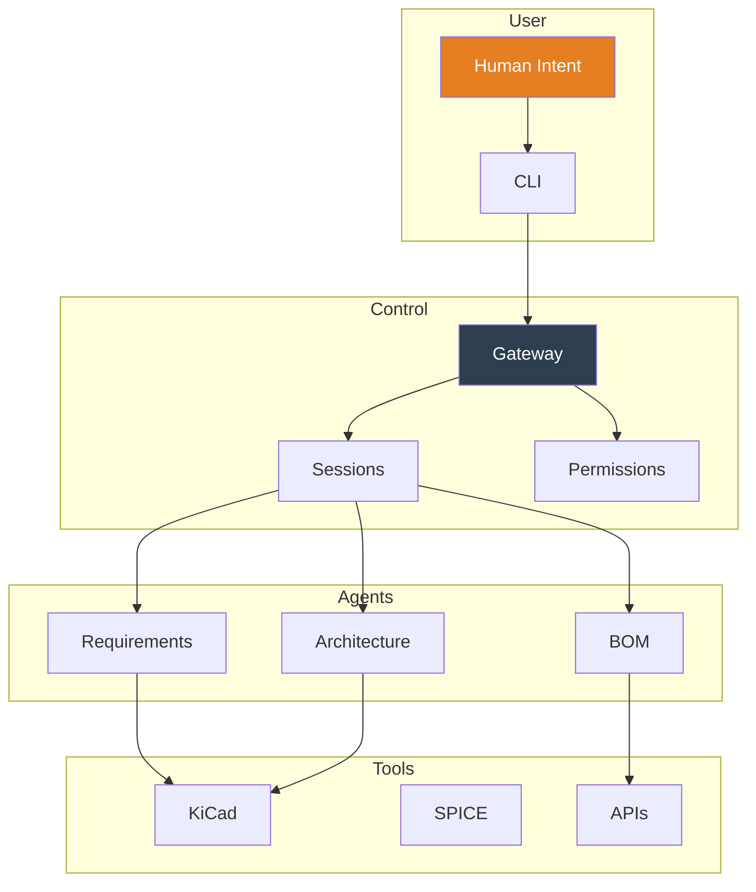
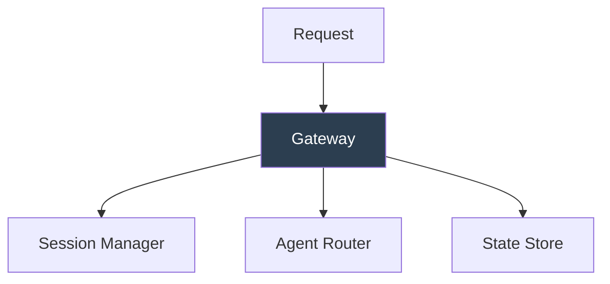
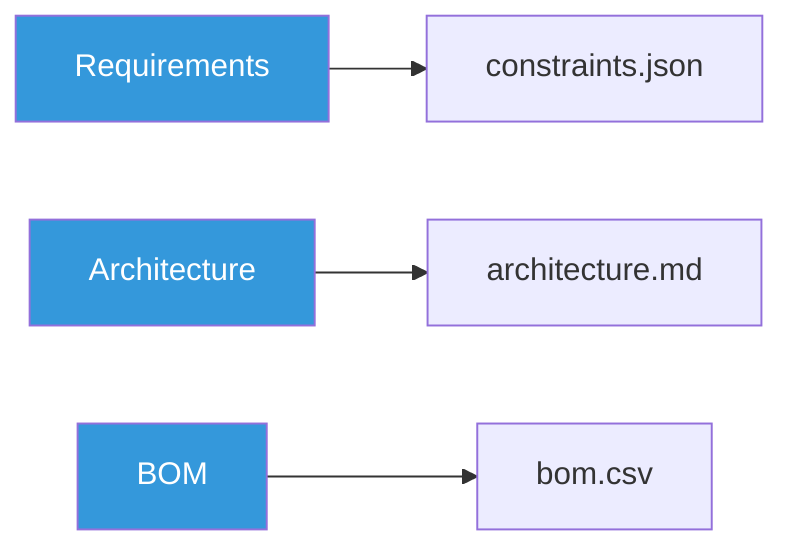
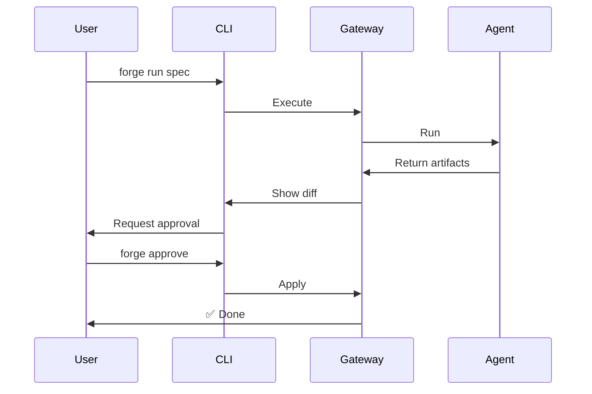
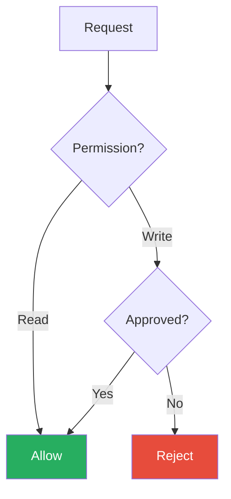

# Forge Architecture

Forge is structured as a **control plane** that orchestrates specialist agents and tool adapters.

## System Overview



## Core Components

### 1. Forge CLI

Primary user interface.

**Commands**:
- `setup` — Initialize workspace
- `onboard` — Configure project
- `gateway` — Start control plane
- `doctor` — Check environment
- `run <skill>` — Execute workflows
- `approve` — Review changes

### 2. Forge Gateway

Control plane and orchestrator.



**Responsibilities**:
- Session management
- Agent orchestration
- Permission enforcement
- State persistence

### 3. Agent System

Specialist agents for specific tasks.



### 4. Tool Adapters

Clean interfaces to external tools.

**Example: KiCad Adapter**

```typescript
interface KiCadAdapter {
  runERC(): Promise<ERCResult>;
  exportBOM(): Promise<BOMData>;
  exportNetlist(): Promise<string>;
}
```

## Data Flow

### Workflow: "Generate Requirements"



## Workspace Structure

```
project/
  PRD.md
  constraints.json
  eda/
  bom/
  .forge/
    config.json
    sessions/
    traces/
```

## Safety Model



**Permission Levels**:
1. **Read**: Always allowed
2. **Propose**: Requires approval
3. **Write**: Requires explicit approval
4. **Execute**: Requires review

## Technology Stack

**v0.1**:
- TypeScript + Node.js
- Commander.js (CLI)
- Express (Gateway)
- File system (State)
- Git (VCS)

## Design Principles

1. **Local-first**: Works offline
2. **Git-native**: Version control first-class
3. **Transparent**: All operations traceable
4. **Safe**: No destructive actions without approval
5. **Composable**: Skills combine into workflows

---

[← Home]({{ site.baseurl }}/) • [Quick Start →]({{ site.baseurl }}/quickstart)
