# Forge System Architecture

> **Internal Technical Documentation**
> This document describes the internal architecture, component interactions, and data flows within Forge.

## Overview

Forge is structured as a **control plane** that orchestrates specialist agents and tool adapters to transform human intent into manufacturable hardware artifacts.

## 1. High-Level System Architecture

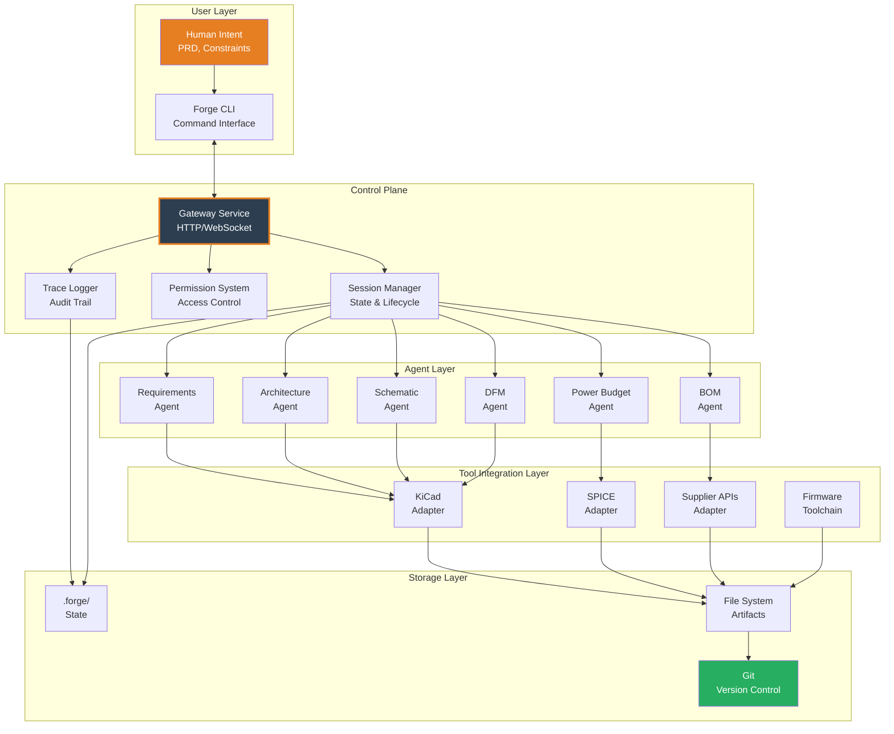

## 2. Component Architecture

### 2.1 Forge CLI

**Purpose**: Primary user interface and command executor

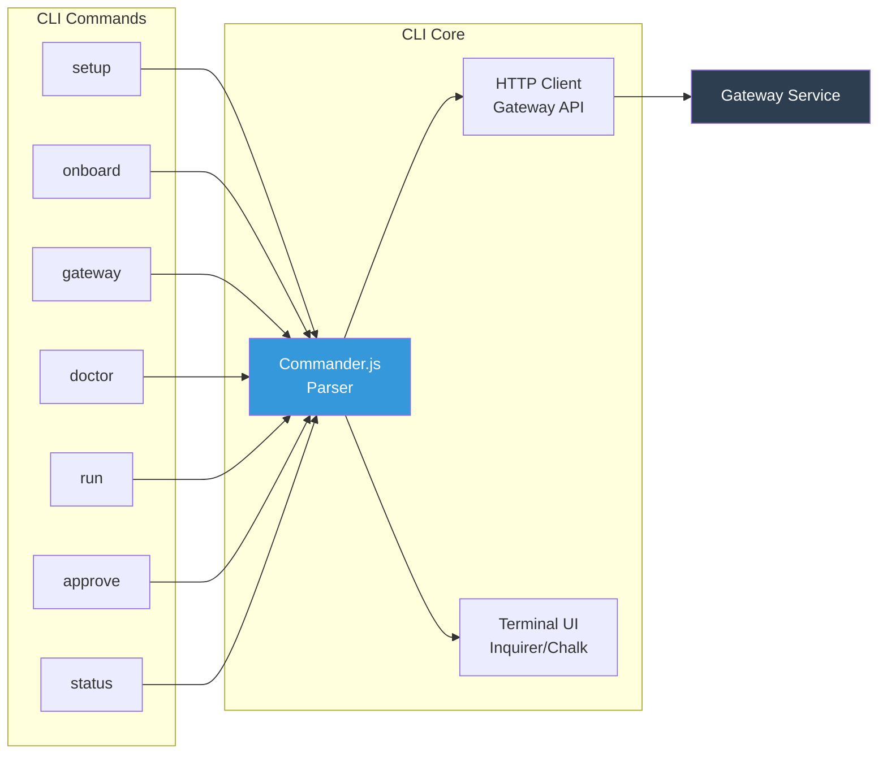

**Command Flow**:
1. User invokes CLI command
2. Commander.js parses arguments
3. HTTP client sends request to Gateway
4. Terminal UI displays results/prompts

### 2.2 Gateway Service

**Purpose**: Control plane, orchestration, and state management

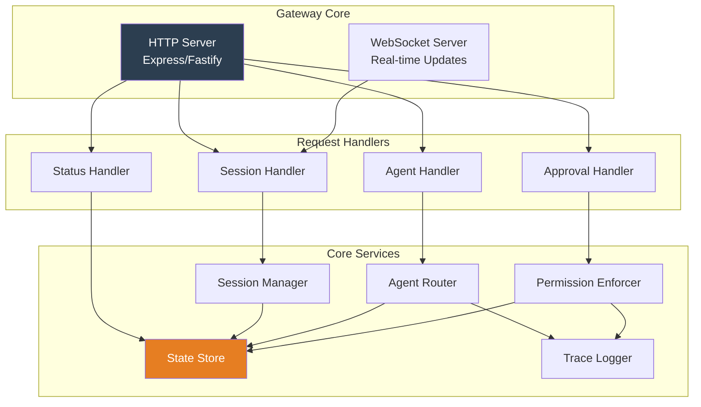

**API Endpoints** (v0.1):

```typescript
// Session Management
POST   /api/v1/session/create
GET    /api/v1/session/:id
DELETE /api/v1/session/:id
GET    /api/v1/sessions

// Agent Execution
POST   /api/v1/agent/run
GET    /api/v1/agent/:id/status

// Approval Workflow
GET    /api/v1/pending
POST   /api/v1/approve/:session
POST   /api/v1/reject/:session

// System Status
GET    /api/v1/status
GET    /api/v1/health
```

### 2.3 Agent System

**Purpose**: Specialist task executors with LLM integration

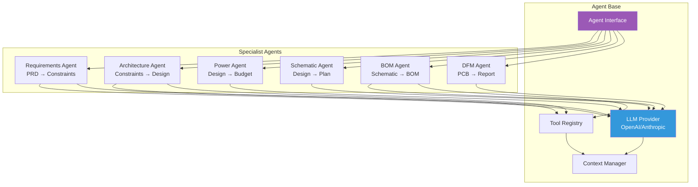

**Agent Lifecycle**:

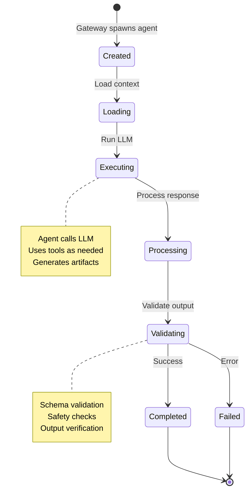

### 2.4 Tool Adapters

**Purpose**: Clean interfaces to external tools and services

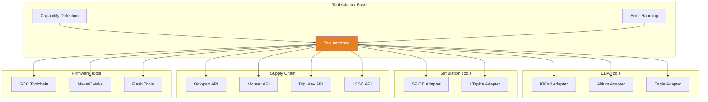

**Example: KiCad Adapter Interface**

```typescript
interface KiCadAdapter extends ToolAdapter {
  // Detection
  detect(): Promise<KiCadInstall | null>;
  getVersion(): Promise<string>;

  // Project Operations
  openProject(path: string): Promise<void>;
  closeProject(): Promise<void>;

  // Schematic Operations
  runERC(): Promise<ERCResult>;
  exportNetlist(format: string): Promise<string>;
  exportBOM(format: string): Promise<BOMData>;

  // PCB Operations
  runDRC(): Promise<DRCResult>;
  exportGerbers(config: GerberConfig): Promise<void>;
  exportPickPlace(): Promise<string>;

  // Utilities
  getComponents(): Promise<Component[]>;
  getPinMapping(): Promise<PinMap>;
}
```

## 3. Data Flow Architecture

### 3.1 Complete Workflow: PRD → Requirements

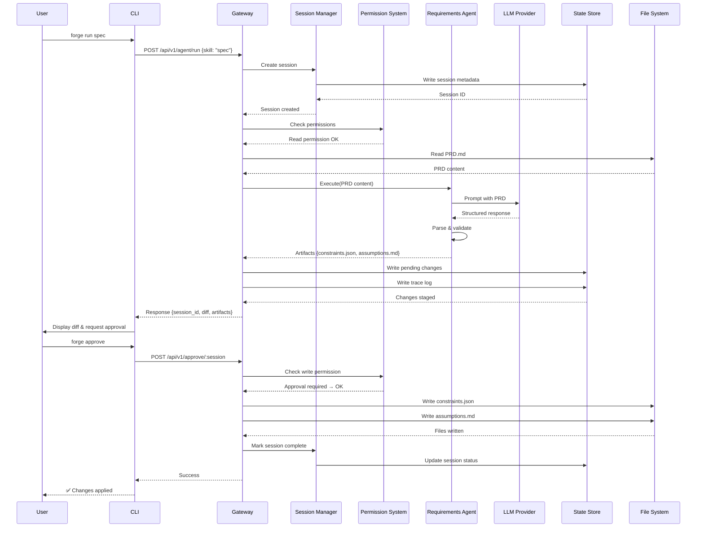

### 3.2 Session Lifecycle

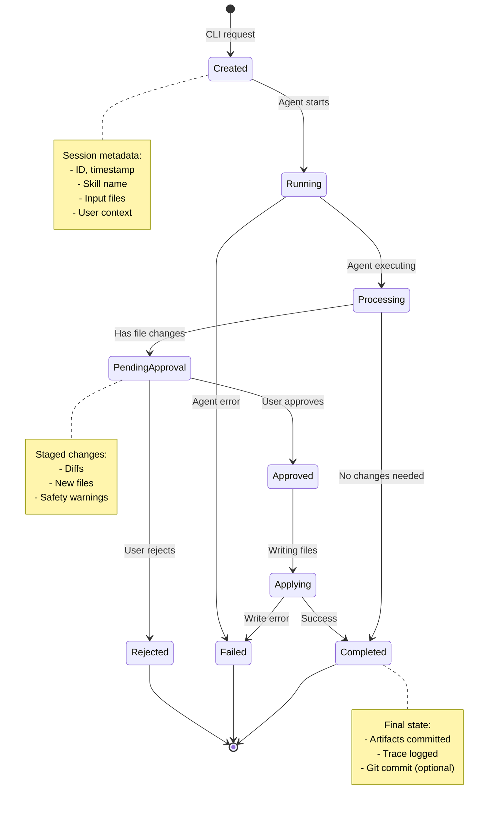

### 3.3 Agent Execution Flow

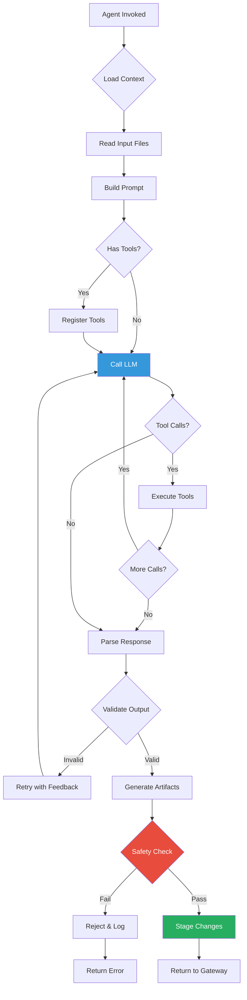

### 3.4 Multi-Agent Workflow

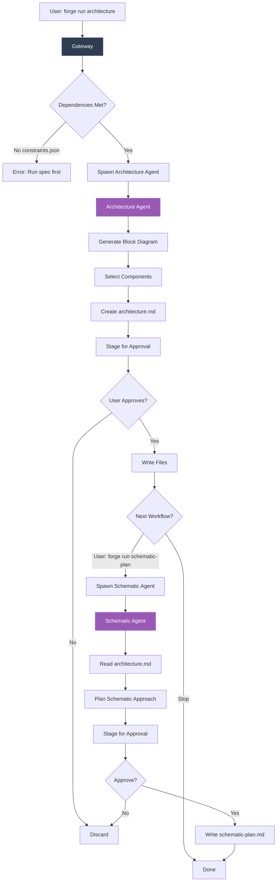

## 4. Workspace & State Management

### 4.1 Workspace Structure

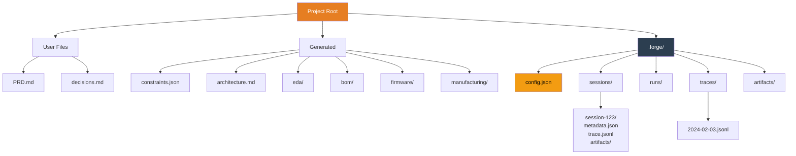

**Directory Details**:

```
project/
├── PRD.md                      # User-written requirements
├── constraints.json            # Generated by requirements agent
├── decisions.md                # Design decision log
│
├── eda/                        # EDA tool files
│   └── kicad/
│       ├── board.kicad_sch
│       └── board.kicad_pcb
│
├── bom/                        # Bill of materials
│   ├── bom.csv
│   ├── alternates.csv
│   └── costing.json
│
├── firmware/                   # Firmware source
│   ├── src/
│   ├── pinmap.json
│   └── CMakeLists.txt
│
├── manufacturing/              # Manufacturing outputs
│   ├── gerbers/
│   ├── pick_place.csv
│   └── assembly_notes.md
│
├── tests/                      # Test plans
│   └── bringup.md
│
└── .forge/                     # Forge internal state
    ├── config.json             # Workspace config
    │
    ├── sessions/               # Active & completed sessions
    │   └── abc123/
    │       ├── metadata.json   # Session info
    │       ├── trace.jsonl     # Execution trace
    │       └── artifacts/      # Staged changes
    │
    ├── runs/                   # Historical run data
    │   └── run-456.json
    │
    ├── traces/                 # Daily trace logs
    │   └── 2024-02-03.jsonl
    │
    └── artifacts/              # Cached artifacts
        └── component-db.json
```

### 4.2 State Store Schema

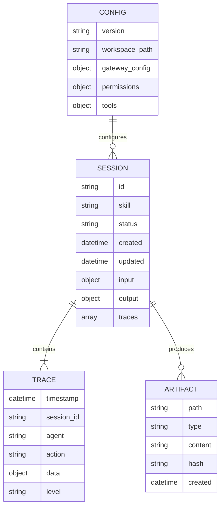

## 5. Permission & Safety Model

### 5.1 Permission Flow

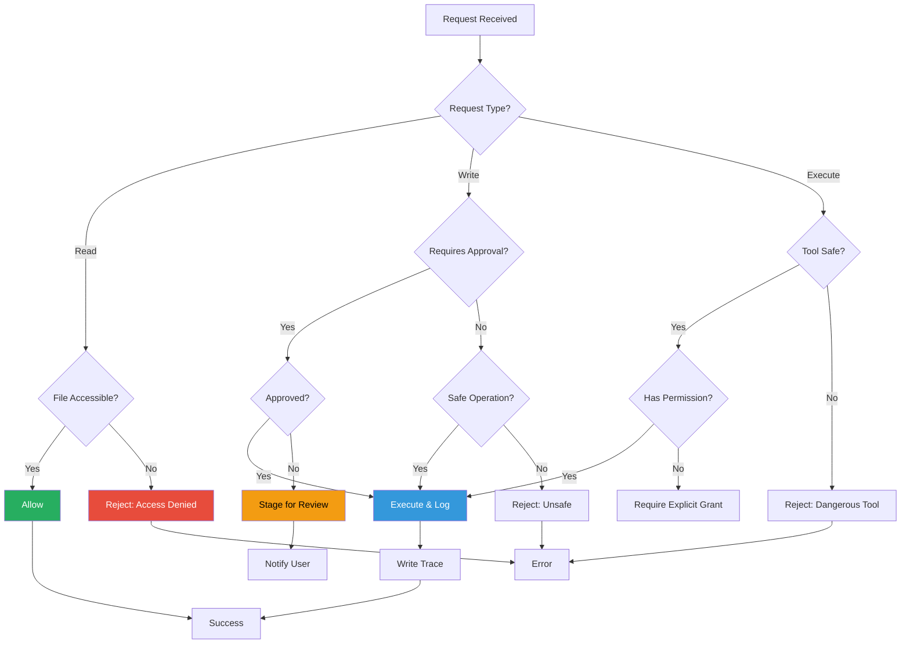

### 5.2 Permission Levels

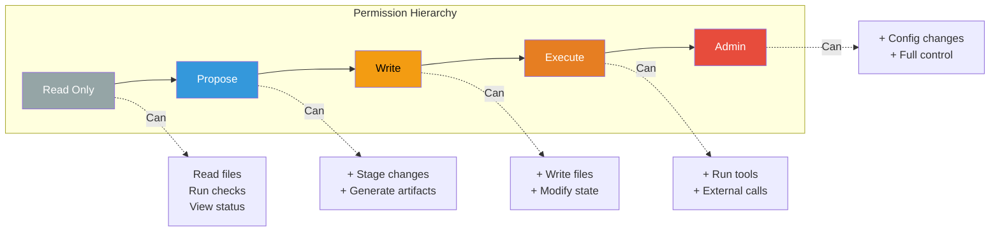

**Permission Matrix**:

| Operation | Read | Propose | Write | Execute | Admin |
|-----------|------|---------|-------|---------|-------|
| Read PRD.md | ✅ | ✅ | ✅ | ✅ | ✅ |
| Generate constraints.json | ❌ | ✅ | ✅ | ✅ | ✅ |
| Write constraints.json | ❌ | ❌ | ✅ | ✅ | ✅ |
| Run KiCad ERC | ❌ | ❌ | ❌ | ✅ | ✅ |
| Modify config.json | ❌ | ❌ | ❌ | ❌ | ✅ |

### 5.3 Safety Checks

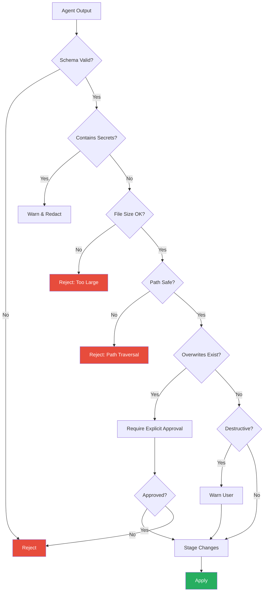

## 6. Technology Stack

### 6.1 Implementation Stack (v0.1)

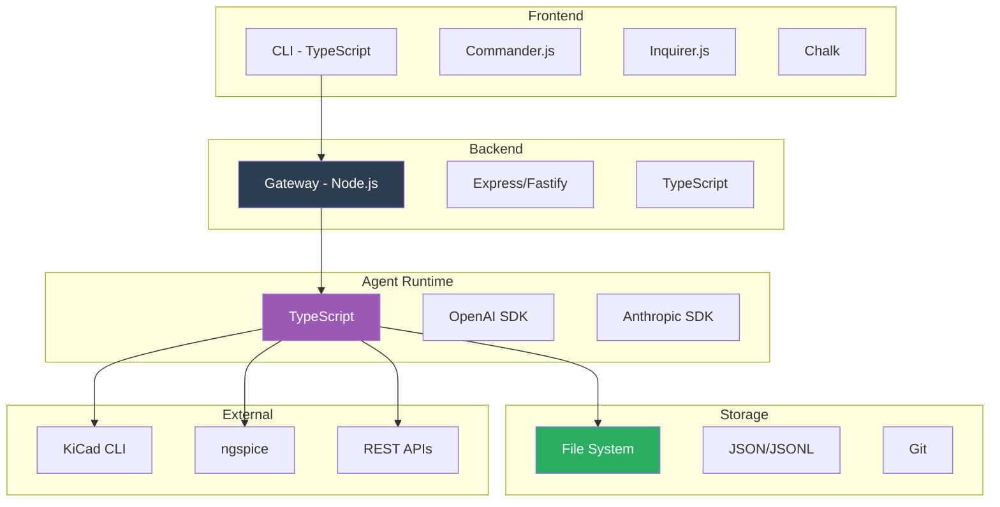

### 6.2 Dependencies

**CLI**:
- `commander` — CLI framework
- `inquirer` — Interactive prompts
- `chalk` — Terminal colors
- `axios` — HTTP client

**Gateway**:
- `express` or `fastify` — HTTP server
- `ws` — WebSocket support
- `zod` — Schema validation
- `pino` — Structured logging

**Agents**:
- `openai` — OpenAI API client
- `@anthropic-ai/sdk` — Anthropic API client
- `ajv` — JSON schema validation

**Tools**:
- `execa` — Process execution
- `glob` — File pattern matching
- `chokidar` — File watching

## 7. Design Principles & Patterns

### 7.1 Core Principles

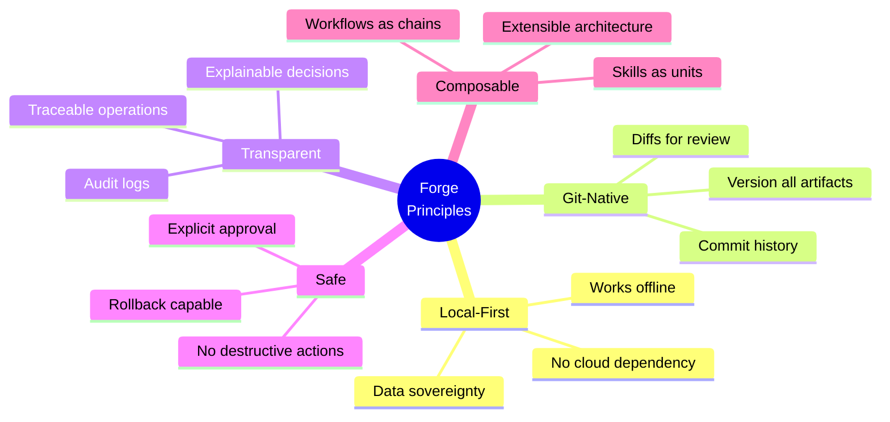

### 7.2 Architectural Patterns

**1. Command Pattern (CLI)**
```typescript
interface Command {
  name: string;
  execute(args: Args): Promise<Result>;
}
```

**2. Adapter Pattern (Tools)**
```typescript
interface ToolAdapter {
  detect(): Promise<boolean>;
  execute(action: Action): Promise<Result>;
}
```

**3. Chain of Responsibility (Permissions)**
```typescript
interface PermissionHandler {
  next?: PermissionHandler;
  handle(request: Request): boolean;
}
```

**4. Observer Pattern (Sessions)**
```typescript
interface SessionObserver {
  onStateChange(session: Session): void;
}
```

**5. Strategy Pattern (Agents)**
```typescript
interface AgentStrategy {
  execute(context: Context): Promise<Artifacts>;
}
```

## 8. Deployment Architecture

### 8.1 Local Deployment (v0.1)

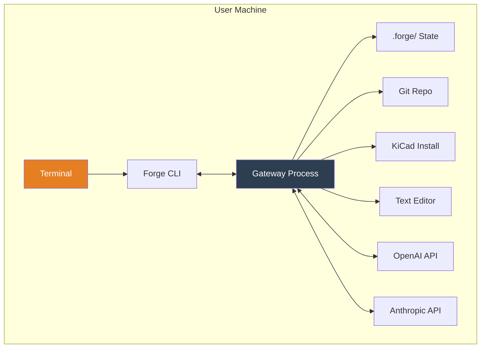

### 8.2 Future: Team Deployment

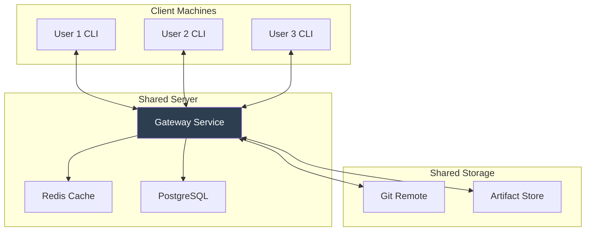

## 9. Scalability Considerations

### 9.1 Performance Targets (v0.1)

| Operation | Target | Notes |
|-----------|--------|-------|
| CLI startup | <500ms | Cold start |
| Gateway response | <100ms | Non-agent requests |
| Agent execution | <30s | Depends on LLM |
| File write | <1s | Local FS |
| Session creation | <200ms | State write |

### 9.2 Resource Limits

| Resource | Limit | Reason |
|----------|-------|--------|
| Session size | 10MB | Memory constraint |
| Trace log | 100MB/day | Disk space |
| Concurrent agents | 3 | LLM rate limits |
| File size | 10MB | Safety limit |

## 10. Future Enhancements

### 10.1 Planned Features

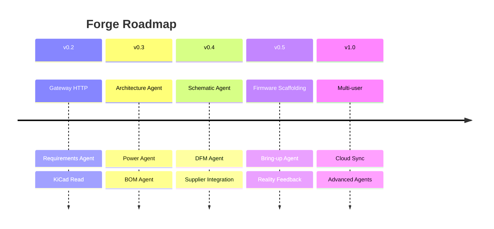

### 10.2 Extension Points

1. **Custom Agents**: Plugin system for domain-specific agents
2. **Tool Adapters**: Support for additional EDA tools
3. **LLM Providers**: Pluggable LLM backends
4. **Storage Backends**: Database options for scale
5. **Web UI**: Optional web interface for teams

---

## Appendix: Key Data Structures

### Session Metadata

```typescript
interface Session {
  id: string;
  skill: string;
  status: SessionStatus;
  created: Date;
  updated: Date;
  input: {
    files: string[];
    args: Record<string, any>;
  };
  output: {
    artifacts: Artifact[];
    errors: Error[];
  };
  traces: Trace[];
}
```

### Trace Entry

```typescript
interface Trace {
  timestamp: Date;
  session_id: string;
  agent: string;
  action: string;
  data: any;
  level: 'debug' | 'info' | 'warn' | 'error';
}
```

### Artifact

```typescript
interface Artifact {
  path: string;
  type: 'file' | 'directory';
  content?: string;
  hash: string;
  size: number;
  created: Date;
}
```

---

**Document Version**: v0.1
**Last Updated**: 2024-02-03
**Status**: Internal Architecture Documentation

[← Home]({{ site.baseurl }}/) • [Quick Start →]({{ site.baseurl }}/quickstart)
