# MVP Roadmap & Implementation Strategy
{: .no_toc }

From first productionable slice to enterprise-grade orchestrator
{: .fs-6 .fw-300 }

## Table of Contents
{: .no_toc .text-delta }

1. TOC
{:toc}

---

## Context: Company Size & Target Markets

**Unspecified Constraints**: Company size, budget, and target markets drive implementation priorities.

### Practical Options

```mermaid
flowchart LR
    subgraph Startup["🚀 Startup (5-15 engineers)"]
        S1[Open-source tools]
        S2[Narrow integrations]
        S3[BOM risk + gates]
    end

    subgraph MidSize["🏢 Mid-Size (15-60 engineers)"]
        M1[CAD/EDA APIs]
        M2[Lab automation]
        M3[QMS/CAPA workflows]
    end

    subgraph Enterprise["🏭 Enterprise (60+ engineers)"]
        E1[PLM/ERP/MES integration]
        E2[Supplier scorecards]
        E3[Safety cases + governance]
    end

    Startup --> MidSize --> Enterprise

    style Startup fill:#e8f5e9,stroke:#388e3c
    style MidSize fill:#fff3e0,stroke:#f57c00
    style Enterprise fill:#e3f2fd,stroke:#1976d2
```



---

## MVP (First Productionable Slice)

### Core Value Proposition

**Goal**: Deliver immediate value with minimal integration complexity

**Development Timeline**: 6 months total (3-4 months core development + 1 month integration/testing + 1 month documentation)

**User Time Savings**: 40-60% reduction (6-8 weeks → 3-5 weeks per product)

**Team Size**: 3-5 engineers

**Specialist Agents Delivered**: 6-7 core engineering agents
1. **REQ** - Requirements/Product Spec Agent
2. **EE** - Electronics/Architecture Agent
3. **FW** - Firmware/Embedded Agent
4. **SIM** - Simulation Agent
5. **MFG** - Manufacturing Prep Agent
6. **SC** - Supply Chain/Cost Agent
7. **TST** - Test Plan Agent (partial coverage)

---

### MVP Scope

#### 1. Digital Thread Core

**What**: Requirements ↔ BOM ↔ Build ↔ Test evidence linked in graph

**Why**: This is the foundation - everything builds on traceability

**Standards Alignment**:
- [ISO/IEC/IEEE 15288](https://www.iso.org/standard/63711.html) lifecycle framing
- [NIST Digital Thread](https://www.nist.gov/programs-projects/digital-thread-manufacturing) data model

**Technical Stack**:
```yaml
graph_database:
  engine: Neo4j Community Edition
  schema:
    nodes:
      - Requirement
      - BOMItem
      - Build
      - TestEvidence
      - ComplianceEvidence
    relationships:
      - SATISFIED_BY
      - MANUFACTURED_BY
      - TESTED_BY
      - JUSTIFIES

object_storage:
  engine: MinIO (S3-compatible)
  buckets:
    - cad-files
    - eda-projects
    - test-logs
    - compliance-docs
```

**Deliverables**:
- ✅ Graph schema defined
- ✅ REST API for CRUD operations
- ✅ Basic web UI for navigation
- ✅ CLI for bulk imports

---

#### 2. Gate Engine (EVT/DVT/PVT)

**What**: Automated completeness checks for phase gates

**Why**: Prevents skipping critical validation steps

**Implementation**:
```yaml
gate_definitions:
  - name: "EVT"
    entry_criteria:
      - requirement_coverage: "> 95%"
      - bom_risk_score: "< 30"
      - dfm_check: "PASS"
      - test_plan_approved: true

    orchestrator_checks:
      - baseline_requirements
      - generate_build_pack
      - firmware_instrumentable
      - traceability_to_test_plan

    exit_criteria:
      - core_functions_work: true
      - pre_compliance_scheduled: true
      - reliability_plan_approved: true

    approvals:
      - role: "Chief Engineer"
      - role: "Product Manager"

  - name: "DVT"
    # ... similar structure

  - name: "PVT"
    # ... similar structure
```

**Technical Stack**:
```yaml
workflow_engine:
  engine: Temporal (open-source)
  workflows:
    - gate_readiness_check
    - gate_transition
    - evidence_collection

policy_engine:
  engine: Open Policy Agent (OPA)
  policies:
    - gate_progression_guards
    - approval_requirements
    - segregation_of_duties
```

**Deliverables**:
- ✅ EVT/DVT/PVT gate definitions
- ✅ Automated readiness scoring
- ✅ Evidence checklist generation
- ✅ Approval workflow

---

#### 3. BOM Sourcing Risk

**What**: Live availability, alternates, EOL warnings via distributor APIs

**Why**: Supply-chain disasters are a top failure mode

**API Integrations**:
```yaml
supply_apis:
  - name: Digi-Key
    endpoint: https://api.digikey.com/v1
    capabilities:
      - part_search
      - pricing
      - availability
      - lifecycle_status
      - parametric_search

  - name: Mouser
    endpoint: https://api.mouser.com/api/v1
    capabilities:
      - part_search
      - pricing
      - availability
      - datasheet_links

  - name: Nexar (Octopart)
    endpoint: https://api.nexar.com/graphql
    capabilities:
      - part_search
      - lifecycle_status
      - alternates
      - compliance_docs
```

**Orchestrator Logic**:
```python
def calculate_bom_risk(bom_items):
    risk_score = 0

    # Single-source risk
    single_source_ratio = count_single_source(bom_items) / len(bom_items)
    risk_score += single_source_ratio * 30

    # Lead time risk
    max_lead_time = max(item.lead_time for item in bom_items)
    risk_score += max_lead_time * 2

    # EOL risk
    eol_count = count_eol_flags(bom_items)
    risk_score += eol_count * 15

    # Price volatility
    volatility = calculate_price_volatility(bom_items)
    risk_score += volatility * 10

    return {
        'score': risk_score,
        'level': 'LOW' if risk_score < 20 else 'MEDIUM' if risk_score < 40 else 'HIGH',
        'recommendations': generate_mitigations(bom_items)
    }
```

**Deliverables**:
- ✅ Digi-Key API integration
- ✅ Mouser API integration
- ✅ Nexar/Octopart integration
- ✅ BOM risk scoring algorithm
- ✅ Alternate parts suggestions
- ✅ Real-time availability dashboard

---

#### 4. Compliance Checklist Generator

**What**: Map target markets → applicable regimes → evidence checklist

**Why**: Prevents "late surprise" noncompliance

**Compliance Regimes**:
```yaml
regimes:
  - market: UK
    requirements:
      - regime: UKCA
        standards:
          - EMC Directive (2014/30/EU)
          - RoHS Directive (2011/65/EU)
          - Radio Equipment Directive (2014/53/EU)
        evidence_required:
          - emc_test_report
          - technical_file
          - declaration_of_conformity

      - regime: PSTI
        standards:
          - Product Security Act 2022
          - ETSI EN 303 645
        evidence_required:
          - security_baseline_checklist
          - vulnerability_disclosure_policy
          - update_support_period_statement

  - market: EU
    requirements:
      - regime: CE
        standards:
          - RED (2014/53/EU)
          - RoHS (2011/65/EU)
          - Cyber Resilience Act (2024)
        evidence_required:
          - emc_test_report
          - radio_test_report
          - technical_documentation
          - eu_declaration_of_conformity
          - sbom

  - market: USA
    requirements:
      - regime: FCC
        standards:
          - Part 15 (Intentional Radiators)
        evidence_required:
          - fcc_test_report
          - fcc_id_label
          - test_lab_accreditation
```

**Orchestrator Logic**:
```python
def generate_compliance_checklist(product, target_markets):
    checklist = []

    for market in target_markets:
        regimes = get_regimes_for_market(market)

        for regime in regimes:
            # Map product features to applicable standards
            applicable_standards = filter_applicable_standards(
                product.features,
                regime.standards
            )

            for standard in applicable_standards:
                checklist.append({
                    'market': market,
                    'regime': regime.name,
                    'standard': standard.name,
                    'evidence_required': standard.evidence,
                    'status': check_evidence_status(product, standard),
                    'priority': calculate_priority(market, regime),
                    'recommended_labs': get_accredited_labs(market, standard)
                })

    return checklist
```

**Deliverables**:
- ✅ Regime database (UKCA, CE, FCC, PSTI, CRA)
- ✅ Standards mapping engine
- ✅ Evidence checklist generator
- ✅ Test lab directory
- ✅ Compliance dashboard

---

#### 5. Test Evidence Ingestion

**What**: Ingest lab logs + CI artefacts into digital thread

**Why**: Links test results to requirements and compliance

**Event Sources**:
```yaml
ci_systems:
  - platform: GitHub Actions
    events:
      - workflow_run.completed
    artefacts:
      - firmware builds
      - unit test results
      - code coverage reports

  - platform: GitLab CI
    events:
      - pipeline.completed
    artefacts:
      - build artefacts
      - test reports

lab_systems:
  - equipment: SCPI-compatible instruments
    protocols:
      - SCPI over TCP/IP
      - NI-VISA
    artefacts:
      - oscilloscope captures
      - spectrum analyzer sweeps
      - power supply logs

  - platform: OpenTAP
    artefacts:
      - test sequences
      - measurement results
      - pass/fail status
```

**Ingestion Pipeline**:
```python
def ingest_test_evidence(source, artefact):
    # Parse artefact
    parsed = parse_artefact(artefact)

    # Store in object storage
    artefact_url = store_artefact(artefact)

    # Create evidence node in graph
    evidence = create_evidence_node(
        type=parsed.type,
        timestamp=parsed.timestamp,
        status=parsed.status,
        data=parsed.data,
        artefact_url=artefact_url
    )

    # Link to requirements
    for req_id in parsed.requirements_covered:
        link_evidence_to_requirement(evidence, req_id)

    # Link to compliance
    for compliance_id in parsed.compliance_justifies:
        link_evidence_to_compliance(evidence, compliance_id)

    # Trigger notifications
    if parsed.status == 'FAIL':
        notify_failure(evidence)
```

**Deliverables**:
- ✅ GitHub Actions integration
- ✅ Lab equipment adapters (SCPI/VISA)
- ✅ Evidence parsing engine
- ✅ Graph linking automation
- ✅ Failure notification system

---

### MVP Architecture


---

### MVP Deliverables & Timeline

**Phase 1 (Month 1-2): Foundation**
- ✅ Neo4j schema + basic CRUD API
- ✅ MinIO object storage setup
- ✅ Authentication/authorization
- ✅ Basic web UI (gate dashboard)

**Phase 2 (Month 2-3): Integrations**
- ✅ Digi-Key/Mouser/Nexar APIs
- ✅ BOM risk scoring
- ✅ GitHub Actions integration
- ✅ Evidence ingestion pipeline

**Phase 3 (Month 3-4): Workflows**
- ✅ Temporal workflow engine
- ✅ OPA policy engine
- ✅ EVT/DVT/PVT gate definitions
- ✅ Compliance checklist generator

**Phase 4 (Month 4): Polish**
- ✅ End-to-end testing
- ✅ Documentation
- ✅ Example project (drone FC)
- ✅ User onboarding flow

---

## Phase 2: Mid-Size Company Features

**Development Timeline**: +6 months (Months 5-10 from project start)

**User Time Savings**: 80-85% reduction (6-8 weeks → 1-1.5 weeks per product)

**Target**: 15-60 engineer companies

**Additional Agents Delivered**: 12 new specialist agents (19 total)

**New Capabilities**:
1. **ID** - Industrial Design Agent (form factor, ergonomics)
2. **ME** - Mechanical Engineering Agent (CAD, enclosures)
3. **SYS** - Systems Engineering Agent (architecture, interfaces)
4. **PROTO** - Prototyping & Fabrication Agent (build packs, assembly docs)
5. **PMO** - Product Management Agent (roadmapping, prioritization)
6. **SUP** - Supplier Management Agent (vendor qualification, sourcing)
7. **OPS** - Operations Agent (manufacturing planning)
8. **QA** - Quality Assurance Agent (QMS workflows, CAPA)
9. **FIELD** - Field Engineering Agent (deployment support)
10. **SAFE** - Safety Engineering Agent (hazard analysis, FMEA)
11. **UX** - UX/Ergonomics Agent (human factors)
12. **REL** - Reliability Agent (failure prediction)

**Note**: Industrial Design and Prototyping moved from Phase 3 to Phase 2 as they are Layer 1 (Core Engineering) disciplines required for EVT/DVT gates and form factor decisions.

---

### Additional Integrations

#### 1. CAD/EDA APIs

**Purpose**: Automate design rule checks, BOM extraction, release tagging

**Integrations**:
```yaml
cad_tools:
  - name: SOLIDWORKS
    api: SOLIDWORKS API (COM/C#)
    capabilities:
      - export_step
      - export_drawings
      - extract_bom
      - run_dfe_checks
      - tag_releases
    priority: HIGH

  - name: Fusion 360
    api: Fusion 360 REST API
    capabilities:
      - export_models
      - parametric_updates
      - version_control
    priority: MEDIUM

eda_tools:
  - name: KiCad
    api: KiCad Python API
    note: "Phase 1 MVP has read-only adapter (ERC/DRC checks, BOM export). Phase 2 adds write capabilities (schematic generation, auto-routing)."
    capabilities:
      - run_erc  # Phase 1: Read-only validation
      - run_drc  # Phase 1: Read-only validation
      - export_gerbers  # Phase 1: Read-only export
      - export_bom  # Phase 1: Read-only export
      - export_netlist  # Phase 1: Read-only export
      - generate_schematic  # Phase 2: Write capability
      - auto_route_pcb  # Phase 2: Write capability
      - update_components  # Phase 2: Write capability
    priority: CRITICAL

  - name: Altium
    api: Altium REST API
    capabilities:
      - design_rule_checks
      - variant_management
      - release_management
    priority: HIGH
```

**Example: KiCad Integration**:
```python
from kikit import automation

class KiCadAdapter:
    def run_erc(self, project_path):
        """Run Electrical Rule Check"""
        result = automation.run_erc(project_path)

        # Ingest into digital thread
        evidence = create_evidence_node(
            type='ERC',
            status='PASS' if result.error_count == 0 else 'FAIL',
            data={
                'errors': result.errors,
                'warnings': result.warnings
            }
        )

        return evidence

    def export_bom(self, project_path):
        """Extract BOM from schematic"""
        bom = automation.export_bom(project_path, format='csv')

        # Parse and link to BOM risk scoring
        bom_items = parse_bom_csv(bom)
        for item in bom_items:
            create_bom_node(item)
            trigger_supply_risk_check(item)

        return bom_items
```

---

#### 2. Lab Automation

**Purpose**: Reproducible tests, evidence capture, increased throughput

**Standards**:
- [IVI SCPI](https://www.ivifoundation.org/) - Instrument control
- [NI-VISA](https://www.ni.com/en-us/support/downloads/drivers/download.ni-visa.html) - Hardware abstraction
- [OpenTAP](https://opentap.io/) - Test sequencing

**Architecture**:

```mermaid
flowchart LR
    subgraph Lab["🔬 Lab Equipment"]
        OSC[Oscilloscope<br/>SCPI]
        DMM[Multimeter<br/>SCPI]
        PSU[Power Supply<br/>SCPI]
        SA[Spectrum Analyzer<br/>SCPI]
    end

    subgraph Adapter["Lab Adapter"]
        SCPI[SCPI Driver]
        VISA[NI-VISA]
        SEQ[OpenTAP<br/>Sequencer]
    end

    subgraph Core["Orchestrator"]
        QUEUE[Test Queue]
        STORE[Evidence Store]
    end

    OSC --> SCPI
    DMM --> SCPI
    PSU --> SCPI
    SA --> SCPI

    SCPI --> VISA
    VISA --> SEQ

    SEQ --> QUEUE
    QUEUE --> STORE

    style Adapter fill:#9b59b6,color:#fff
```


**Example: Power-On Test Sequence**:
```python
from opentap import TestStep, Input

class PowerOnTest(TestStep):
    """Automated power-on test with evidence capture"""

    @Input
    def dut_serial(self):
        return "DRONE-FC-001"

    def Run(self):
        # Set power supply
        self.psu.set_voltage(12.0)
        self.psu.set_current_limit(2.0)
        self.psu.output_on()

        # Wait for boot
        time.sleep(2)

        # Measure voltages
        v_5v = self.dmm.measure_voltage(channel=1)
        v_3v3 = self.dmm.measure_voltage(channel=2)

        # Capture scope trace
        scope_data = self.oscilloscope.capture()

        # Store evidence
        evidence = {
            'test': 'power_on',
            'dut_serial': self.dut_serial,
            'v_5v': v_5v,
            'v_3v3': v_3v3,
            'scope_trace': scope_data,
            'timestamp': datetime.now()
        }

        # Upload to orchestrator
        upload_test_evidence(evidence)

        # Pass/fail logic
        if 4.9 <= v_5v <= 5.1 and 3.25 <= v_3v3 <= 3.35:
            return self.Pass()
        else:
            return self.Fail("Voltage out of range")
```

---

#### 3. QMS/CAPA Workflows

**Purpose**: Nonconformance tracking, corrective actions linked to design

**Implementation**:
```yaml
qms_workflows:
  - name: "Nonconformance Intake"
    triggers:
      - test_failure
      - field_return
      - supplier_defect

    steps:
      - create_nc_record
      - classify_severity
      - assign_investigator
      - root_cause_analysis
      - determine_disposition

    outputs:
      - nc_report
      - rework_instructions
      - scrap_authorization

  - name: "CAPA Generation"
    triggers:
      - nc_classified_high_severity
      - repeat_defect

    steps:
      - identify_root_cause
      - develop_corrective_action
      - develop_preventive_action
      - assign_owner
      - set_due_date
      - verify_effectiveness

    outputs:
      - capa_plan
      - design_change_request (if needed)
      - process_change_request (if needed)

digital_thread_links:
  - nc_record → bom_item (defective component)
  - capa → requirement (if requirements need update)
  - capa → design_element (if design needs change)
  - capa → test_procedure (if tests need enhancement)
```

**Dashboard**:
```yaml
qms_metrics:
  - name: "Open NCs"
    value: 5
    threshold: < 10
    status: OK

  - name: "Open CAPAs"
    value: 3
    threshold: < 5
    status: OK

  - name: "CAPA Cycle Time"
    value: 8.2 days
    threshold: < 10 days
    status: OK

  - name: "Repeat Defects"
    value: 0
    threshold: 0
    status: EXCELLENT
```

---

## Phase 3: Enterprise Features

**Development Timeline**: +12 months (Months 11-22 from project start)

**User Time Savings**: 90%+ reduction (6-8 weeks → <1 week per product)

**Target**: 60+ engineer companies

---

### Enterprise Integrations

#### 1. PLM/ERP/MES Integration

**Purpose**: Close the loop from design → manufacturing → field

**Systems**:
```yaml
plm_systems:
  - name: Siemens Teamcenter
    api: Teamcenter SOA (SOAP/REST)
    data_exchanged:
      - part_master_data
      - document_management
      - change_management
      - bom_structure

  - name: PTC Windchill
    api: Windchill REST API
    data_exchanged:
      - cad_data_management
      - part_lifecycle
      - configuration_management

erp_systems:
  - name: SAP
    api: SAP OData API
    data_exchanged:
      - purchase_orders
      - inventory_levels
      - supplier_master
      - cost_accounting

  - name: Oracle NetSuite
    api: NetSuite REST API
    data_exchanged:
      - orders
      - inventory
      - financials

mes_systems:
  - name: Siemens Opcenter
    api: Opcenter Execution REST API
    data_exchanged:
      - work_orders
      - production_data
      - quality_data
      - traceability_records
```

**Data Flow**:


---

#### 2. Supplier Scorecards

**Purpose**: Data-driven supplier qualification and monitoring

**Metrics**:
```yaml
supplier_scorecard:
  supplier_id: "SUP-12345"
  supplier_name: "Acme Electronics Ltd"

  quality_metrics:
    - name: "Defect PPM"
      value: 150
      threshold: < 500
      trend: "improving"
      status: GOOD

    - name: "Incoming Inspection Reject Rate"
      value: 0.8%
      threshold: < 2%
      status: GOOD

  delivery_metrics:
    - name: "On-Time Delivery"
      value: 94%
      threshold: > 90%
      status: GOOD

    - name: "Lead Time Accuracy"
      value: 88%
      threshold: > 85%
      status: OK

  responsiveness_metrics:
    - name: "Quote Response Time"
      value: 2.1 days
      threshold: < 3 days
      status: EXCELLENT

    - name: "CAPA Response Time"
      value: 4.5 days
      threshold: < 5 days
      status: GOOD

  overall_score: 87/100
  status: APPROVED
  next_audit: "2024-09-15"
```

---

#### 3. Advanced Safety Cases

**Purpose**: Formal safety argumentation for regulated industries

**Standards**:
- [IEC 61508](https://www.iec.ch/functionalsafety/) - Functional safety
- [ISO 26262](https://www.iso.org/standard/68383.html) - Automotive functional safety
- [DO-178C](https://www.rtca.org/) - Airborne software
- [IEC 62304](https://www.iso.org/standard/38421.html) - Medical device software

**Safety Case Structure** (Goal Structuring Notation):
```yaml
safety_case:
  claim: "Drone flight controller is acceptably safe for consumer use"

  strategy: "Argument by hazard analysis"

  sub_claims:
    - claim: "All hazards identified"
      evidence:
        - hazard_log_v1.0.pdf
        - hazard_workshop_minutes.pdf

    - claim: "All hazards mitigated to ALARP"
      strategy: "Argument by hazard category"

      sub_claims:
        - claim: "Propeller strike hazard mitigated"
          evidence:
            - prop_guard_design.pdf
            - failsafe_testing_report.pdf
            - fmea_entry_HAZ-001.pdf

        - claim: "Flyaway hazard mitigated"
          evidence:
            - geofence_implementation.pdf
            - rtl_testing_report.pdf
            - fmea_entry_HAZ-002.pdf

    - claim: "Safety case remains valid"
      evidence:
        - configuration_management_plan.pdf
        - change_impact_analysis_procedure.pdf
```

**Orchestrator Support**:
- Track safety claims in digital thread
- Link claims to evidence artefacts
- Trigger safety re-assessment on design changes
- Generate safety case documents

---

## End-to-End Scenario Examples

### Scenario 1: Consumer Drone

**Product**: FPV racing drone flight controller

**Target Markets**: UK, EU, USA

**Orchestrator Flow**:


---

### Scenario 2: Industrial Robot Cell

**Product**: Collaborative robot workcell

**Regulations**: ISO 12100, ISO 10218-1, ISO 13849-1

**Orchestrator Flow**:

```yaml
project: "Cobot-Cell-v1"
target_market: "EU"
safety_critical: true

orchestrator_actions:
  - name: "Hazard analysis gating"
    agent: REL
    input: product_concept
    output: hazard_log_v1.0.pdf
    gate: "Concept → EVT"
    approval_required: "Safety Engineer"

  - name: "Risk assessment"
    agent: REL
    input: hazard_log
    output: risk_assessment_iso_12100.pdf
    standards: [ISO 12100]

  - name: "SRP/CS design"
    agent: EE
    input: risk_assessment
    output: safety_control_system_design.pdf
    standards: [ISO 13849-1]
    sil_target: "PLd Category 3"

  - name: "Robot safety requirements"
    agent: REQ
    input: risk_assessment
    output: safety_requirements.json
    standards: [ISO 10218-1]

  - name: "Safety case evidence"
    agent: REG
    input:
      - hazard_log
      - risk_assessment
      - safety_control_system_design
      - test_evidence
    output: safety_case_v1.0.pdf
    gate: "DVT → PVT"
    approval_required: "Safety Engineer + Notified Body"

gate_checks:
  DVT:
    - hazard_analysis_complete: true
    - risk_mitigation_verified: true
    - safety_case_approved: true
    - functional_safety_validated: true

  PVT:
    - ce_marking_evidence: true
    - machinery_directive_conformity: true
    - risk_assessment_final: true
```

---

### Scenario 3: Consumer IoT Device

**Product**: Smart home sensor

**Regulations**: UKCA, PSTI, ETSI EN 303 645

**Orchestrator Flow**:

```yaml
project: "Smart-Sensor-v1"
target_markets: [UK, EU]
has_connectivity: true

cybersecurity_requirements:
  - regime: PSTI
    standards: [ETSI EN 303 645]
    evidence_required:
      - no_default_passwords: true
      - vulnerability_disclosure_policy: true
      - update_support_period: "minimum 3 years"
      - secure_update_mechanism: true

orchestrator_actions:
  - name: "Threat modeling"
    agent: SEC
    input: product_architecture
    output: threat_model_v1.0.pdf
    methodology: "STRIDE"

  - name: "Secure-by-design checks"
    agent: SEC
    input: firmware_code
    output: security_review.pdf
    checks:
      - hardcoded_credentials: FAIL if found
      - crypto_libraries: approved list only
      - update_signature: required

  - name: "ETSI baseline compliance"
    agent: SEC
    input: product_design
    output: etsi_303645_checklist.pdf
    provisions:
      - "5-1-1": "No universal default passwords"
      - "5-2-1": "Report vulnerabilities"
      - "5-3-1": "Keep software updated"
      # ... all 13 provisions

  - name: "SBOM generation"
    agent: SEC
    input: firmware_build
    output: sbom_cyclonedx.json
    format: "CycloneDX"

  - name: "Vulnerability workflow"
    agent: SEC
    input: sbom
    output: vulnerability_report.pdf
    sources: [NVD, GitHub Advisory]

gate_checks:
  DVT:
    - threat_model_approved: true
    - etsi_baseline_met: true
    - no_critical_vulns: true

  PVT:
    - ukca_evidence_complete: true
    - psti_statement_of_compliance: true
    - update_mechanism_tested: true
```

---

## Technology Stack Summary

### Core Components

| Component | Technology | License | Why |
|-----------|-----------|---------|-----|
| **Graph Database** | Neo4j | Community (GPLv3) or Enterprise | Relationship-first queries, ACID |
| **Object Storage** | MinIO | AGPLv3 | S3-compatible, self-hosted |
| **Event Bus** | Apache Kafka or NATS | Apache 2.0 or Apache 2.0 | Durable streams, pub/sub |
| **Workflow Engine** | Temporal | MIT | Durable workflows, retries |
| **Policy Engine** | Open Policy Agent | Apache 2.0 | Declarative policies, audit |
| **API Framework** | FastAPI (Python) | MIT | OpenAPI, async, type-safe |
| **Web UI** | React + TypeScript | MIT | Component-based, type-safe |

---

### Integration APIs

| Domain | APIs | Priority | Complexity |
|--------|------|----------|----------|
| **Supply Chain** | Digi-Key, Mouser, Nexar | CRITICAL | Low |
| **EDA** | KiCad Python, Altium REST | CRITICAL | Medium |
| **CAD** | SOLIDWORKS COM, Fusion 360 | HIGH | Medium |
| **Lab** | SCPI/VISA, OpenTAP | HIGH | Medium |
| **CI/CD** | GitHub Actions, GitLab CI | HIGH | Low |
| **PLM** | Teamcenter SOA, Windchill | MEDIUM | High |
| **ERP** | SAP OData, NetSuite | MEDIUM | High |
| **MES** | Opcenter REST | LOW | High |

---

## Resource Requirements

### MVP (Phase 1)

**Team**:
- 1x Backend Engineer (Python/FastAPI)
- 1x Frontend Engineer (React/TypeScript)
- 1x DevOps Engineer (K8s, Neo4j, Kafka)
- 1x Product Manager (Requirements, UX)

**Infrastructure**:
```yaml
development:
  - Neo4j: 4 GB RAM, 2 CPUs
  - MinIO: 50 GB storage
  - Kafka: 4 GB RAM, 2 CPUs
  - API server: 2 GB RAM, 1 CPU

production:
  - Neo4j cluster: 3 nodes, 16 GB RAM each
  - MinIO cluster: 3 nodes, 500 GB storage each
  - Kafka cluster: 3 nodes, 8 GB RAM each
  - API servers: 3 instances, 4 GB RAM each
```

**Budget**:
- Engineering: $400K (4 engineers × $100K × 1 year)
- Infrastructure: $5K/month × 12 = $60K
- Tools/licenses: $10K
- **Total MVP: ~$470K**

---

### Phase 2 (Mid-Size)

**Additional Team**:
- +1 Integration Engineer (CAD/EDA APIs)
- +1 Test Automation Engineer (Lab systems)
- +1 QA Engineer (QMS workflows)

**Budget**: +$300K engineering + $60K infra (6 months × $10K/month) = $360K

---

### Phase 3 (Enterprise)

**Additional Team**:
- +1 PLM/ERP Integration Engineer
- +1 Safety/Compliance Engineer
- +1 Security Engineer

**Budget**: +$300K engineering + $20K/month infra = ~$540K

---

## Success Metrics & KPIs

### Business Metrics

| Metric | MVP Target | Phase 2 Target | Phase 3 Target |
|--------|-----------|----------------|----------------|
| **Time to EVT** | -40% | -60% | -70% |
| **Re-spin rate** | <20% | <10% | <5% |
| **BOM risk incidents** | -50% | -80% | -90% |
| **Compliance delays** | -30% | -60% | -80% |
| **CAPA cycle time** | N/A | <10 days | <7 days |

---

### Technical Metrics

| Metric | MVP Target | Phase 2 Target | Phase 3 Target |
|--------|-----------|----------------|----------------|
| **Gate readiness visibility** | Real-time | Real-time + predictions | AI-powered recommendations |
| **Traceability coverage** | 90% | 95% | 99% |
| **Evidence automation** | 60% | 75% | 85% |
| **API uptime** | 99% | 99.5% | 99.9% |

---

## Risk Mitigation

### Technical Risks

| Risk | Probability | Impact | Mitigation |
|------|-------------|--------|------------|
| **CAD/EDA API instability** | Medium | High | Adapter pattern isolates changes; version pinning |
| **Graph DB performance** | Low | Medium | Benchmark early; index optimization; caching |
| **Supplier API rate limits** | Medium | Medium | Request batching; caching; multi-supplier fallback |
| **Workflow complexity** | High | Medium | Start simple; iterative refinement; extensive testing |

---

### Business Risks

| Risk | Probability | Impact | Mitigation |
|------|-------------|--------|------------|
| **Low adoption** | Medium | High | Early customer feedback; pilot programs; free tier |
| **Competitor feature parity** | Low | Medium | Focus on digital thread differentiation |
| **Regulatory changes** | Medium | High | Modular regime definitions; expert advisors |
| **Customer data security** | Low | Critical | SOC 2 compliance; encryption; audit logs |

---

## Next Steps

### Immediate (Next 30 days)

1. ✅ **Validate with pilot customer**: Find 1-2 early adopters
2. ✅ **Finalize MVP scope**: Lock down features, cut scope creep
3. ✅ **Set up infrastructure**: Neo4j, MinIO, Kafka on dev cluster
4. ✅ **Begin API development**: REST endpoints for digital thread

### Short-term (Next 90 days)

1. ✅ **Implement core integrations**: Digi-Key, Mouser, Nexar
2. ✅ **Build gate engine**: EVT/DVT/PVT workflows in Temporal
3. ✅ **Deploy OPA policies**: Gate guards, approval rules
4. ✅ **Create dashboard UI**: Gate readiness, BOM risk, compliance

### Mid-term (Next 180 days)

1. ✅ **Beta launch with pilot customers**
2. ✅ **Iterate based on feedback**
3. ✅ **Add KiCad integration**
4. ✅ **Plan Phase 2 features**

---

## Conclusion

**The Path Forward**:

1. **MVP (3-4 months)**: Digital thread + gates + BOM risk + compliance
2. **Phase 2 (+6 months)**: CAD/EDA APIs + lab automation + QMS
3. **Phase 3 (+12 months)**: PLM/ERP/MES + supplier scorecards + safety cases

**Investment**: ~$470K MVP → ~$890K Phase 2 → ~$1.43M Phase 3

**Return**: 40-70% time savings, <5% respin rate, zero compliance surprises

**Competitive Moat**: Digital thread with full traceability - no competitor has this.

---

## Further Reading

- [Orchestrator Technical Architecture](./orchestrator-technical) - Detailed system design
- [Complete Framework](../research/hardware-development-layers) - 25-discipline mapping
- [Agent System](../agents/) - Specialist agent patterns
- [Tool Integrations](../tools/) - API adapter examples

---

**MetaForge MVP: From Digital Thread to Market Readiness in 3 Phases**

*Standards-based • Event-driven • Policy-enforced • Audit-traceable*

[← Orchestrator Technical](./orchestrator-technical.md) • [Architecture Home →](./index.md)
