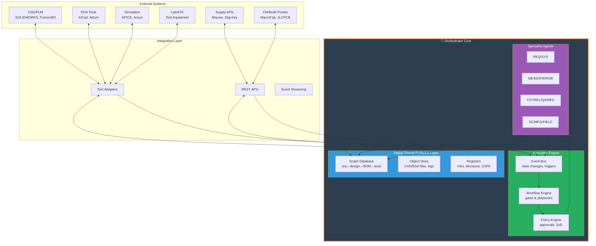
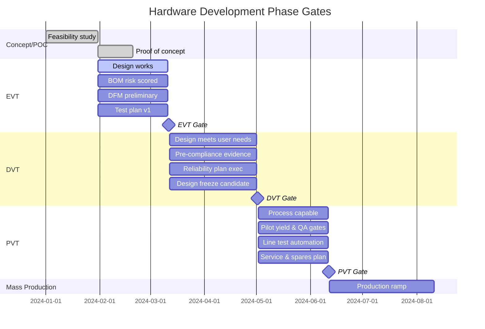
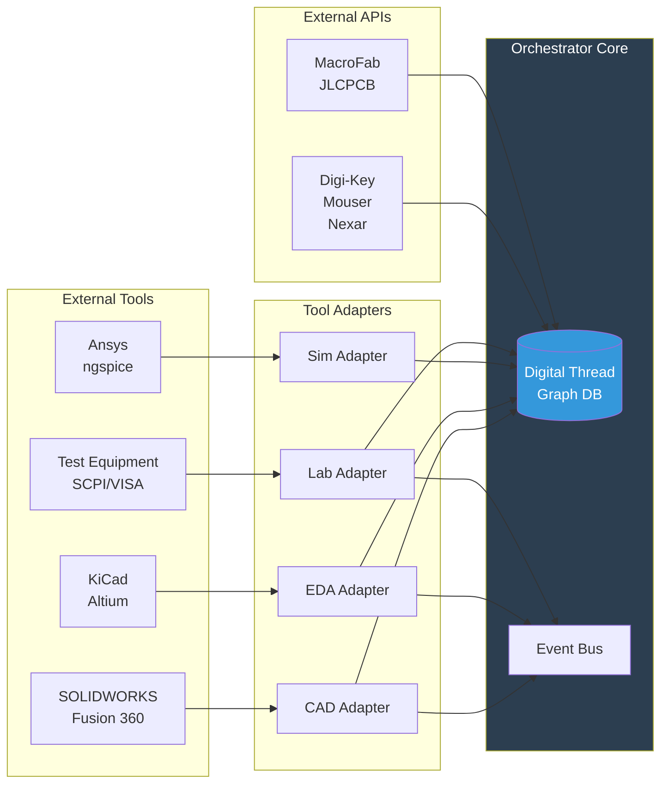

# Orchestrator Technical Architecture
{: .no_toc }

A hardware orchestrator is an **engineering operating system**: event-driven work management + digital thread graph + tool adapters + policy/governance
{: .fs-6 .fw-300 }

## Table of Contents
{: .no_toc .text-delta }

1. TOC
{:toc}

---

## Executive Summary

**The Core Problem**: Hardware and robotics products fail to reach market not because teams "can't design", but because work is fragmented across disciplines, tools, suppliers, regulations, and physical validation cycles.

**The Remedy**: A digital-thread orchestrator that:
1. **Keeps requirements/design/BOM/test/compliance evidence linked end-to-end** ("digital thread")
2. **Routes work to specialist agents and humans** with stage-gate governance
3. **Automates checks** that prevent late discovery of integration, supply-chain, manufacturing-yield, safety, cybersecurity, and certification blockers

**Standards Alignment**:
- **Lifecycle framing**: [ISO/IEC/IEEE 15288](https://www.iso.org/standard/63711.html) (Systems and software engineering - System life cycle processes)
- **Digital thread**: [NIST standards-based lifecycle data thread](https://www.nist.gov/programs-projects/digital-thread-manufacturing)
- **Risk management**: [ISO 31000](https://www.iso.org/iso-31000-risk-management.html) (identify→analyse→treat→monitor)

**Realistic Target**: High automation of documentation, coordination, verification, and risk detection, with **explicit human sign-off** for safety/compliance/irreversible decisions. Full autonomy remains unrealistic in safety- and mission-critical domains.

---

## Orchestrator Core Architecture

> **Note on Terminology**: Throughout MetaForge documentation, "**Gateway Service**" refers to the HTTP/WebSocket API server that provides the interface for CLI and web clients. The "**Orchestrator**" is the coordination engine within the Gateway that manages agents, workflows, and the digital thread. When running `forge gateway`, you start both components together - they're two aspects of the same service.

### High-Level System Design



### Core Components

#### 1. Digital Thread Evidence Layer

**Purpose**: Single source of truth linking all product lifecycle artefacts

**Graph Database** (relationships-first):
- **Nodes**: Requirements, design elements, BOM items, tests, evidence
- **Edges**: "satisfiedBy", "manufacturedBy", "testedBy", "justifies"
- **Queries**: "Show all tests that justify UKCA conformity for RF module revision B"

**Implementation**: Neo4j or similar graph database with ACID guarantees

**Example Schema**:
```cypher
// Requirement satisfied by design element
(req:Requirement)-[:SATISFIED_BY]->(design:DesignElement)

// Design element manufactured by part
(design:DesignElement)-[:MANUFACTURED_BY]->(part:BOMItem)

// Part tested by procedure
(part:BOMItem)-[:TESTED_BY]->(test:TestProcedure)

// Test produces evidence for certification
(test:TestProcedure)-[:PRODUCES]->(evidence:Evidence)
(evidence:Evidence)-[:JUSTIFIES]->(cert:Certification)
```

**Object Store**:
- Immutable storage for CAD files, EDA projects, simulation results, test logs
- Content-addressable (hash-based) for deduplication and integrity
- Implementation: S3-compatible storage with versioning

**Registers**:
- **Risk register**: FMEA, hazard analysis, cybersecurity threats
- **Decision log**: Design decisions, trade-offs, rationale
- **CAPA register**: Corrective and preventive actions

---

#### 2. Event Bus (Event-Driven Architecture)

**Purpose**: Trigger workflows on state changes

**Event Sources**:
- `BOM.updated`: Component added, removed, or spec changed
- `Supplier.leadTimeChanged`: Lead time exceeds threshold
- `Test.failed`: EVT/DVT/PVT test failure
- `Design.released`: Design baseline frozen
- `Compliance.evidenceAdded`: New certification evidence uploaded

**Event Streaming Platform**: Apache Kafka or NATS for durable, ordered streams

**Example Event Flow**:
```yaml
event: "BOM.updated"
payload:
  bom_id: "drone-fc-v1.2"
  change_type: "component_replaced"
  old_part: "STM32F405RGT6"
  new_part: "STM32F405RGT7"
  reason: "EOL notification from supplier"

triggers:
  - workflow: "impact_analysis"
    agent: "REQ"
    action: "Check requirements still satisfied"

  - workflow: "cost_update"
    agent: "SC"
    action: "Recalculate BOM cost"

  - workflow: "test_regression"
    agent: "TST"
    action: "Re-run hardware compatibility tests"
```

---

#### 3. Workflow Engine (Stage-Gate Governance)

**Purpose**: Enforce EVT/DVT/PVT gates with automated checks

**Gate Definition** (EVT example):
```yaml
gate: "EVT"
description: "Engineering Validation Test"
entry_criteria:
  - requirement_coverage: "> 95%"
  - bom_risk_score: "< 30"
  - dfm_check: "PASS"
  - test_plan_approved: true

orchestrator_checks:
  - name: "Baseline requirements"
    agent: "REQ"
    output: "requirements_v1.0.json"

  - name: "Generate build pack"
    agent: "MFG"
    output: "BOM + Gerbers + STEP + assembly notes"

  - name: "Firmware instrumentable"
    agent: "FW"
    output: "Debug build with telemetry"

  - name: "Traceability to test plan"
    agent: "TST"
    output: "req→test mapping at 95%+"

exit_criteria:
  - core_functions_work: true
  - pre_compliance_evidence: "EMC pre-scan scheduled"
  - reliability_plan: "FMEA v1.0 approved"

approvals:
  - role: "Chief Engineer"
    type: "technical_sign_off"
  - role: "Product Manager"
    type: "business_sign_off"
```

**Workflow Automation**:
- Automatically generate build packs when BOM is frozen
- Schedule lab slots when test plan is approved
- Trigger compliance evidence checklist when target market is set

---

#### 4. Policy Engine (Governance as Code)

**Purpose**: Enforce approvals, segregation of duties, and constraints

**Policy Language**: Open Policy Agent (OPA) or similar declarative policy engine

**Example Policies**:

```rego
# Segregation of duties: same person cannot author AND approve safety-critical change
package safety_approval

deny[msg] {
  input.change.safety_critical == true
  input.change.author == input.approval.approver
  msg := "Safety-critical changes require independent approval"
}

# BOM cost must be within target before DVT gate
package dvt_gate

deny[msg] {
  input.gate == "DVT"
  input.bom.total_cost > input.product.target_cost * 1.05
  msg := sprintf("BOM cost $%.2f exceeds target $%.2f by >5%%",
                 [input.bom.total_cost, input.product.target_cost])
}

# Cybersecurity vulnerability must be addressed before production
package production_gate

deny[msg] {
  input.gate == "PVT"
  count(input.vulnerabilities.open_critical) > 0
  msg := sprintf("Cannot proceed to PVT with %d open critical vulnerabilities",
                 [count(input.vulnerabilities.open_critical)])
}
```

**Enforcement Points**:
- Gate transitions (EVT→DVT→PVT)
- Design releases
- Supplier approvals
- Compliance declarations

---

## Agent Roles and Orchestration Matrix

### Agent Role Legend

| Code | Role | Primary Outputs | Human Owner |
|------|------|-----------------|-------------|
| **PMO** | Programme orchestration | Integrated plan, RAID, gate status | Programme Manager |
| **PRD** | Product/market | PRD, target margin, launch scope | Product Manager |
| **REQ** | Requirements/traceability | Requirement set, change impact | Systems Engineer |
| **SYS** | Systems/MBSE | Architecture, interface contracts | Chief Architect |
| **ID** | Industrial design/HF | Form, UX risks, CMF pack | Industrial Designer |
| **ME** | Mechanical | CAD, tolerances, assembly plan | Mechanical Engineer |
| **EE** | Electronics | Schematics, PCB, BOM, DFM | Electronics Engineer |
| **FW** | Firmware/embedded | Drivers, RTOS, calibration code | Firmware Engineer |
| **ROB** | Robotics SW/AI | Autonomy stack, sim tests, logs | Robotics Engineer |
| **SIM** | Simulation/digital twin | Models, worst-case margins | Simulation Engineer |
| **TST** | Test engineering | Test plans, automation, coverage | Test Engineer |
| **REL** | Reliability | FMEA/FTA inputs, HALT/HASS plan | Reliability Engineer |
| **MFG** | Manufacturing/NPI | Tool plan, work instructions, yields | Manufacturing Engineer |
| **SC** | Supply chain | Sourcing, alternates, EOL risk | Supply Chain Manager |
| **QA** | Quality system | QMS artefacts, CAPA, audits | Quality Manager |
| **REG** | Regulatory/certification | Test evidence, tech files, DoCs | Regulatory Affairs |
| **SEC** | Cybersecurity | Threat model, update policy, SBOM | Security Engineer |
| **FIELD** | Deployment/service | Install scripts, telemetry, RMA loop | Field Engineer |

---

### Complete Orchestration Matrix

**Format**: Each row specifies capabilities, roles, artefacts, KPIs, failure modes, and realistic automation coverage.

**Automation % Assumptions**: Deep tool integrations + structured data (BOM, CAD metadata, test logs). Percentages drop sharply when work remains unstructured.

---

#### Market Discovery → Product Definition

| Area | Required Orchestration Capabilities | Roles | Critical Inputs → Outputs | KPIs | Typical Failure Modes | Auto % |
|------|-------------------------------------|-------|---------------------------|------|----------------------|--------|
| **Problem discovery & segmentation** | Evidence backlog; assumption tracking; scope freeze workflow | PRD/PMO | Interviews/market data → ICP, value props, risks | Invalidated assumptions/week; churn in scope | Building wrong product | 30–50% |
| **PRD & target cost/margin** | Constraint propagation (cost, weight, power); versioned PRD | PRD/REQ/SC | PRD drafts → signed PRD + cost model | Target cost variance | "Gold-plating"; margin collapse | 40–60% |
| **Requirements capture** | Enforce good requirements; traceability graph; change impact | REQ/SYS | Stakeholder needs → req set + RVM | Req volatility; orphan reqs | Ambiguity; missing acceptance tests | 50–70% |

---

#### Systems Architecture & Integration

| Area | Required Orchestration Capabilities | Roles | Critical Inputs → Outputs | KPIs | Typical Failure Modes | Auto % |
|------|-------------------------------------|-------|---------------------------|------|----------------------|--------|
| **Systems architecture** | Trade study automation; interface control docs; dependency graph | SYS/EE/ME/FW | Constraints → block diagrams + ICDs | Interface defects; rework cycles | Integration surprises | 40–60% |
| **Interface management** | Contract tests for interfaces; schema/IDL governance | SYS/TST | ICDs → interface tests + stubs | Integration defect density | Silent mismatches | 50–70% |

**Standards Alignment**:
- Requirements: [ISO/IEC/IEEE 29148:2018](https://www.iso.org/standard/72089.html)
- Systems engineering: [ISO/IEC/IEEE 15288:2023](https://www.iso.org/standard/63711.html)
- MBSE: [SysML v2](https://www.omg.org/spec/SysML/)

---

#### Industrial Design & Human Factors

| Area | Required Orchestration Capabilities | Roles | Critical Inputs → Outputs | KPIs | Typical Failure Modes | Auto % |
|------|-------------------------------------|-------|---------------------------|------|----------------------|--------|
| **Industrial design & HF** | Ergonomic risk register; UX test scheduling; CMF spec control | ID/PMO | Sketches/prototypes → CMF pack | Usability defects; NPS in trials | "Looks good, unusable" | 20–40% |

---

#### Mechanical Engineering

| Area | Required Orchestration Capabilities | Roles | Critical Inputs → Outputs | KPIs | Typical Failure Modes | Auto % |
|------|-------------------------------------|-------|---------------------------|------|----------------------|--------|
| **Mechanical design & tolerancing** | CAD rulesets; tolerance stack notes; assembly constraints | ME/ID | CAD/DFM rules → drawings + GD&T notes | DFM violations; assembly time | Tolerance stack failures | 30–55% |
| **Materials, sealing, thermal** | Material library; environment requirements mapping | ME/SIM | Env specs → sealing/thermal plan | Ingress failures; thermal margin | Corrosion, IP failures | 25–50% |

---

#### Electronics Engineering

| Area | Required Orchestration Capabilities | Roles | Critical Inputs → Outputs | KPIs | Typical Failure Modes | Auto % |
|------|-------------------------------------|-------|---------------------------|------|----------------------|--------|
| **Electronics architecture** | Power budgets; EMC risk scoring; design rule checks | EE/SIM | Power tree → budgets + risk log | Brownouts; EMC pre-test fails | Late EMC failures | 40–65% |
| **Component selection** | Lifecycle (EOL) checks; parametric alternates; AML/AVL mgmt | EE/SC | Candidate parts → approved parts list | Single-source ratio; lead time | EOL, shortages | **60–80%** |
| **Schematic capture** | Linting; ERC; requirement linkage to nets | EE/REQ | Schematics → verified netlist | ERC errors; design review defects | Logic/power mistakes | 60–80% |
| **PCB layout** | DRC, impedance rules; manufacturability checks | EE/MFG | PCB constraints → gerbers/ODB/IPC | DFM flags; re-spin count | Re-spins | 50–75% |
| **EMC/EMI pre-compliance** | Schedule pre-scan tests; correlate failures to layout | SIM/TST/EE | Layout + test logs → mitigations | Time to resolve EMI; pass rate | Late certification failures | 30–55% |

---

#### Embedded Software

| Area | Required Orchestration Capabilities | Roles | Critical Inputs → Outputs | KPIs | Typical Failure Modes | Auto % |
|------|-------------------------------------|-------|---------------------------|------|----------------------|--------|
| **Embedded firmware** | CI for firmware; hardware-in-loop triggers; config mgmt | FW/TST | Code + board rev → signed builds | Crash-free hours; test coverage | Timing bugs | 50–75% |
| **Robotics SW/AI** | Dataset & sim scenario governance; safety constraints | ROB/TST/SYS | Logs/sim → validated behaviours | Scenario pass rate; regressions | "Works in lab only" | 35–60% |

---

#### Simulation & Validation

| Area | Required Orchestration Capabilities | Roles | Critical Inputs → Outputs | KPIs | Typical Failure Modes | Auto % |
|------|-------------------------------------|-------|---------------------------|------|----------------------|--------|
| **Simulation/digital twin** | Model provenance; automated worst-case sweeps | SIM/SYS | CAD/EE params → margins evidence | Margin to limits | Wrong model assumptions | 30–60% |

---

#### Prototyping & Testing

| Area | Required Orchestration Capabilities | Roles | Critical Inputs → Outputs | KPIs | Typical Failure Modes | Auto % |
|------|-------------------------------------|-------|---------------------------|------|----------------------|--------|
| **Prototype planning** | Long-lead tracking; build packages; lab capacity scheduler | PMO/MFG | BOM + drawings → build pack | Prototype cycle time | Missing parts/docs | 50–70% |
| **Prototyping & fabrication** | Vendor order automation; revision binding | MFG/SC | Release state → PO + travellers | Build yield (proto) | Wrong rev, wrong files | 40–60% |
| **Test plan & coverage** | Requirements→tests mapping; coverage dashboards | TST/REQ | Requirements → test plan + scripts | Coverage; defect escape rate | Untested edge cases | 50–75% |
| **Automated test rigs** | Instrument control abstraction; test sequencing | TST | SCPI/VISA drivers → reusable rigs | Tests/hour; flakiness rate | Fragile rigs | 40–70% |

---

#### Reliability & Safety

| Area | Required Orchestration Capabilities | Roles | Critical Inputs → Outputs | KPIs | Typical Failure Modes | Auto % |
|------|-------------------------------------|-------|---------------------------|------|----------------------|--------|
| **Reliability engineering** | FMEA/FTA workflows; stress plan scheduling | REL/SYS | Hazards + field data → FMEA + plan | MTBF projection; top-5 risks | Unknown unknowns | 25–45% |
| **Safety engineering** | Hazard analysis gating; safety case evidence | REL/REG/SYS | Risk analysis → safety case | Residual risk closure | Unsafe operation | 20–40% |

**Safety Standards**:
- Functional safety: [IEC 61508](https://www.iec.ch/functionalsafety/)
- Machinery risk: [ISO 12100:2010](https://www.iso.org/standard/51528.html)
- Industrial robots: [ISO 10218-1:2025](https://www.iso.org/standard/85886.html)
- Safety control systems: [ISO 13849-1:2023](https://www.iso.org/standard/69883.html)

---

#### Cybersecurity & Privacy

| Area | Required Orchestration Capabilities | Roles | Critical Inputs → Outputs | KPIs | Typical Failure Modes | Auto % |
|------|-------------------------------------|-------|---------------------------|------|----------------------|--------|
| **Cybersecurity engineering** | Secure-by-design checks; vulnerability workflow; update policy | SEC/REG | Threat model → security evidence | Vuln MTTR; update cadence | Non-compliance, breaches | 40–65% |
| **Data privacy & governance** | Data map; consent/retention policies | SEC/PMO | Telemetry needs → DPIA artefacts | Privacy issues found late | Blocked deployments | 20–40% |

**Cybersecurity Standards**:
- UK PSTI: [Product Security and Telecommunications Infrastructure Act](https://www.legislation.gov.uk/ukpga/2022/46/enacted)
- EU CRA: [Cyber Resilience Act](https://digital-strategy.ec.europa.eu/en/policies/cyber-resilience-act)
- IoT baseline: [ETSI EN 303 645](https://www.etsi.org/deliver/etsi_en/303600_303699/303645/02.01.01_60/en_303645v020101p.pdf)

---

#### Configuration Management

| Area | Required Orchestration Capabilities | Roles | Critical Inputs → Outputs | KPIs | Typical Failure Modes | Auto % |
|------|-------------------------------------|-------|---------------------------|------|----------------------|--------|
| **Configuration management** | Immutable baselines; traceability across artefacts | REQ/PMO | Commits/files → release baselines | "What shipped?" accuracy | Wrong build shipped | **60–85%** |

---

#### Cost & Supply Chain

| Area | Required Orchestration Capabilities | Roles | Critical Inputs → Outputs | KPIs | Typical Failure Modes | Auto % |
|------|-------------------------------------|-------|---------------------------|------|----------------------|--------|
| **Cost engineering/value analysis** | Cost rollups; sensitivity to components/process | PRD/SC/MFG | BOM + cycle times → should-cost | Cost vs target | Cost creep | 50–70% |
| **Supplier qualification** | Quality history; audit scheduling; PPAP-like evidence | SC/QA | Vendor data → approved vendor list | Defect ppm; on-time | Poor supplier quality | 30–55% |

**Supply Chain Integration**:
- [Digi-Key APIs](https://developer.digikey.com/)
- [Mouser Electronics APIs](https://www.mouser.com/api-hub/)
- [Nexar/Octopart data](https://nexar.com/api)

---

#### Manufacturing & Quality

| Area | Required Orchestration Capabilities | Roles | Critical Inputs → Outputs | KPIs | Typical Failure Modes | Auto % |
|------|-------------------------------------|-------|---------------------------|------|----------------------|--------|
| **Manufacturing DFM/DFA** | Rule checks; assembly simulation; work instruction gen | MFG/ME/EE | Design → DFM pack + WI | First-pass yield | Line stops | 40–70% |
| **NPI phase-gates** | Enforce EVT/DVT/PVT criteria; gate evidence packs | PMO/MFG/REG | Test evidence → gate decision | Gate pass rate | Skipping gates | **60–80%** |
| **Quality system (QMS/CAPA)** | Nonconformance workflows; CAPA linkage to design | QA/PMO | Defects → CAPA + change request | CAPA cycle time | Repeat defects | 40–60% |

---

#### Regulatory & Certification

| Area | Required Orchestration Capabilities | Roles | Critical Inputs → Outputs | KPIs | Typical Failure Modes | Auto % |
|------|-------------------------------------|-------|---------------------------|------|----------------------|--------|
| **Regulatory/certification** | Requirements→standards mapping; tech file automation | REG/EE/ME | Standards + tests → DoC/tech file | Test pass; time-to-cert | Late failures | 30–55% |

**Certification Regimes**:
- UK: [UKCA marking](https://www.gov.uk/guidance/using-the-ukca-marking)
- EU: [RoHS](https://environment.ec.europa.eu/topics/waste-and-recycling/rohs-directive_en)
- US: [FCC equipment authorisation](https://www.fcc.gov/oet/ea)

---

#### Logistics & Field Operations

| Area | Required Orchestration Capabilities | Roles | Critical Inputs → Outputs | KPIs | Typical Failure Modes | Auto % |
|------|-------------------------------------|-------|---------------------------|------|----------------------|--------|
| **Logistics & packaging** | Transport constraints; packaging validation | MFG/SC | Product + route → packaging spec | Damage rate | In-transit failures | 25–45% |
| **Field deployment/commissioning** | Install playbooks; site readiness checks | FIELD/SYS | Site data → install scripts | Time-to-commission | Surprise constraints | 30–55% |
| **Monitoring/OTA/update ops** | Fleet telemetry; release rings; rollback workflows | FIELD/SEC/FW | Telemetry → health dashboards | Crash rate; rollback | Bricked devices | 40–70% |
| **Service/repair/RMA** | Parts planning; diagnostic trees; repair manuals | FIELD/MFG | Failures → repair procedures | RMA turnaround | Unserviceable design | 30–55% |
| **End-of-life/sustainability** | Compliance evidence; teardown/serviceability scoring | REG/ME | Materials data → RoHS evidence | Compliance gaps | Blocked market access | 40–60% |

---

## Key Observation: Highest Leverage Points

**Where the orchestrator delivers maximum value:**

1. **Cross-link enforcement** (digital thread):
   - Requirements ↔ Tests ↔ BOM ↔ Builds ↔ Field Evidence
   - **Impact**: Reduces integration surprises and compliance rework

2. **Immutable baselines** (configuration management):
   - "What shipped?" accuracy at 99%+
   - **Impact**: Eliminates wrong-build-shipped disasters

3. **Automated gate checks** (NPI phase-gates):
   - EVT/DVT/PVT evidence completeness before proceed
   - **Impact**: Prevents skipping critical validation

4. **Component lifecycle tracking** (supply chain):
   - EOL warnings, lead-time monitoring, alternates
   - **Impact**: Avoids late supply-chain disasters

---

## Communication Patterns

### 1. Event Streaming (State Changes)

**Purpose**: Hardware orchestration benefits from event streaming to trigger remediation workflows

**Event Sources**:
- CI systems (firmware/robotics/software builds)
- Build systems (manufacturing artefacts)
- Lab equipment (test results)
- Supplier APIs (availability changes)

**Event Streaming Platform**: [Apache Kafka](https://kafka.apache.org/) or [NATS](https://nats.io/)

**Example Event Flow**:
```
Supplier API → "Lead time changed: STM32F405 now 26 weeks"
     ↓
Event Bus → "Supplier.leadTimeChanged"
     ↓
Workflow Engine → Trigger "supply_risk_mitigation"
     ↓
SC Agent → "Find alternates: STM32F407, STM32H7 series"
     ↓
Notify PMO/EE → "Action required: approve alternate or delay timeline"
```

---

### 2. Publish/Subscribe (Durable Streams)

**Benefits**:
- Decoupled agents (don't need to know about each other)
- Replay-able history (audit trail)
- Horizontal scaling (multiple consumers)

**Implementation**:
```yaml
topics:
  - "design.released"
  - "bom.updated"
  - "test.completed"
  - "gate.requested"
  - "compliance.evidence_added"

subscribers:
  "bom.updated":
    - agent: "SC"
      action: "Check supplier lead times"
    - agent: "MFG"
      action: "Update DFM analysis"
    - agent: "REQ"
      action: "Verify requirements still met"
```

---

### 3. Repository Events & Artefact Retention

**Git Integration**:
- Firmware commits trigger CI builds
- CAD file changes trigger DFM checks
- Test scripts updated → regression suite re-run

**Artefact Retention**:
- All builds stored with hash-based addressing
- Test logs immutably archived
- Design files versioned with semantic meaning

**Example**:
```yaml
repository: "firmware"
event: "push"
branch: "main"
commit: "a1b2c3d"

orchestrator_actions:
  - trigger: "ci_build"
    agent: "FW"
    output: "firmware-v1.2.3-a1b2c3d.elf"

  - trigger: "hardware_in_loop_test"
    agent: "TST"
    requires: "EVT board available"

  - store: "artefact_registry"
    path: "builds/firmware-v1.2.3-a1b2c3d.elf"
    hash: "sha256:7f3a8b..."
```

---

## Decision Governance

### Governance Requirements

**Enforce**:
1. **Segregation of duties**: Same actor cannot both authorise AND approve safety-critical change
2. **Policy as code**: Repeatable approvals and constraints via APIs
3. **Risk management**: ISO 31000 lifecycle (identify→analyse→treat→monitor)
4. **Process compatibility**: ISO/IEC/IEEE 15288 lifecycle alignment

---

### Policy Engine Architecture

**Implementation**: [Open Policy Agent (OPA)](https://www.openpolicyagent.org/)

**Why OPA**:
- Declarative policy language (Rego)
- Decoupled decision logic from enforcement
- API-based policy decisioning
- Audit logging built-in

**Example Policies**:

#### Safety Segregation of Duties
```rego
package safety_approval

# Deny if same person authors and approves safety-critical change
deny[msg] {
  input.change.safety_critical == true
  input.change.author == input.approval.approver
  msg := "Safety-critical changes require independent approval"
}

# Require safety engineer sign-off for functional safety
deny[msg] {
  input.change.safety_critical == true
  not has_safety_engineer_approval
  msg := "Functional safety changes require safety engineer approval"
}

has_safety_engineer_approval {
  some i
  input.approvals[i].role == "Safety Engineer"
  input.approvals[i].status == "approved"
}
```

#### Gate Progression Guards
```rego
package dvt_gate

# DVT gate requires BOM cost within target
deny[msg] {
  input.gate == "DVT"
  input.bom.total_cost > input.product.target_cost * 1.05
  msg := sprintf("BOM cost $%.2f exceeds target $%.2f by >5%%",
                 [input.bom.total_cost, input.product.target_cost])
}

# DVT gate requires EMC pre-compliance evidence
deny[msg] {
  input.gate == "DVT"
  not has_emc_evidence
  msg := "DVT requires EMC pre-compliance test evidence"
}

has_emc_evidence {
  some i
  input.evidence[i].type == "EMC_PreCompliance"
  input.evidence[i].status == "PASS"
}
```

#### Production Release Guards
```rego
package production_gate

# Block PVT if critical vulnerabilities open
deny[msg] {
  input.gate == "PVT"
  count(input.vulnerabilities.open_critical) > 0
  msg := sprintf("Cannot proceed to PVT with %d open critical vulnerabilities",
                 [count(input.vulnerabilities.open_critical)])
}

# Block production if UKCA evidence incomplete
deny[msg] {
  input.gate == "Production"
  "UK" in input.target_markets
  not has_ukca_evidence
  msg := "UK market requires UKCA conformity evidence"
}

has_ukca_evidence {
  some i
  input.compliance[i].regime == "UKCA"
  input.compliance[i].status == "complete"
}
```

---

### Enforcement Points

**Where policies are checked**:

1. **Gate transitions**: EVT→DVT→PVT→Production
2. **Design releases**: Baseline freeze
3. **Supplier approvals**: Add to AVL
4. **Compliance declarations**: UKCA/FCC/RoHS
5. **Firmware releases**: OTA deployment
6. **Safety changes**: Hazard analysis updates

**Policy Decision Flow**:
```
Request → Policy Engine → Allow/Deny + Rationale
                ↓
         Audit Log (immutable)
```

---

## Workflows and Readiness Gates

### Phase-Gate Framework: EVT/DVT/PVT

**Industry Standard**: Engineering Validation, Design Validation, Production Validation

**Purpose**: Control maturity before mass production with defined pass criteria



---

### Orchestrator Actions Per Gate

#### EVT (Engineering Validation Test)

**Goal**: Prove core functions work

**Orchestrator Automation**:
```yaml
gate: "EVT"

orchestrator_checks:
  - name: "Baseline requirements"
    agent: "REQ"
    action: "Freeze requirements v1.0"
    output: "requirements_v1.0.json"
    verification: "All requirements have acceptance criteria"

  - name: "Generate build pack"
    agent: "MFG"
    action: "Create manufacturing bundle"
    output:
      - "BOM_v1.0.csv"
      - "Gerbers_v1.0.zip"
      - "STEP_assembly.stp"
      - "Assembly_notes.pdf"
    verification: "All files generated, no missing data"

  - name: "Firmware instrumentable"
    agent: "FW"
    action: "Build debug firmware with telemetry"
    output: "firmware-evt-debug.elf"
    verification: "Build succeeds, debug symbols present"

  - name: "Traceability to test plan"
    agent: "TST"
    action: "Map requirements to test procedures"
    output: "req_to_test_matrix.csv"
    verification: "Coverage ≥95%"

entry_criteria:
  - requirement_coverage: ">= 95%"
  - bom_risk_score: "< 30"
  - dfm_check: "PASS"
  - test_plan_approved: true

exit_criteria:
  - core_functions_work: true
  - pre_compliance_scheduled: "EMC pre-scan booked"
  - reliability_plan_approved: "FMEA v1.0 signed off"

human_approvals:
  - role: "Chief Engineer"
    type: "technical_sign_off"
  - role: "Product Manager"
    type: "business_sign_off"
```

---

#### DVT (Design Validation Test)

**Goal**: Design meets user/regulatory needs

**Orchestrator Automation**:
```yaml
gate: "DVT"

orchestrator_checks:
  - name: "Schedule certified lab slots"
    agent: "REG"
    action: "Book EMC/safety test labs"
    output: "lab_bookings.json"
    verification: "Slots confirmed, samples allocated"

  - name: "Documentation completeness"
    agent: "REG"
    action: "Generate technical file checklist"
    output: "tech_file_checklist.yaml"
    verification: "All sections >90% complete"

  - name: "Run regression suites"
    agent: "TST"
    action: "Execute full test suite"
    output: "test_results_dvt.xml"
    verification: "All tests PASS, no regressions"

  - name: "Cybersecurity evidence"
    agent: "SEC"
    action: "Attach security baseline evidence"
    output:
      - "threat_model_v1.0.pdf"
      - "sbom_v1.0.json"
      - "vulnerability_disclosure_policy.md"
    verification: "ETSI EN 303 645 baseline met"

entry_criteria:
  - evt_complete: true
  - user_feedback_incorporated: true
  - cost_vs_target: "< 5% variance"

exit_criteria:
  - regulatory_evidence_complete: true
  - reliability_demonstrated: "MTBF projection meets target"
  - design_freeze_approved: true

human_approvals:
  - role: "Regulatory Affairs"
    type: "compliance_sign_off"
  - role: "Chief Engineer"
    type: "design_freeze_approval"
```

---

#### PVT (Production Validation Test)

**Goal**: Process is capable, ready for mass production

**Orchestrator Automation**:
```yaml
gate: "PVT"

orchestrator_checks:
  - name: "Manufacturing travellers"
    agent: "MFG"
    action: "Generate work instructions"
    output:
      - "traveller_pcba.pdf"
      - "traveller_final_assembly.pdf"
      - "test_procedures_line.pdf"
    verification: "All steps defined, no ambiguity"

  - name: "Yield metrics collection"
    agent: "MFG"
    action: "Track pilot build yields"
    output: "yield_analysis_pvt.json"
    verification: "First-pass yield ≥85%"

  - name: "QA/CAPA workflow live"
    agent: "QA"
    action: "Activate nonconformance system"
    output: "qms_system_live.status"
    verification: "CAPA intake tested, workflows validated"

  - name: "Service diagnostics ready"
    agent: "FIELD"
    action: "Package field service tools"
    output:
      - "diagnostic_scripts.zip"
      - "repair_manual_v1.0.pdf"
      - "spare_parts_list.csv"
    verification: "Service engineers trained"

  - name: "Packaging validation"
    agent: "MFG"
    action: "Transport testing complete"
    output: "packaging_test_report.pdf"
    verification: "Drop/vibration tests PASS"

entry_criteria:
  - dvt_complete: true
  - tooling_complete: true
  - suppliers_qualified: true

exit_criteria:
  - pilot_yield: ">= 85%"
  - line_test_automation: "100% coverage"
  - service_readiness: "RMA system live"

human_approvals:
  - role: "VP Manufacturing"
    type: "production_readiness_sign_off"
  - role: "Quality Manager"
    type: "qms_sign_off"
```

---

## Tool/API Integration Surface

### Candidate Tools & APIs (Illustrative)

| Domain | Tools / APIs | Why They Matter | Integration Priority |
|--------|-------------|-----------------|---------------------|
| **Mechanical CAD** | [SOLIDWORKS API](https://help.solidworks.com/), [Fusion 360 API](https://www.autodesk.com/developer-network/platform-technologies/fusion-360), [Onshape REST API](https://onshape-public.github.io/docs/) | Automate exports, metadata, release tagging, drawing packs | High |
| **EDA** | [Altium REST](https://www.altium.com/documentation/altium-designer/), [KiCad Python/IPC](https://docs.kicad.org/), [Cadence SKILL](https://www.cadence.com/) | Enforce design rules, extract BOM/netlists, bind revisions | **Critical** |
| **Simulation** | [Ansys scripting](https://www.ansys.com/), [ngspice](http://ngspice.sourceforge.net/) | Automated sweeps, margin evidence for gates | Medium |
| **Lab Automation** | [IVI SCPI](https://www.ivifoundation.org/), [NI-VISA](https://www.ni.com/en-us/support/downloads/drivers/download.ni-visa.html), [OpenTAP](https://opentap.io/) | Reproducible tests, evidence capture, throughput | High |
| **Supply APIs** | [Digi-Key](https://developer.digikey.com/), [Mouser](https://www.mouser.com/api-hub/), [Nexar/Octopart](https://nexar.com/api) | Live availability, alternates, compliance docs | **Critical** |
| **CM/Build Portals** | [MacroFab API](https://macrofab.com/), [JLCPCB](https://jlcpcb.com/) | Close quote→build→yield loop | Medium |
| **PCB Fab Data** | [Gerber X2](https://www.ucamco.com/en/gerber), [IPC-2581](https://www.ipc.org/ipc-2581) | Reduce manufacturing data ambiguity | High |

---

### Integration Architecture



---

## Dashboard & Metrics (What to Measure)

**Principle**: Metrics should be generated from the digital thread (linked artefacts), not manually reported, to avoid "status theatre".

### Key Metrics by Category

#### 1. Gate Readiness Score

**Formula**:
```
Gate Readiness = (
  Evidence Completeness % +
  Critical Defects Resolved % +
  Requirements Coverage %
) / 3
```

**Dashboard**:
```yaml
EVT Readiness: 87%
  - Evidence complete: 92% ✅
  - Critical defects open: 2 ⚠️
  - Requirements coverage: 96% ✅
  - Action: Close 2 critical defects before gate

DVT Readiness: 64%
  - Evidence complete: 78% ⚠️
  - Critical defects open: 0 ✅
  - Requirements coverage: 95% ✅
  - Action: Complete EMC pre-compliance tests
```

---

#### 2. BOM Risk Score

**Inputs**:
- Single-source %
- Max lead time (weeks)
- EOL flags
- Price volatility

**Formula**:
```
BOM Risk = (
  Single_Source_Ratio × 30 +
  Max_Lead_Time × 2 +
  EOL_Parts_Count × 15 +
  Price_Volatility × 10
)
```

**Dashboard**:
```yaml
BOM Risk Score: 42 (Medium)
  - Single-source parts: 8/120 (6.7%) ⚠️
  - Max lead time: 18 weeks (STM32F405) 🔴
  - EOL warnings: 2 parts ⚠️
  - Price volatility: Low ✅

  Recommended actions:
    - Find alternate for STM32F405 (18w lead time)
    - Dual-source connector supplier
```

---

#### 3. Integration Defect Density

**Track per interface**:
```yaml
Interfaces:
  - name: "IMU_SPI"
    defects_found: 0
    defect_density: 0.0 defects/KLOC
    status: ✅

  - name: "ESC_PWM"
    defects_found: 3
    defect_density: 1.2 defects/KLOC
    status: ⚠️
    action: "Add contract tests for PWM timing"

  - name: "RC_SBUS"
    defects_found: 1
    defect_density: 0.5 defects/KLOC
    status: ✅
```

---

#### 4. Re-spin Rate

**Track by phase**:
```yaml
Re-spin History:
  - EVT: 0 (target: 0)
  - DVT: 1 (EMC failure, fixed)
  - PVT: 0 (target: 0)

Total re-spins: 1
Cost impact: $12,000
Time impact: +6 weeks
```

---

#### 5. Compliance Coverage

**Map standards to evidence**:
```yaml
Target Markets: [UK, EU, USA]

Compliance Status:
  - UKCA (UK):
      - EMC Directive: 85% complete
      - RoHS: 100% complete ✅
      - Radio Equipment: 60% complete ⚠️
      - Action: Book notified body assessment

  - CE (EU):
      - RED: 70% complete
      - RoHS: 100% complete ✅
      - EU Drone Reg: 80% complete
      - Action: Complete C1 class documentation

  - FCC (USA):
      - Part 15: 50% complete ⚠️
      - Action: Schedule FCC test lab
```

---

#### 6. Yield & Quality Metrics

**Manufacturing**:
```yaml
Pilot Build (PVT):
  - Units attempted: 50
  - First-pass yield: 88% ✅
  - Rework: 6 units (12%)
  - Scrap: 0 units
  - Top defect: "Cold solder joint on USB connector"

CAPA Metrics:
  - Open CAPA: 3
  - CAPA cycle time: 8.2 days (target: <10)
  - Repeat defects: 0 ✅
```

---

#### 7. Fleet Health (Post-Launch)

**Field Metrics**:
```yaml
Fleet Status:
  - Units in field: 500
  - Crash-free hours: 99.2%
  - Update success rate: 98.4%
  - Rollback events: 3 (0.6%)

Top Issues:
  1. GPS lock timeout (12 reports)
  2. Battery calibration drift (8 reports)
  3. Compass interference (5 reports)

Security:
  - Critical vulnerabilities: 0 ✅
  - High vulnerabilities: 1 (patch in review)
  - Update SLA: 14 days (target: <30)
```

---

## Risks and Limitations

### What Can Be Automated

**High Automation (60-85%)**:
- ✅ Configuration management
- ✅ Component lifecycle tracking
- ✅ NPI gate checks
- ✅ Schematic ERC/DRC
- ✅ Test plan coverage mapping

**Medium Automation (40-60%)**:
- ⚠️ Requirements extraction
- ⚠️ Cost engineering
- ⚠️ FMEA/FTA generation
- ⚠️ Simulation sweeps
- ⚠️ Manufacturing DFM

**Low Automation (20-40%)**:
- 🔴 Safety case evidence
- 🔴 Industrial design aesthetics
- 🔴 Regulatory declarations
- 🔴 Data privacy impact

---

### What Remains Human-Dependent

**Non-Delegable Decisions**:
1. **Safety acceptance**: IEC 61508 requires accountable persons
2. **Regulatory declarations**: UKCA/FCC/RoHS require controlled documentation
3. **Business trade-offs**: Cost vs. time-to-market vs. features
4. **Irreversible tooling decisions**: Injection mold design

**Physical-World Validation**:
- Manufacturing variability (process capability)
- Environmental testing (thermal, vibration, ingress)
- Field deployment variability (installation, commissioning)
- User acceptance (ergonomics, usability)

---

### LLM-Based Design Assistance

**Current State (2024-2026)**:
- ✅ Code generation for firmware/scripts improving
- ✅ CAD workflow assistance emerging
- ⚠️ Design reasoning still limited
- 🔴 Safety-critical design NOT automatable

**Realistic Target**:
- **Optimise cycle time and error detection**
- **NOT promise full autonomy**

---

## Summary: Orchestration Value Proposition

### The Problem We Solve

**Without Orchestrator**:
- Fragmented tools (8-12 per engineer)
- Manual coordination (2-3 hours/day lost)
- Late error detection (40-60% respin rate)
- Lost knowledge (90% tribal)
- Compliance surprises ($50K+ blocked shipments)

**With Orchestrator**:
- **Digital thread**: Requirements ↔ Design ↔ BOM ↔ Tests ↔ Field
- **Automated gates**: EVT/DVT/PVT with evidence completeness
- **Early detection**: Component EOL, supply risk, compliance gaps
- **Knowledge retention**: Immutable audit trail, decisions captured
- **Governance**: Policy-enforced approvals, segregation of duties

---

### Key Metrics Impact

| Metric | Without | With Orchestrator | Improvement |
|--------|---------|-------------------|-------------|
| **Re-spin rate** | 40-60% | <5% | **90% reduction** |
| **Gate readiness visibility** | Manual status reports | Real-time dashboard | **100% accuracy** |
| **BOM risk detection** | Discovery at fab order | Continuous monitoring | **6+ weeks earlier** |
| **Compliance evidence** | Assembled last-minute | Incremental throughout | **Zero late surprises** |
| **Configuration accuracy** | "What shipped?" = guess | Digital thread linked | **99%+ accuracy** |
| **CAPA cycle time** | 15-30 days | <10 days | **60% faster** |

---

## Next Steps

### For Implementation

1. **MVP Scope**: Digital thread + EVT/DVT/PVT gates + BOM risk + compliance checklist
2. **Tool Integrations**: Start with KiCad API + Digi-Key API + Nexar
3. **Standards Alignment**: ISO/IEC/IEEE 15288 lifecycle + ISO 31000 risk
4. **Policy Engine**: Deploy OPA for gate governance
5. **Event Bus**: Kafka or NATS for workflow triggers

### Further Reading

- [Complete Framework](../research/hardware-development-layers) - 25-discipline mapping
- [Agent System](../agents/) - Specialist agent architecture
- [Tool Adapters](../tools/) - Integration patterns
- [MVP Roadmap](./mvp-roadmap) - Phased implementation plan

---

**MetaForge: Standards-Based Hardware Engineering Operating System**

*ISO/IEC/IEEE 15288 lifecycle • NIST digital thread • ISO 31000 risk management • Policy-enforced governance*

[← Architecture Home](./index.md) • [View MVP Roadmap →](./mvp-roadmap.md)
