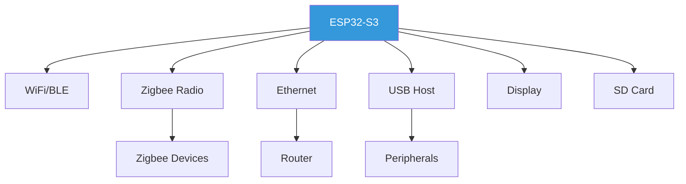

# Example Projects
{: .no_toc }

Complete worked examples demonstrating MetaForge workflows
{: .fs-6 .fw-300 }

## Table of contents
{: .no_toc .text-delta }

1. TOC
{:toc}

---

## Drone Flight Controller

A complete example of designing a quadcopter flight controller from PRD to manufacturing files.

### Project Overview


### Requirements (PRD.md)

```markdown
# Drone Flight Controller

## Overview
A flight controller for a 5" freestyle quadcopter with GPS and telemetry.

## Specifications
- 4x motor outputs (DShot600)
- IMU: 6-axis gyro + accelerometer
- Barometer for altitude hold
- GPS for position hold and RTH
- OSD chip for camera overlay
- Telemetry: 2.4GHz (ELRS) + 900MHz (backup)
- Input voltage: 7-26V (2-6S LiPo)
- USB-C for configuration
- SD card for blackbox logging

## Constraints
- Size: 36mm x 36mm (30.5mm mounting holes)
- Weight: < 15g
- 4-layer PCB
- All SMD components
- Cost target: < $30 BOM
```

### Generated Artifacts

**constraints.json**:
```json
{
  "electrical": {
    "supply_voltage": { "min": 7, "max": 26, "unit": "V" },
    "motor_outputs": 4,
    "protocols": ["DShot600", "ELRS", "GPS"],
    "interfaces": ["USB-C", "SD", "SPI", "I2C", "UART"]
  },
  "mechanical": {
    "dimensions": { "x": 36, "y": 36, "unit": "mm" },
    "mounting_pattern": "30.5mm",
    "pcb_layers": 4,
    "max_weight": 15
  },
  "performance": {
    "gyro_update_rate": 8000,
    "loop_frequency": 4000
  },
  "cost": {
    "target_bom": 30,
    "currency": "USD"
  }
}
```

**architecture.md** (excerpt):
```markdown
# Architecture

## Block Diagram

## Component Selection

### Microcontroller
- **Part**: STM32H743VIT6
- **Rationale**:
  - 480MHz Cortex-M7
  - Sufficient I/O for all peripherals
  - Hardware floating-point for PID loops

### IMU
- **Part**: BMI270 (gyro) + BMP390 (baro)
- **Rationale**:
  - Low noise, high update rate
  - Proven in flight controllers

### Motor Drivers
- **Part**: 4x DRV8323RS
- **Rationale**:
  - Integrated gate drivers
  - Supports DShot protocol
```

---

## IoT Temperature Sensor

Simple battery-powered WiFi temperature sensor.

### PRD

```markdown
# WiFi Temperature Sensor

## Requirements
- Temperature range: -40°C to 125°C
- Accuracy: ±0.5°C
- WiFi 2.4GHz
- Battery: CR2032 coin cell
- Sleep current: < 10µA
- Sample every 60 seconds
- Target battery life: 1 year

## Form Factor
- < 30mm diameter (fit in standard enclosure)
- Single-sided PCB
```

### Workflow

```bash
# 1. Setup
forge setup
forge onboard

# 2. Requirements
forge run spec
# → Generates constraints.json

# 3. Architecture
forge run architecture
# → Selects ESP32-C3, BME280, coin cell holder

# 4. Power Budget
forge run power
# → Calculates 8 months battery life with CR2032
# → Suggests CR2450 for 12+ months

# 5. Schematic Plan
forge run schematic-plan
# → Outlines circuit topology

# 6. BOM
forge run bom
# → Gets pricing: $4.50 BOM @ 1000 units
```

---

## Solar Battery Charger

Solar panel battery charger with MPPT.

### Key Features
- 18V solar panel input
- Charges 12V lead-acid or LiFePO4
- MPPT algorithm for efficiency
- LCD display for voltage/current
- Temperature compensation

### Workflow Highlights

**Power Budget Agent**:
```json
{
  "input_power": {
    "solar_max": 100,
    "solar_typical": 60,
    "unit": "W"
  },
  "charging_profiles": {
    "lead_acid": {
      "bulk": { "voltage": 14.4, "current_max": 7 },
      "float": { "voltage": 13.6, "current_max": 1 }
    }
  },
  "efficiency": {
    "mppt": 0.96,
    "converter": 0.92,
    "overall": 0.88
  }
}
```

---

## Smart Home Hub

Central controller for home automation.

### Architecture



---

## Comparison Table

| Project | MCU | Complexity | Cost (BOM) | Dev Time* |
|---------|-----|------------|------------|-----------|
| Temp Sensor | ESP32-C3 | Low | $4.50 | 2 hours |
| Battery Charger | STM32G0 | Medium | $12 | 4 hours |
| Drone FC | STM32H7 | High | $28 | 8 hours |
| Home Hub | ESP32-S3 | High | $35 | 6 hours |

*Dev time with MetaForge vs. 2-5x longer manually

---

## Example Repositories

Each example project is available as a complete repository:

- [drone-fc](https://github.com/metaforge-examples/drone-fc) - Flight controller
- [iot-sensor](https://github.com/metaforge-examples/iot-sensor) - Temperature sensor
- [solar-charger](https://github.com/metaforge-examples/solar-charger) - MPPT charger
- [home-hub](https://github.com/metaforge-examples/home-hub) - Automation hub

Each repository includes:
- Complete `PRD.md`
- All generated artifacts
- KiCad schematic and PCB
- BOM with supplier links
- Manufacturing files (Gerbers, pick & place)
- Firmware skeleton

---

## Learning Path

### 1. Start Simple
Begin with the **IoT Temperature Sensor** - demonstrates core workflow without complexity.

### 2. Add Complexity
Move to **Battery Charger** - introduces power electronics and multiple agents.

### 3. Advanced Project
Tackle **Drone Flight Controller** - full complexity with high-speed design.

### 4. Your Project
Apply learnings to your own hardware idea.

---

## Contributing Examples

Have a cool MetaForge project? Share it!

1. Fork [metaforge-examples](https://github.com/metaforge-examples)
2. Add your project
3. Include complete documentation
4. Submit PR

---

[← API Reference](../api/) • [Contributing →](../contributing/)
