# Quick Start Guide
{: .no_toc }

Get MetaForge up and running in 5 minutes
{: .fs-6 .fw-300 }

## Table of contents
{: .no_toc .text-delta }

1. TOC
{:toc}

---

## Prerequisites

Before you begin, ensure you have:

- **Node.js** v18+ installed
- **Git** installed
- **KiCad** (optional, for EDA integration)
- **Text editor** (VS Code recommended)


---

## Installation

### 1. Clone the Repository

```bash
git clone https://github.com/metaforge-labs/forge.git
cd forge
```

### 2. Install Dependencies

```bash
npm install
```

### 3. Build MetaForge

```bash
npm run build
```

### 4. Verify Installation

```bash
forge doctor
```

**Expected output**:
```
✅ Node.js v18.x.x
✅ Git v2.x.x
✅ MetaForge CLI installed
⚠️  KiCad not found (optional)
```

---

## First Project

### Initialize Workspace

```bash
# Create project directory
mkdir my-hardware-project
cd my-hardware-project

# Initialize MetaForge workspace
forge setup
```

This creates the `.forge/` directory with initial configuration:

```
my-hardware-project/
└── .forge/
    ├── config.json
    ├── sessions/
    ├── traces/
    └── artifacts/
```

### Interactive Onboarding

```bash
forge onboard
```

The onboarding wizard will:
1. Create a starter `PRD.md` (Product Requirements Document)
2. Set up project structure
3. Configure tool preferences
4. Guide you through first workflow


---

## Run Your First Workflow

### 1. Start the Gateway

Open a new terminal and start the MetaForge gateway service:

```bash
forge gateway
```

**Expected output**:
```
🔥 MetaForge Gateway v0.1.0
📡 Listening on http://localhost:3000
✅ Ready for commands
```

### 2. Edit Your PRD

Open `PRD.md` and describe your hardware project:

```markdown
# Smart Temperature Sensor

## Overview
A battery-powered IoT temperature sensor with WiFi connectivity.

## Requirements
- Temperature range: -40°C to 125°C
- Accuracy: ±0.5°C
- Battery life: 1 year (1 reading/minute)
- WiFi: 2.4GHz 802.11n
- Size: < 50mm x 50mm
- Cost target: < $15 BOM

## Constraints
- Single-sided PCB
- No fine-pitch components (> 0.5mm pitch)
- Standard parts only
```

### 3. Run Requirements Agent

```bash
forge run spec
```

**What happens**:


The agent will:
1. Read your `PRD.md`
2. Extract technical constraints
3. Generate `constraints.json`
4. Create `assumptions.md` with design decisions
5. Show you a diff for approval

**Example output**:
```
📖 Reading PRD.md...
🤖 Running requirements agent...
✅ Generated constraints.json (2.3KB)
✅ Generated assumptions.md (1.8KB)

📝 Review changes:
  + constraints.json
  + assumptions.md

Approve changes? (yes/no):
```

### 4. Approve Changes

```bash
yes
```

Or use:
```bash
forge approve
```

---

## Next Steps

### Run Architecture Agent

```bash
forge run architecture
```

This will:
- Read `constraints.json`
- Select appropriate components
- Generate `architecture.md` with block diagram
- Create initial component list

### Explore Generated Files

```
my-hardware-project/
├── PRD.md                    ← Your requirements
├── constraints.json          ← Generated constraints
├── assumptions.md            ← Design assumptions
├── architecture.md           ← System architecture
└── .forge/
    └── sessions/
        └── [session-id]/     ← Execution traces
```

### View Session History

```bash
forge status
```

**Output**:
```
📊 MetaForge Status

Recent Sessions:
  ✅ spec (2 min ago)         - constraints.json, assumptions.md
  ✅ architecture (1 min ago) - architecture.md

Pending Approvals: None

Next Steps:
  → forge run schematic-plan
  → forge run bom
```

---

## Common Commands

| Command | Description |
|---------|-------------|
| `forge setup` | Initialize workspace |
| `forge onboard` | Interactive project setup |
| `forge gateway` | Start control plane service |
| `forge run <skill>` | Execute a workflow |
| `forge approve` | Approve pending changes |
| `forge status` | Show current state |
| `forge doctor` | Check system dependencies |

---

## Complete Workflow

```mermaid
flowchart TD
    A[forge setup] --> B[forge onboard]
    B --> C[Write PRD.md]
    C --> D[forge run spec]
    D --> E[forge run architecture]
    E --> F[forge run schematic-plan]
    F --> G[forge run bom]
    G --> H[forge run dfm]
    H --> I[Manufacturing Files ✅]

    style A fill:#3498db,color:#fff
    style C fill:#E67E22,color:#fff
    style I fill:#27ae60,color:#fff
```



---

## Troubleshooting

### Gateway Not Starting

**Problem**: `forge gateway` fails to start

**Solution**:
```bash
# Check if port 3000 is in use
lsof -i :3000

# Use a different port
forge gateway --port 4000
```

### Agent Execution Fails

**Problem**: `forge run spec` hangs or fails

**Solution**:
```bash
# Check gateway is running
curl http://localhost:3000/api/v1/health

# View detailed logs
forge run spec --verbose

# Check session traces
cat .forge/sessions/*/trace.jsonl
```

### Permission Denied

**Problem**: Cannot write files

**Solution**:
```bash
# Check workspace permissions
ls -la .forge/

# Reinitialize if needed
rm -rf .forge/
forge setup
```

---

## What's Next?

- [Installation Guide](installation) - Detailed setup instructions
- [First Project](first-project) - Complete walkthrough
- [Architecture](../architecture/) - System internals
- [Examples](../examples/) - Real-world projects

---

[← Home](../) • [Installation →](installation)
