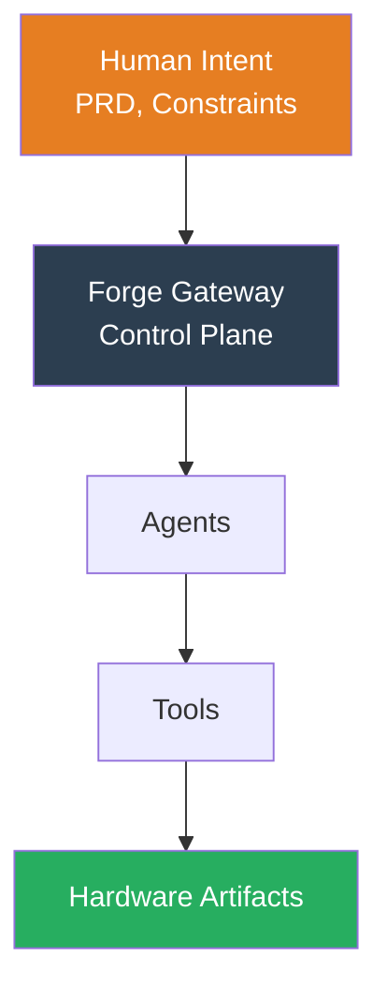

<div class="hero">
  <h1>🔥 Forge</h1>
  <p>{{ site.description }}</p>
  <p style="margin-top: 2rem;">
    <a href="{{ site.baseurl }}/quickstart" class="button">Get Started</a>
    <a href="https://github.com/forge-labs/forge" class="button button-secondary">GitHub</a>
  </p>
</div>

## What is Forge?

Forge is a **local-first control plane** that turns human intent into reviewable, manufacturable hardware artifacts.

```bash
forge setup
forge onboard
forge run spec
```

## Key Features

<div class="grid">
  <div class="card">
    <h3>🎯 Intent-Driven</h3>
    <p>Write PRDs in natural language. Forge structures requirements and guides implementation.</p>
  </div>
  <div class="card">
    <h3>🤖 Agent-Powered</h3>
    <p>Specialist agents for requirements, architecture, BOM, and DFM.</p>
  </div>
  <div class="card">
    <h3>🔧 Tool-Integrated</h3>
    <p>Works with KiCad, SPICE, suppliers, and firmware toolchains.</p>
  </div>
  <div class="card">
    <h3>📝 Git-Native</h3>
    <p>Everything versioned, diffed, reviewed. PRs for hardware.</p>
  </div>
  <div class="card">
    <h3>🔒 Safe by Default</h3>
    <p>Read-only first. Explicit approval for writes.</p>
  </div>
  <div class="card">
    <h3>🏠 Local-First</h3>
    <p>Your data stays on your machine. Works offline.</p>
  </div>
</div>

## Architecture



## Status <span class="badge badge-warning">v0.1 In Progress</span>

**What works**:
- ✅ CLI skeleton
- ✅ Workspace setup
- ✅ Project onboarding

**Coming soon**:
- ⏳ Gateway service
- ⏳ Requirements agent
- ⏳ KiCad adapter

## Get Started

```bash
npm install
npm run build
forge setup
forge onboard
```

[Read the Quick Start →]({{ site.baseurl }}/quickstart)
