# MetaForge
{: .fs-9 }

From Design Assistant to Autonomous Hardware Development Platform
{: .fs-6 .fw-300 }

[Get Started](getting-started/){: .btn .btn-primary .fs-5 .mb-4 .mb-md-0 .mr-2 }
[View Roadmap](#roadmap){: .btn .fs-5 .mb-4 .mb-md-0 }

---

## 🎯 The Problem: Hardware Development is Fundamentally Broken

### The Core Issue

**Hardware engineers waste weeks on manual, error-prone workflows using disconnected 1990s-era tools, resulting in costly respins, lost tribal knowledge, and a 2-5 year learning curve that prevents innovation.**


---

### Five Critical Problems

#### **1. Manual, Time-Consuming Workflows** ⏱️

**The Reality:**
- Engineers spend **40-50 hours per week** on repetitive manual tasks
- **2-3 days** researching and selecting components across multiple supplier websites
- **1-2 weeks** manually routing PCB traces in KiCad
- **4-6 hours** building BOM spreadsheets, checking stock, finding pricing
- **Total cycle time: 6-8 weeks** from idea to first prototype

**Why This Happens:**
- No automation between design phases
- Each step requires different tools and manual data transfer
- Copy-paste errors between tools (schematic → BOM → ordering)
- Every project starts from scratch

**Impact:**
```
Time to Market Delay
────────────────────
Weeks 1-2:  Component research & schematic
Weeks 3-4:  PCB layout
Week 5:     BOM creation & ordering
Weeks 6-8:  Fabrication wait
Week 9:     Discovery: Design doesn't work ❌
────────────────────
Result: 6+ months for working prototype
        vs. competitors shipping in 3 months
```

---

#### **2. Tool Fragmentation & Context Switching** 🔀

**Daily Tool Chaos:**


**The Cost:**
- **8-12 context switches per day** between disconnected tools
- Average **15-20 minutes lost** per context switch (finding windows, re-orienting)
- **2-3 hours daily** wasted on tool overhead vs. actual design work
- **No single source of truth** - data scattered across 10+ applications

**Real Example:**
```
Component Selection Process (Traditional)
──────────────────────────────────────────
1. Open datasheet PDF (5 min)
2. Compare 3 MCU options in browser tabs (20 min)
3. Check stock on Octopart (10 min)
4. Check pricing on Mouser (10 min)
5. Check JLCPCB assembly catalog (15 min)
6. Update Excel BOM (10 min)
7. Copy specs into KiCad schematic (5 min)
8. Hope you didn't make a typo ⚠️

Total: 75 minutes for ONE component
Multiply × 50 components = 62.5 hours
```

---

#### **3. Late Error Detection = Expensive Failures** 💸

**When Errors Are Found:**


**Statistics:**
- **40-60%** of hardware designs require at least one respin
- **Average respin cost**: $10,000-$50,000
- **Average delay**: 6-8 weeks per respin
- **Root causes**: Issues that could have been caught in simulation

**Common Errors (Found Too Late):**
1. ❌ Wrong footprint selected → Components don't fit
2. ❌ Power supply insufficient → MCU brownouts
3. ❌ I2C pullups missing → Sensors don't communicate
4. ❌ Pin conflict → GPIO already used
5. ❌ Thermal issues → Voltage regulator overheats
6. ❌ EMI problems → Fails FCC testing
7. ❌ Component out of stock → 6-month lead time

**Financial Impact:**
```
Single Respin Cost Breakdown
────────────────────────────
PCB fabrication:     $2,000
Component costs:     $3,000
Assembly labor:      $2,000
Engineering time:    $5,000 (1 week × $5K)
Opportunity cost:    $10,000 (market delay)
────────────────────
Total per respin:    $22,000

With 40% respin rate:
Expected cost = $22K × 0.4 = $8,800 per project
```

---

#### **4. Lost Knowledge & No Traceability** 🧠

**The Tribal Knowledge Problem:**

```mermaid
flowchart LR
    subgraph Team["Design Team"]
        E1[Senior Engineer<br/>🧠 10 years experience]
        E2[Junior Engineer<br/>📚 Learning]
    end

    E1 --> D1[Makes critical decisions]
    D1 --> K1[Knowledge stays in head]
    K1 --> L1[❌ Not documented]
    L1 --> C1[Engineer leaves]
    C1 --> L2[💀 Knowledge lost forever]

    E2 --> D2[Asks: Why was this chosen?]
    D2 --> K2[❓ No one knows]
    K2 --> R1[🔄 Repeat same mistakes]

    style L2 fill:#ffcdd2,stroke:#c62828
    style R1 fill:#fff3e0,stroke:#f57c00
```

**What Gets Lost:**
- ❌ **Why** a component was chosen over alternatives
- ❌ **What** constraints drove the design
- ❌ **Which** vendors are reliable
- ❌ **How** to debug specific issues
- ❌ **When** to use certain design patterns

**Real Impact:**
```
Engineer Turnover Scenario
──────────────────────────
Year 1: Senior engineer designs product
        → Makes 50 critical decisions
        → Documents 5 in comments
        → Knowledge: 90% in head

Year 2: Senior engineer leaves
        → New engineer takes over
        → Finds code, but not reasoning
        → Redesigns from scratch (6 months)
        → Repeats same mistakes

Cost: $100K+ in lost productivity
```

**No Git for Hardware:**
- Software: Every change tracked, every decision in commit messages
- Hardware: Excel files named `BOM_final_v3_FINAL_actually_final.xlsx`
- No diff tools for schematics
- No review process for design changes
- No rollback when things break

---

#### **5. Prohibitive Learning Curve** 📚

**Time to Competence:**


**Skills Required:**
1. **Electrical Engineering** (2 years)
   - Circuit analysis, Ohm's law, Kirchhoff's laws
   - Analog vs. digital design
   - Power supply design
   - Signal integrity

2. **PCB Design** (1 year)
   - KiCad/Altium proficiency
   - Layer stackup
   - Impedance matching
   - Routing strategies

3. **Embedded Systems** (1-2 years)
   - C/C++ programming
   - RTOS concepts
   - Peripheral drivers (I2C, SPI, UART)
   - Debugging (JTAG, oscilloscope)

4. **Manufacturing** (6 months)
   - DFM principles
   - Assembly processes (SMT, through-hole)
   - Testing strategies
   - Vendor management

5. **Domain Expertise** (1+ years)
   - Industry-specific (automotive, aerospace, medical)
   - Regulatory compliance (FCC, CE, UL)
   - Certification processes

**Total: 5+ years to senior-level competency**

**Barrier to Entry:**
- Hobbyists give up after 6 months
- Startups can't hire (senior engineers: $150K+)
- Universities take 4 years (Bachelor's EE)
- Self-taught path: 2-3 years of failures

---

### Quantified Business Impact

| Metric | Traditional Workflow | Business Impact |
|--------|---------------------|-----------------|
| **Time to First Prototype** | 6-8 weeks | Miss market windows, competitors ship first |
| **Respin Rate** | 40-60% | $10K-50K per respin × 0.5 = $5K-25K expected cost |
| **Tool Context Switches** | 8-12 per day | 2-3 hours wasted daily = 25-40% productivity loss |
| **Knowledge Loss** | 90% tribal | $100K+ cost per engineer turnover |
| **Learning Curve** | 2-5 years | Cannot scale teams, high salary requirements |
| **Error Detection** | Week 9 (post-fab) | 10x more expensive than catching in design phase |

**Total Cost of Broken Workflow:**
```
Per-Project Economics (Traditional)
────────────────────────────────────
Engineering time:        $30,000 (6 weeks × $5K/week)
Tools & licenses:        $5,000
Components (prototype):  $2,000
PCB fabrication:         $2,000
Expected respin (40%):   $15,000 (0.4 × $37.5K)
────────────────────────────────────
Total expected cost:     $54,000
Time to first success:   12-16 weeks

With MetaForge Vision (Phase 3)
────────────────────────────────
Platform fee:            $500
Manufacturing:           $2,000
Components:              $2,000
Certification (opt):     $3,000
Respin risk (5%):        $400
────────────────────────────────────
Total expected cost:     $7,900 (85% savings)
Time to first success:   2-3 weeks (80% faster)
```

---

### The Root Cause

**Hardware development hasn't evolved since the 1990s:**

| Aspect | Software (2024) | Hardware (2024) |
|--------|----------------|-----------------|
| **Design Tools** | VS Code, AI autocomplete | KiCad (manual), datasheets |
| **Version Control** | Git (universal) | Rare (files, not semantics) |
| **Testing** | CI/CD, automated | Manual, post-fabrication |
| **Collaboration** | PRs, code review | Email attachments |
| **Iteration Speed** | Minutes (hot reload) | Weeks (fab wait) |
| **Error Detection** | Compile time, linting | After $10K spent |
| **Knowledge Sharing** | Stack Overflow, docs | Tribal, lost on turnover |
| **Barrier to Entry** | Months (online courses) | Years (degree required) |

**The gap has widened:**
- Software engineers ship features in **days**
- Hardware engineers wait **weeks** just to test an idea
- Software has **CI/CD**, hardware has "cross fingers and hope"
- Software has **GitHub Copilot**, hardware has "read 500-page datasheets"

---

### Problem Statement (One Sentence)

> **"Hardware engineers waste 6-8 weeks and $50K+ per product using disconnected 1990s-era tools with no automation, no validation, and no knowledge capture, resulting in 40-60% respin rates and making hardware development 100x slower than software development."**

This is the problem **MetaForge** solves.

---

## 💡 The Solution: MetaForge Evolution

MetaForge is a **hardware development platform** that evolves from AI-powered design assistant to fully autonomous product development system.

### The Three-Phase Evolution

```mermaid
flowchart TB
    subgraph Phase1["Phase 1: Design Assistant (v0.1-0.3)<br/>👨‍💻 Human-in-the-Loop"]
        P1A[Human writes PRD]
        P1B[Agents suggest designs]
        P1C[Human reviews & approves]
        P1D[Human uses tools]
        P1E[Human orders parts]

        P1A --> P1B --> P1C --> P1D --> P1E
    end

    subgraph Phase2["Phase 2: Semi-Autonomous (v0.4-0.6)<br/>🤝 Minimal Human Input"]
        P2A[Human writes PRD]
        P2B[Agents design & validate]
        P2C[Human approves milestones]
        P2D[Agents use tools]
        P2E[Agents order parts]

        P2A --> P2B --> P2C --> P2D --> P2E
    end

    subgraph Phase3["Phase 3: Full Autonomous (v0.7-1.0)<br/>🤖 End-to-End Automation"]
        P3A[Human writes PRD]
        P3B[Agents handle everything]
        P3C[Products delivered]

        P3A --> P3B --> P3C
    end

    Phase1 --> Phase2 --> Phase3

    style Phase1 fill:#e3f2fd,stroke:#1976d2
    style Phase2 fill:#fff3e0,stroke:#f57c00
    style Phase3 fill:#e8f5e9,stroke:#388e3c
```

---

## 📍 Phase 1: Design Assistant (Current - v0.1-0.3)
**Human-in-the-Loop: AI Accelerates, Human Controls**

### What MetaForge Does


### Human Responsibilities
- ✍️ Write PRD
- ✅ Review & approve agent outputs
- 🛠️ PCB layout in KiCad
- 📦 Order parts from vendors
- 🔧 Assembly & testing
- 💻 Write firmware

### Agent Capabilities
- ✅ Extract requirements → `constraints.json`
- ✅ Select components → `architecture.md`
- ✅ Calculate power budget → `power-budget.json`
- ✅ Generate BOM → `bom.csv` with pricing
- ✅ DFM validation → manufacturability checks
- ✅ Generate test plans → `test-procedures.md`

### Time Savings
- **Traditional**: 6-8 weeks
- **With MetaForge Phase 1**: **2-3 weeks** (60% faster)

### Cost Savings
- Avoid 40% respin rate through early validation
- Save $10K-50K per project

---

## 📍 Phase 2: Semi-Autonomous (Future - v0.4-0.6)
**Minimal Human Input: Agents Do the Heavy Lifting**

### What MetaForge Does


### Human Responsibilities
- ✍️ Write PRD
- ✅ Approve key milestones (3-4 checkpoints)
- 🔧 Final assembly
- ✈️ Flight testing (for drones)

### Agent Capabilities
- ✅ **Everything from Phase 1**
- 🆕 PCB auto-routing (KiCad automation)
- 🆕 Complete firmware generation (90%+ complete)
- 🆕 Mechanical CAD (frame, enclosures)
- 🆕 Virtual prototyping (SPICE, flight sim, thermal)
- 🆕 Automated ordering (JLCPCB, Xometry, etc.)
- 🆕 Test procedure automation

### Time Savings
- **Traditional**: 6-8 weeks
- **With MetaForge Phase 2**: **1 week** (85% faster)

### Cost Savings
- Eliminate respins through simulation
- No CAD licenses needed
- No firmware development time

---

## 📍 Phase 3: Full Autonomous (Vision - v0.7-1.0)
**End-to-End Automation: PRD → Delivered Products**

### What MetaForge Does

```mermaid
flowchart LR
    H1[👨‍💻 Human] --> A1[📝 Write PRD + Budget]
    A1 --> A2[🤖 MetaForge Platform]
    A2 --> A3[📦 Products Delivered]

    A2 -.-> S1[Design]
    A2 -.-> S2[Simulate]
    A2 -.-> S3[Manufacture]
    A2 -.-> S4[Assemble]
    A2 -.-> S5[Test]
    A2 -.-> S6[Certify]

    style H1 fill:#E67E22,color:#fff
    style A2 fill:#27ae60,color:#fff
    style A3 fill:#27ae60,color:#fff
```

### Human Responsibilities
- ✍️ Write PRD
- 💳 Set budget
- 📍 Provide shipping address
- ✅ Approve final design (optional)
- 📦 Receive & use product

### MetaForge Handles Everything
- ✅ **Everything from Phase 1 & 2**
- 🆕 Autonomous manufacturing ordering
- 🆕 Automated assembly coordination
- 🆕 Remote testing infrastructure
- 🆕 Certification documentation & lab booking
- 🆕 Production scaling
- 🆕 Supply chain management
- 🆕 Quality assurance

### User Experience

```bash
# Single command from PRD to delivered product
forge create drone-fc \
  --prd PRD.md \
  --quantity 10 \
  --budget 2000 \
  --address "123 Main St, Austin, TX"

# MetaForge does everything
# 2 weeks later: 10 working flight controllers arrive
```

### Time Savings
- **Traditional**: 6 months (including learning)
- **With MetaForge Phase 3**: **2-3 weeks** (90%+ faster)

### Cost Savings
- **Traditional**: $50K-100K+ (tools, learning, respins)
- **With MetaForge Phase 3**: **$2K-5K** (vendor costs only)

---

## 🎨 How MetaForge Solves It

### Value Proposition: Speed + Safety + Knowledge


### Core Workflow Across Phases

```mermaid
sequenceDiagram
    participant E as 👨‍💻 Engineer
    participant C as 💻 CLI
    participant G as 🔥 Gateway
    participant A as 🤖 Agents
    participant V as 🏭 Vendors

    Note over E,V: Phase 1: Human-in-the-Loop
    E->>C: forge run spec
    C->>G: Execute workflow
    G->>A: Spawn agents
    A->>G: Return artifacts
    G->>E: Show diff for approval ✋
    E->>C: forge approve
    C->>E: Continue in KiCad manually

    Note over E,V: Phase 2: Semi-Autonomous
    E->>C: forge create project
    C->>A: Full design pipeline
    A->>E: Milestone approvals (3-4x) ✋
    E->>C: forge approve-milestone
    A->>A: Auto-route, firmware gen
    A->>V: Place orders
    V->>E: Parts delivered

    Note over E,V: Phase 3: Full Autonomous
    E->>C: forge create drone --quantity 10
    C->>A: End-to-end automation
    A->>V: Design → Manufacture → Test
    V->>E: Working products delivered 📦
```

---

## 🤖 Agent Architecture Evolution

### Phase 1 Agents (v0.1-0.3) - Design Assistants

```mermaid
flowchart TB
    subgraph Phase1["Phase 1: 4-6 Specialist Agents"]
        direction LR

        A1[📋 Requirements<br/>Agent]
        A2[🏗️ Architecture<br/>Agent]
        A3[💰 BOM<br/>Agent]
        A4[✅ DFM<br/>Agent]
        A5[🔌 Power Budget<br/>Agent]
        A6[📝 Test Plan<br/>Agent]

        A1 --> Output1[constraints.json]
        A2 --> Output2[architecture.md]
        A3 --> Output3[bom.csv]
        A4 --> Output4[dfm-report.json]
        A5 --> Output5[power-budget.json]
        A6 --> Output6[test-procedures.md]
    end

    Human1[👨‍💻 Human] --> Review[Reviews ALL outputs]
    Review --> Approve[Approves each step]
    Approve --> Manual[Manual PCB layout + ordering]

    style Phase1 fill:#e3f2fd,stroke:#1976d2
    style Human1 fill:#E67E22,color:#fff
```

---

### Phase 2 Agents (v0.4-0.6) - Autonomous Workers

```mermaid
flowchart TB
    subgraph Phase2["Phase 2: 12 Specialist Agents"]
        direction TB

        subgraph Design["Design Agents"]
            D1[📋 Requirements]
            D2[🏗️ Architecture]
            D3[🔌 Power Budget]
        end

        subgraph Implementation["Implementation Agents"]
            I1[📐 Schematic<br/>Generator]
            I2[🗺️ PCB Auto<br/>Router]
            I3[💻 Firmware<br/>Generator]
            I4[🔧 Mechanical<br/>CAD]
        end

        subgraph Validation["Validation Agents"]
            V1[🧪 SPICE<br/>Simulator]
            V2[🛡️ DFM<br/>Validator]
            V3[📊 Thermal<br/>Analyzer]
        end

        subgraph Manufacturing["Manufacturing Agents"]
            M1[📦 Ordering<br/>Agent]
            M2[🏭 Vendor<br/>Coordinator]
        end

        Design --> Implementation
        Implementation --> Validation
        Validation --> Manufacturing
    end

    Human2[👨‍💻 Human] --> Milestones[Approves 3-4 milestones]
    Milestones --> Assembly[Final assembly only]

    style Phase2 fill:#fff3e0,stroke:#f57c00
    style Human2 fill:#E67E22,color:#fff
```

---

### Phase 3 Agents (v0.7-1.0) - Full Autonomy

```mermaid
flowchart TB
    subgraph Phase3["Phase 3: 15+ Specialist Agents + Orchestrator"]
        direction TB

        Orchestrator[🎯 Orchestrator Agent<br/>End-to-End Coordination]

        subgraph All["All Phase 2 Agents +"]
            direction LR

            N1[🧪 Remote<br/>Testing]
            N2[📜 Certification<br/>Documentation]
            N3[🏭 Assembly<br/>Coordination]
            N4[📊 Quality<br/>Assurance]
            N5[📦 Supply<br/>Chain]
            N6[✈️ Logistics]
        end

        Orchestrator --> All
        All --> Products[📦 Working Products]
    end

    Human3[👨‍💻 Human] --> PRD[Writes PRD + Budget]
    PRD --> Orchestrator
    Products --> Delivery[Receives products]

    style Phase3 fill:#e8f5e9,stroke:#388e3c
    style Orchestrator fill:#27ae60,color:#fff
    style Human3 fill:#E67E22,color:#fff
```

**Key Insight**: As we progress from Phase 1 → 3, agents become more capable and coordinated, while human involvement shifts from continuous review to strategic direction.

---

## Documentation

```mermaid
flowchart TB
    subgraph Docs["📚 MetaForge Documentation"]
        direction TB

        subgraph START["🚀 Getting Started"]
            GS[Quick Start]
            INST[Installation]
            FIRST[First Project]
        end

        subgraph ARCH["🏗️ Architecture & Design"]
            SYS[System Architecture]
            COMP[Components]
            DATA[Data Flows]
        end

        subgraph DEV["💻 Development & API"]
            AGENTS[Agent System]
            TOOLS[Tool Adapters]
            API[API Reference]
        end

        subgraph EX["📖 Examples & Guides"]
            EXAMPLES[Example Projects]
            GUIDES[How-To Guides]
        end
    end

    style START fill:#e8f5e9
    style ARCH fill:#e3f2fd
    style DEV fill:#fff3e0
    style EX fill:#fce4ec
```

### Getting Started

| Document | Description |
|:---------|:------------|
| [Quick Start](getting-started/) | Get up and running in 5 minutes |
| [Installation](getting-started/installation) | Detailed installation guide |
| [First Project](getting-started/first-project) | Build your first hardware project |

### Architecture & Design

| Document | Description |
|:---------|:------------|
| [System Architecture](architecture/) | Complete system design and data flows |
| [Orchestrator Technical](architecture/orchestrator-technical) | Standards-based orchestrator with digital thread, event-driven workflows, and governance |
| [MVP Roadmap](architecture/mvp-roadmap) | Phased implementation from MVP to enterprise with technology stack and timelines |

### Development & API

| Document | Description |
|:---------|:------------|
| [Agent System](agents/) | Building and extending agents |
| [Tool Adapters](tools/) | Integrating external tools |
| [API Reference](api/) | Gateway API specifications |

### Examples & Guides

| Document | Description |
|:---------|:------------|
| [Example Projects](examples/) | Complete worked examples |
| [Contributing](contributing/) | How to contribute to MetaForge |

---

## 📅 Roadmap: Three-Phase Evolution

### Development Timeline


### Feature Progression by Phase

| Phase | Version | Key Features | Time Savings | Human Role |
|-------|---------|--------------|--------------|------------|
| **Phase 1:<br/>Design Assistant** | v0.1-0.3 | • Requirements extraction<br/>• Component selection<br/>• BOM generation<br/>• DFM validation<br/>• Test plan generation | 60% faster<br/>(2-3 weeks) | • Write PRD<br/>• Review approvals<br/>• PCB layout<br/>• Order parts<br/>• Assembly |
| **Phase 2:<br/>Semi-Autonomous** | v0.4-0.6 | • **All Phase 1 features**<br/>• PCB auto-routing<br/>• Firmware generation<br/>• Mechanical CAD<br/>• Virtual prototyping<br/>• Automated ordering | 85% faster<br/>(1 week) | • Write PRD<br/>• Approve milestones (3-4x)<br/>• Final assembly |
| **Phase 3:<br/>Full Autonomous** | v0.7-1.0 | • **All Phase 2 features**<br/>• Manufacturing coordination<br/>• Remote testing<br/>• Certification docs<br/>• Supply chain mgmt<br/>• Quality assurance | 90%+ faster<br/>(2-3 weeks) | • Write PRD<br/>• Set budget<br/>• Receive products |

### Technology Stack


---

## 🔄 Core Workflows by Phase

### Phase 1 Workflow (Current - v0.1-0.3)

```mermaid
flowchart TD
    A[👨‍💻 Write PRD.md] --> B[forge run spec]
    B --> C{🤖 Requirements<br/>Agent}
    C --> D[✅ Review constraints.json]

    D --> E[forge run architecture]
    E --> F{🤖 Architecture<br/>Agent}
    F --> G[✅ Review architecture.md]

    G --> H[forge run bom]
    H --> I{🤖 BOM<br/>Agent}
    I --> J[✅ Review bom.csv]

    J --> K[forge run dfm]
    K --> L{🤖 DFM<br/>Agent}
    L --> M[✅ Review DFM report]

    M --> N[👨‍💻 Manual: KiCad layout]
    N --> O[👨‍💻 Manual: Order from JLCPCB]
    O --> P[👨‍💻 Manual: Assembly & test]

    style A fill:#E67E22,color:#fff
    style D fill:#FFF4E6,stroke:#E67E22
    style G fill:#FFF4E6,stroke:#E67E22
    style J fill:#FFF4E6,stroke:#E67E22
    style M fill:#FFF4E6,stroke:#E67E22
    style C fill:#9b59b6,color:#fff
    style F fill:#9b59b6,color:#fff
    style I fill:#9b59b6,color:#fff
    style L fill:#9b59b6,color:#fff
    style P fill:#27ae60,color:#fff
```

**Key Point**: Human reviews every agent output, then manually completes PCB layout and manufacturing.

---

### Phase 2 Workflow (Future - v0.4-0.6)

```mermaid
flowchart TD
    A[👨‍💻 Write PRD.md] --> B[forge create project]
    B --> C{🤖 Full Design<br/>Pipeline}
    C --> D[✅ Approve Milestone 1:<br/>Component selection]

    D --> E{🤖 Schematic +<br/>Auto-routing}
    E --> F[✅ Approve Milestone 2:<br/>PCB design]

    F --> G{🤖 Firmware +<br/>Mechanical CAD}
    G --> H[✅ Approve Milestone 3:<br/>Complete design]

    H --> I{🤖 Manufacturing<br/>Coordination}
    I --> J[📦 Parts delivered]
    J --> K[👨‍💻 Assembly & test]

    style A fill:#E67E22,color:#fff
    style D fill:#FFF4E6,stroke:#E67E22
    style F fill:#FFF4E6,stroke:#E67E22
    style H fill:#FFF4E6,stroke:#E67E22
    style C fill:#9b59b6,color:#fff
    style E fill:#9b59b6,color:#fff
    style G fill:#9b59b6,color:#fff
    style I fill:#9b59b6,color:#fff
    style K fill:#27ae60,color:#fff
```

**Key Point**: Human approves 3-4 milestones, agents handle all design work and ordering.

---

### Phase 3 Workflow (Vision - v0.7-1.0)

```mermaid
flowchart TD
    A[👨‍💻 Write PRD + Budget] --> B[forge create drone<br/>--quantity 10<br/>--budget 5000]
    B --> C{🤖 MetaForge<br/>End-to-End}
    C --> D[Design]
    C --> E[Simulate]
    C --> F[Manufacture]
    C --> G[Assemble]
    C --> H[Test]
    C --> I[Certify]
    D --> J[📦 Products delivered]
    E --> J
    F --> J
    G --> J
    H --> J
    I --> J

    style A fill:#E67E22,color:#fff
    style C fill:#27ae60,color:#fff,stroke:#2d5016,stroke-width:3px
    style J fill:#27ae60,color:#fff,stroke:#2d5016,stroke-width:3px
    style D fill:#9b59b6,color:#fff
    style E fill:#9b59b6,color:#fff
    style F fill:#9b59b6,color:#fff
    style G fill:#9b59b6,color:#fff
    style H fill:#9b59b6,color:#fff
    style I fill:#9b59b6,color:#fff
```

**Key Point**: One command, zero approvals, working products delivered.

---

## 📊 Phase Comparison Matrix

| Aspect | Phase 1: Design Assistant | Phase 2: Semi-Autonomous | Phase 3: Full Autonomous |
|--------|--------------------------|-------------------------|--------------------------|
| **Human Effort** | 40% (3 weeks) | 15% (2-3 days) | 5% (1-2 hours) |
| **Approvals Required** | Every agent output (10-15x) | 3-4 milestones | Optional final review |
| **Manual Work** | PCB layout, ordering, assembly | Final assembly | None (just receive) |
| **Time to Prototype** | 2-3 weeks | 1 week | 2-3 weeks (includes manufacturing) |
| **Cost per Project** | ~$5K (60% savings) | ~$3K (85% savings) | ~$2K (90% savings) |
| **Respin Risk** | 20% (validation) | 10% (simulation) | 5% (full testing) |
| **Knowledge Capture** | Git-versioned artifacts | + Simulation results | + Test reports, certification docs |
| **Agent Count** | 4-6 agents | 10-12 agents | 15+ agents |
| **Vendor Integration** | Manual ordering | Automated ordering | Full supply chain + manufacturing |
| **Target Users** | Hardware engineers | Small teams, startups | Anyone with an idea |

---

## 📍 Current Project Status

**Current Phase**: Phase 1 - v0.1 Foundation

**What Works** (v0.1):
- ✅ Project structure defined
- ✅ Architecture documented with 20+ Mermaid diagrams
- ✅ Three-phase evolution roadmap established
- ✅ Documentation site (Jekyll + Mermaid)
- ⏳ CLI skeleton in progress
- ⏳ Gateway service in development

**Next Milestones** (v0.1-0.3):
- 🔄 Requirements Agent (extracts constraints from PRD)
- 🔄 Architecture Agent (selects components, power budget)
- 🔄 BOM Agent (generates BOM with pricing)
- 🔄 DFM Agent (manufacturability validation)
- 🔄 KiCad adapter (read-only schematic generation)
- 🔄 Example: Drone flight controller project

**Phase 1 Delivery** (v0.3 - Target: 2024 Q3):
- ✅ Human writes PRD → Agents generate validated design artifacts
- ✅ 60% time savings vs. traditional workflow
- ✅ Git-versioned, traceable design decisions
- ✅ Early error detection before PCB fabrication

---

## 🚀 Quick Start (Phase 1 - Current)

**Current Status**: v0.1 foundation in progress. The workflow below represents the target for Phase 1 completion (v0.3).

```bash
# Install MetaForge
npm install -g @metaforge/cli

# Initialize workspace
forge init my-drone-project
cd my-drone-project

# Create PRD for your hardware project
cat > PRD.md << EOF
# Drone Flight Controller

## Requirements
- STM32F4 microcontroller
- MPU6050 IMU sensor
- 4x ESC outputs (PWM)
- Power: 5V/3.3V regulators from 12V input
- Budget: $50 total BOM cost
EOF

# Run Phase 1 workflow
forge run spec              # Extract requirements → constraints.json
forge run architecture      # Select components → architecture.md
forge run power-budget      # Calculate power → power-budget.json
forge run bom              # Generate BOM → bom.csv with pricing
forge run dfm              # Validate manufacturability → dfm-report.json

# Review artifacts (all version-controlled in Git)
git status                 # See generated artifacts
git diff                   # Review changes
forge approve              # Accept and commit

# Continue in KiCad (manual for Phase 1)
# - Import architecture.md as starting point
# - Use bom.csv for component placement
# - Order from JLCPCB using generated BOM
```

**Time Saved**: What would take 6-8 weeks now takes **2-3 weeks** with Phase 1.

[Full Quick Start Guide →](getting-started/)

---

## 📖 Key Terminology

### Gateway vs. Orchestrator

**Gateway Service**: The HTTP/WebSocket API server that provides the interface for CLI and web clients. Handles authentication, request routing, and real-time updates. Think of it as the "front door" to MetaForge.

**Orchestrator**: The coordination and workflow engine that manages specialist agents, enforces policies, maintains the digital thread, and orchestrates cross-disciplinary workflows. This is the "brain" that coordinates all the agents.

**Relationship**: The Gateway Service **contains** the Orchestrator engine. When you see "MetaForge Gateway" in architecture diagrams, it includes both the API layer (Gateway) and the coordination logic (Orchestrator).

**In Practice**:
- Run the Gateway: `forge gateway` (starts both the API server and orchestrator)
- The Orchestrator coordinates agents behind the scenes
- Users interact with the Gateway's API/CLI interface

### Agent Terminology

MetaForge uses **specialist agents** (not god-mode AI). Each agent is an expert in one discipline:

| Abbreviation | Full Name | Alternative Names |
|--------------|-----------|-------------------|
| **REQ** | Requirements Agent | Product Spec Agent |
| **SYS** | Systems Agent | Architecture Agent |
| **EE** | Electronics Agent | Electronics Engineering Agent |
| **ME** | Mechanical Agent | Mechanical Engineering Agent |
| **FW** | Firmware Agent | Embedded Software Agent |
| **SC** | Supply Chain Agent | Supplier Agent, Procurement Agent |
| **MFG** | Manufacturing Agent | NPI Agent, Production Agent |
| **REG** | Regulatory Agent | Compliance Agent, Certification Agent |
| **SEC** | Cybersecurity Agent | Security Agent |
| **FIELD** | Field Engineering Agent | Deployment Agent, Service Agent |

**Phase-based Agent Count**:
- **Phase 1 (v0.1-0.3)**: 6-7 specialist agents covering 6-7 core disciplines (Layer 1 foundation + cost engineering)
- **Phase 2 (v0.4-0.6)**: 19 specialist agents covering 19 disciplines (completes Layer 1 with Industrial Design & Prototyping, adds Layers 2-3)
- **Phase 3 (v0.7-1.0)**: 25 specialist agents covering all 25 disciplines (adds Layer 4: regulatory, lifecycle, sustainability)

### Digital Thread

A **graph database** linking all product lifecycle artefacts: requirements → design → BOM → tests → evidence → compliance. Enables queries like "Which requirements are at risk due to component EOL?" and "Trace this field failure back to the original design decision."

---

## 🎯 Design Principles

```mermaid
mindmap
    root((MetaForge<br/>Principles))
        Evolutionary
            Phase 1: Assist
            Phase 2: Automate
            Phase 3: Autonomous
            Trust builds gradually
        Local-First
            No cloud dependency
            Works offline
            Data sovereignty
            Your hardware, your data
        Git-Native
            Version all artifacts
            Diffs for review
            Commit history
            Knowledge captured
        Agent-Driven
            Specialist agents
            Not god-mode AI
            Clear responsibilities
            Composable workflows
        Safe by Default
            Read-only first
            Explicit approval
            Audit trail
            Fail gracefully
        Reality Feedback
            Learn from builds
            Improve iterations
            Data-driven design
            Continuous learning
```

### Core Philosophy: Gradual Autonomy

**MetaForge doesn't replace engineers overnight.** Instead, it evolves:

1. **Phase 1**: Be a trusted assistant that saves time and catches errors
2. **Phase 2**: Once trusted, take on more complex tasks with minimal oversight
3. **Phase 3**: After proving itself, handle end-to-end product development

This mirrors how engineers learn:
- Junior engineers need close review
- Mid-level engineers need milestone approval
- Senior engineers are trusted end-to-end

**Why this matters:**
- ✅ Build trust through demonstrated value
- ✅ Users control pace of autonomy adoption
- ✅ Always maintain human override capability
- ✅ Learn from each phase before advancing

---

## 💬 Why MetaForge?

### For Hardware Engineers
- 🎯 **Stop wasting time on repetitive tasks** - focus on creativity, not busywork
- 🛡️ **Catch errors before fabrication** - save $10K-50K per project
- 📚 **Capture your knowledge** - Git-native, never lose design decisions
- ⚡ **Ship faster** - 60-90% time savings across phases

### For Startups & Small Teams
- 💰 **Lower barrier to hardware** - no need for senior EE ($150K+ salary)
- 🚀 **Faster time to market** - ship in weeks, not months
- 🔄 **Iterate rapidly** - validate ideas before committing $50K+
- 📖 **Knowledge retention** - survives team changes

### For Hobbyists & Makers
- 🎓 **Learn by doing** - agents explain decisions, teach best practices
- 🔧 **Professional results** - manufacturability validation built-in
- 💸 **Avoid expensive mistakes** - catch errors in simulation
- 🌐 **Access expertise** - agent knowledge from thousands of designs

### For the Industry
- 🌍 **Democratize hardware** - make embedded systems accessible to all
- 📈 **Accelerate innovation** - reduce 2-5 year learning curve to months
- ♻️ **Reduce waste** - fewer respins = less e-waste
- 🤝 **Bridge software → hardware** - bring software development speed to hardware

---

## 📸 Before & After Comparison

### Traditional Workflow vs. MetaForge (Phase 3 Vision)

| Task | Traditional | MetaForge Phase 3 | Time Saved |
|------|-------------|-------------------|------------|
| **Requirements** | 3-4 days (manual PRD analysis) | 5 minutes (automated extraction) | 99% ⚡ |
| **Component Research** | 2-3 days (browsing 10+ websites) | 10 minutes (AI-powered selection) | 99% ⚡ |
| **Schematic Design** | 1-2 weeks (manual KiCad) | 1 hour (auto-generated + simulation) | 98% ⚡ |
| **PCB Layout** | 1-2 weeks (manual routing) | 2 hours (auto-routing + DRC) | 97% ⚡ |
| **BOM Creation** | 4-6 hours (Excel + manual pricing) | 2 minutes (auto-generated) | 99% ⚡ |
| **Power Budget** | 2-3 hours (calculator + spreadsheet) | 1 minute (automated calculation) | 99% ⚡ |
| **DFM Validation** | Never done (or found post-fab ❌) | 5 minutes (pre-flight checks) | ∞ 💰 |
| **Ordering** | 2-3 hours (manual vendor upload) | 1 click (automated) | 99% ⚡ |
| **Firmware Skeleton** | 1 week (manual driver setup) | 10 minutes (auto-generated) | 99% ⚡ |
| **Error Detection** | Week 9 (💸 $50K respin) | Week 1 (simulation, $0 cost) | 💰 |
| **Knowledge Capture** | Lost on engineer turnover 💀 | Git-versioned forever ✅ | ∞ 📚 |
| **Total Time** | **6-8 weeks** | **2-3 weeks** | **90%+** |
| **Total Cost** | **$50K+** (incl. respins) | **$2K-5K** | **85%+** |

---

## 🎬 The MetaForge Journey

```mermaid
timeline
    title From Concept to Reality
    section Today: Broken
        Hardware takes 6-8 weeks
        40-60% respin rate
        $50K+ per project
        Knowledge lost on turnover
    section 2024 Q3: Phase 1 Ships
        Design Assistant available
        60% time savings
        Early error detection
        Git-native artifacts
    section 2025 Q2: Phase 2 Ships
        Semi-autonomous design
        85% time savings
        Auto-routing + firmware
        Minimal human oversight
    section 2026 Q1: Phase 3 Ships
        Full autonomous platform
        90%+ time savings
        PRD → delivered products
        Hardware as easy as software
```

---

## 🚀 Get Started Today

### Current Status (2024)
- 📍 **Phase 1 (v0.1) in active development**
- 🎯 Target: Q3 2024 for initial release
- 🔓 Open source (MIT License)
- 🤝 Community-driven development

### How to Participate

**For Early Adopters:**
```bash
# Star the repo to follow progress
git clone https://github.com/metaforge-labs/forge
cd forge
npm install
npm run build

# Join the community
# - Provide feedback on workflows
# - Test early prototypes
# - Share your hardware projects
```

**For Contributors:**
- 💻 **Developers**: Build agents, tool adapters, integrations
- 📚 **Writers**: Improve documentation, create tutorials
- 🧪 **Testers**: Test with real hardware projects
- 🎨 **Designers**: UI/UX for CLI and web interfaces

See [Contributing Guide](contributing/) for details.

---

## 📞 Community & Resources

- **GitHub**: [metaforge-labs/forge](https://github.com/metaforge-labs/forge)
- **Documentation**: [metaforge.dev](http://localhost:4000) (you are here)
- **License**: MIT (free forever)
- **Contributing**: See [Contributing Guide](contributing/)

### Join the Movement

MetaForge is building the future of hardware development. We're making embedded systems design:
- ⚡ **10x faster**
- 🛡️ **10x safer** (catch errors early)
- 📚 **∞x more traceable** (Git-native knowledge)
- 🌍 **Accessible to everyone**

**Hardware engineers deserve better tools.**
**Let's build them together.**

---

<div align="center">

**MetaForge - From Design Assistant to Autonomous Hardware Platform**

*Phase 1 ships 2024 Q3 • Phase 2 ships 2025 Q2 • Phase 3 ships 2026 Q1*

[Get Started](getting-started/){: .btn .btn-primary .fs-5 .mb-4 .mb-md-0 .mr-2 }
[View Architecture](architecture/){: .btn .fs-5 .mb-4 .mb-md-0 }

*Status: Early Development (v0.1) • Built with conviction that hardware deserves better tools*

</div>
