# MetaForge Documentation
{: .fs-9 }

Official documentation for MetaForge - Local-first control plane that turns human intent into reviewable, manufacturable hardware artifacts
{: .fs-6 .fw-300 }

[Get Started](getting-started/){: .btn .btn-primary .fs-5 .mb-4 .mb-md-0 .mr-2 }
[Architecture](architecture/){: .btn .fs-5 .mb-4 .mb-md-0 }

---

## About MetaForge

MetaForge is a **local-first control plane** that transforms human intent (PRDs, design constraints) into production-ready hardware artifacts through AI-powered specialist agents and tool integrations.

### The Problem We Solve


| Pain Point | Impact | Who It Hurts |
|------------|--------|--------------|
| Manual workflows | Weeks of work for each iteration | Hardware engineers |
| Tool fragmentation | Context switching between 5+ tools | Design teams |
| No version control | Hard to track design decisions | Teams & reviewers |
| Late error detection | Costly respins ($10K+ per iteration) | Companies |
| Knowledge loss | Tribal knowledge not captured | Organizations |

### Our Solution

```mermaid
flowchart TB
    subgraph Value["💰 Value Proposition"]
        direction LR
        V1[10x faster<br/>**Minutes vs Days**]
        V2[Early validation<br/>**Catch errors before fab**]
        V3[Git-native<br/>**Full traceability**]
    end

    style V1 fill:#c8e6c9
    style V2 fill:#e3f2fd
    style V3 fill:#fff9c4
```




**How It Works:**

```mermaid
sequenceDiagram
    participant E as 👨‍💻 Engineer
    participant C as 💻 CLI
    participant G as 🔥 Gateway
    participant A as 🤖 Agents
    participant T as 🔧 Tools

    E->>C: forge run spec
    C->>G: Execute workflow
    G->>A: Spawn requirements agent
    A->>A: Process PRD
    A->>G: Return artifacts
    G->>C: Show diff for approval
    C->>E: Review changes
    E->>C: forge approve
    C->>G: Apply changes
    G->>T: Generate KiCad files
    T->>G: Artifacts created
    G->>E: ✅ Hardware ready
```



---

## Documentation

```mermaid
flowchart TB
    subgraph Docs["📚 MetaForge Documentation"]
        direction TB

        subgraph START["🚀 Getting Started"]
            GS[Quick Start]
            INST[Installation]
            FIRST[First Project]
        end

        subgraph ARCH["🏗️ Architecture & Design"]
            SYS[System Architecture]
            COMP[Components]
            DATA[Data Flows]
        end

        subgraph DEV["💻 Development & API"]
            AGENTS[Agent System]
            TOOLS[Tool Adapters]
            API[API Reference]
        end

        subgraph EX["📖 Examples & Guides"]
            EXAMPLES[Example Projects]
            GUIDES[How-To Guides]
        end
    end

    style START fill:#e8f5e9
    style ARCH fill:#e3f2fd
    style DEV fill:#fff3e0
    style EX fill:#fce4ec
```



### Getting Started

| Document | Description |
|:---------|:------------|
| [Quick Start](getting-started/) | Get up and running in 5 minutes |
| [Installation](getting-started/installation) | Detailed installation guide |
| [First Project](getting-started/first-project) | Build your first hardware project |

### Architecture & Design

| Document | Description |
|:---------|:------------|
| [System Architecture](architecture/) | Complete system design and data flows |
| [Components](architecture/components) | Gateway, agents, and tool adapters |
| [Permission Model](architecture/permissions) | Safety and security architecture |

### Development & API

| Document | Description |
|:---------|:------------|
| [Agent System](agents/) | Building and extending agents |
| [Tool Adapters](tools/) | Integrating external tools |
| [API Reference](api/) | Gateway API specifications |

### Examples & Guides

| Document | Description |
|:---------|:------------|
| [Example Projects](examples/) | Complete worked examples |
| [Contributing](contributing/) | How to contribute to MetaForge |

---

## Key Highlights

### Development Phases


| Phase | Key Features |
|-------|--------------|
| v0.1 (Current) | CLI, Gateway, Requirements Agent, KiCad integration |
| v0.2 | Architecture Agent, Power Budget, BOM with suppliers |
| v0.3 | Schematic Agent, DFM checks, Firmware scaffolding |
| v1.0 | Multi-user, Cloud sync, Advanced agents |

### Technology Stack


---

## Core Workflow


---

## Project Status

**Current Phase**: v0.1 - Foundation

**What Works**:
- ✅ Project structure defined
- ✅ Architecture documented
- ✅ Vision and principles established
- ⏳ CLI skeleton in progress
- ⏳ Gateway service in development

**Coming Next**:
- 🔄 Requirements agent
- 🔄 KiCad adapter (read-only)
- 🔄 Example drone flight controller

---

## Quick Start

```bash
# Install dependencies
npm install

# Build the project
npm run build

# Initialize workspace
forge setup

# Create your first project
forge onboard

# Start the gateway
forge gateway

# Run your first workflow
forge run spec
```

[Full Quick Start Guide →](getting-started/)

---

## Design Principles


---

## Community

- **GitHub**: [metaforge-labs/forge](https://github.com/metaforge-labs/forge)
- **License**: MIT
- **Contributing**: See [Contributing Guide](contributing/)

---

*MetaForge - Building better hardware, faster*
*Status: Early Development (v0.1)*
