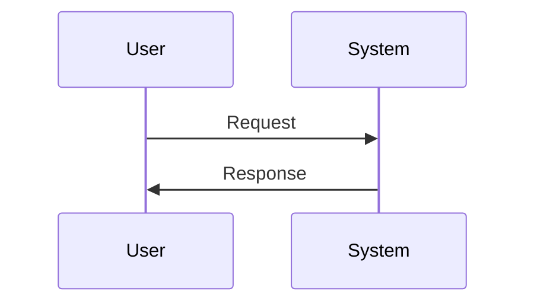
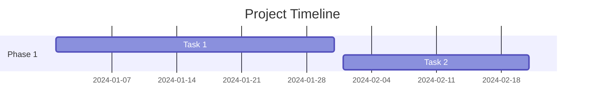
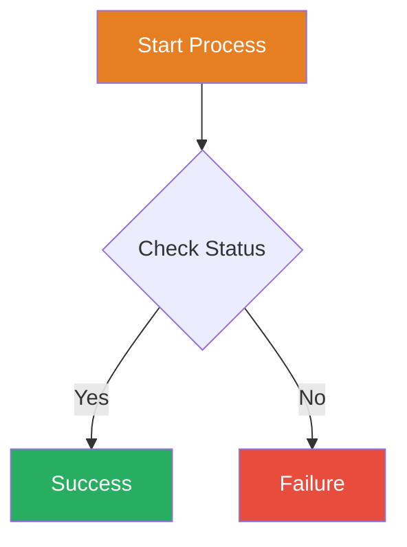

# Mermaid Diagram Test

This page tests if Mermaid diagrams are rendering correctly.

## Test 1: Simple Flowchart

## Test 2: Sequence Diagram

## Test 3: Gantt Chart

## Test 4: Flowchart with Styling

---

If you see rendered diagrams above, Mermaid is working correctly! ✅

If you see code blocks instead, Mermaid is not rendering. ❌
