# Hardware Development Framework: 4 Layers, 25 Disciplines
{: .no_toc }

How MetaForge's Orchestrator Agent Solves the Complete Hardware Product Lifecycle
{: .fs-6 .fw-300 }

## Table of Contents
{: .no_toc .text-delta }

1. TOC
{:toc}

---

## Overview

**Most hardware products fail not because of bad engineering, but because of missing business, operational, and sustainability layers.**

This document presents a **4-layer, 25-discipline framework** for complete hardware product development and demonstrates how MetaForge's orchestrator agent architecture addresses each discipline through specialist agents and tool integrations.

### The Complete Picture

```mermaid
flowchart TB
    subgraph Layer1["🔧 Layer 1: Core Engineering (12 disciplines)"]
        direction LR
        L1A[Product Definition]
        L1B[Industrial Design]
        L1C[Mechanical Engineering]
        L1D[Electronics Engineering]
        L1E[Embedded Software]
        L1F[Systems Engineering]
        L1G[Simulation & Validation]
        L1H[Prototyping]
        L1I[Testing & Reliability]
        L1J[Manufacturing]
        L1K[Certification]
        L1L[Lifecycle Support]
    end

    subgraph Layer2["💼 Layer 2: Productization & Business (5 disciplines)"]
        direction LR
        L2A[Product Management]
        L2B[Cost Engineering]
        L2C[Supplier Management]
        L2D[Operations Engineering]
        L2E[Quality Engineering]
    end

    subgraph Layer3["🚀 Layer 3: Deployment & Field Reality (4 disciplines)"]
        direction LR
        L3A[Field Engineering]
        L3B[Safety Engineering]
        L3C[Human Factors/UX]
        L3D[Reliability Engineering]
    end

    subgraph Layer4["♻️ Layer 4: Scale & Sustainability (4 disciplines)"]
        direction LR
        L4A[Regulatory Strategy]
        L4B[After-Sales Service]
        L4C[Data & Telemetry]
        L4D[End-of-Life]
    end

    Layer1 --> Layer2
    Layer2 --> Layer3
    Layer3 --> Layer4

    style Layer1 fill:#e3f2fd,stroke:#1976d2
    style Layer2 fill:#fff3e0,stroke:#f57c00
    style Layer3 fill:#e8f5e9,stroke:#388e3c
    style Layer4 fill:#f3e5f5,stroke:#9c27b0
```



### Why Most Startups Fail


**Key Insight**: 80% of failures happen outside Layer 1. Engineers build functional products that fail commercially, operationally, or economically.

---

## MetaForge's Solution: Orchestrator Agent Architecture

### How the Orchestrator Works

```mermaid
flowchart TB
    subgraph Human["👨‍💻 Human Input"]
        PRD[Product Requirements<br/>Document]
        Budget[Budget Constraints]
        Timeline[Timeline Goals]
    end

    subgraph Orchestrator["🎯 Orchestrator Agent"]
        Parse[Parse Requirements]
        Plan[Create Execution Plan]
        Coordinate[Coordinate Specialists]
        Validate[Validate Cross-Layer]
        Optimize[Optimize Tradeoffs]
    end

    subgraph Specialists["🤖 Specialist Agent Pool"]
        direction TB

        subgraph L1Agents["Layer 1: Engineering Agents"]
            A1[Product Spec<br/>Agent]
            A2[Industrial Design<br/>Agent]
            A3[Mechanical<br/>Agent]
            A4[Electronics<br/>Agent]
            A5[Firmware<br/>Agent]
            A6[Systems<br/>Agent]
            A7[Simulation<br/>Agent]
            A8[Prototyping<br/>Agent]
            A9[Testing<br/>Agent]
            A10[Manufacturing<br/>Agent]
            A11[Certification<br/>Agent]
            A12[Lifecycle<br/>Agent]
        end

        subgraph L2Agents["Layer 2: Business Agents"]
            B1[Product Mgmt<br/>Agent]
            B2[Cost Engineering<br/>Agent]
            B3[Supplier<br/>Agent]
            B4[Operations<br/>Agent]
            B5[Quality<br/>Agent]
        end

        subgraph L3Agents["Layer 3: Deployment Agents"]
            C1[Field Engineering<br/>Agent]
            C2[Safety<br/>Agent]
            C3[UX/Ergonomics<br/>Agent]
            C4[Reliability<br/>Agent]
        end

        subgraph L4Agents["Layer 4: Scale Agents"]
            D1[Regulatory<br/>Agent]
            D2[After-Sales<br/>Agent]
            D3[Telemetry<br/>Agent]
            D4[Sustainability<br/>Agent]
        end
    end

    subgraph Tools["🛠️ Tool Integrations"]
        CAD[CAD Tools<br/>KiCad, Fusion360]
        SIM[Simulation<br/>SPICE, Ansys]
        MFG[Manufacturing<br/>JLCPCB, Xometry]
        SUP[Suppliers<br/>Mouser, Digi-Key]
        TEST[Testing<br/>Lab Equipment]
        CERT[Certification<br/>FCC, CE, UL]
        DATA[Data Platforms<br/>Analytics, Fleet Mgmt]
    end

    subgraph Output["📦 Deliverables"]
        Design[Complete Design<br/>Package]
        Cost[Cost Model<br/>& BOM]
        Mfg[Manufacturing<br/>Files]
        Test[Test Plans<br/>& Reports]
        Docs[Documentation<br/>& Compliance]
        Product[🎯 Shipped<br/>Products]
    end

    PRD --> Parse
    Budget --> Parse
    Timeline --> Parse

    Parse --> Plan
    Plan --> Coordinate

    Coordinate --> L1Agents
    Coordinate --> L2Agents
    Coordinate --> L3Agents
    Coordinate --> L4Agents

    L1Agents --> Validate
    L2Agents --> Validate
    L3Agents --> Validate
    L4Agents --> Validate

    Validate --> Optimize
    Optimize --> Output

    L1Agents <--> Tools
    L2Agents <--> Tools
    L3Agents <--> Tools
    L4Agents <--> Tools

    style Orchestrator fill:#27ae60,color:#fff,stroke:#1e7e34,stroke-width:3px
    style Product fill:#e67e22,color:#fff,stroke:#d35400,stroke-width:3px
```



**Core Principle**: The orchestrator doesn't do everything itself. It coordinates 25+ specialist agents, each an expert in one discipline, ensuring they work together to deliver complete, manufacturable, commercially-viable products.

---

## Layer 1: Core Engineering (12 Disciplines)

### The Technical Creation Spine

These are the traditional engineering domains. MetaForge excels here but goes far beyond.

---

### 1. Product Definition

**What It Is**: Translating customer needs into technical requirements and specifications.

**Traditional Approach**:
- 1-2 weeks of requirements gathering
- Manual PRD creation in Google Docs
- Incomplete specifications lead to scope creep
- No validation against feasibility

**MetaForge Orchestrator Solution**:


**Agent Capabilities**:
- ✅ **Requirement extraction**: Natural language → structured specs
- ✅ **Completeness checking**: Identifies missing requirements
- ✅ **Feasibility analysis**: Validates against technical constraints
- ✅ **Assumption capture**: Documents implicit requirements
- ✅ **Trade-off analysis**: Cost vs. performance vs. timeline
- ✅ **Market context**: Compares against existing products

**Output Artifacts**:
```json
{
  "product_definition": {
    "core_functionality": [...],
    "performance_targets": {...},
    "constraints": {
      "electrical": {...},
      "mechanical": {...},
      "environmental": {...},
      "cost": {...}
    },
    "assumptions": [...],
    "open_questions": [...]
  }
}
```

**Time Saved**: 1-2 weeks → 15 minutes (99% reduction)

---

### 2. Industrial Design

**What It Is**: Form factor, aesthetics, ergonomics, and user-facing design.

**Traditional Approach**:
- Weeks of CAD modeling iterations
- Separate industrial designers ($100-200/hr)
- Disconnect between aesthetics and manufacturability
- Late discovery of ergonomic issues

**MetaForge Orchestrator Solution**:


**Agent Capabilities**:
- ✅ **Form factor generation**: 3D models from requirements
- ✅ **Ergonomic validation**: Hand size, grip analysis, accessibility
- ✅ **Aesthetic options**: Multiple design variants
- ✅ **Material selection**: Plastics, metals, composites
- ✅ **DFM-aware design**: Manufacturable from day one
- ✅ **Cost-conscious**: Balances aesthetics with budget

**Example Output** (Drone Controller):
```yaml
industrial_design:
  form_factor: "Handheld controller, 180x90x40mm"
  materials:
    body: "ABS plastic, matte finish"
    grips: "TPU overmold for comfort"
  ergonomics:
    grip_diameter: "32mm (5th-95th percentile hands)"
    button_placement: "Thumb-reach zone analysis"
    weight_distribution: "Center of gravity balanced"
  manufacturing:
    process: "Injection molding"
    tooling_cost: "$8,000 (amortized over 1000 units)"
  renders:
    - "front_view.png"
    - "ergonomic_analysis.png"
```

**Time Saved**: 2-3 weeks → 2 hours (98% reduction)

---

### 3. Mechanical Engineering

**What It Is**: Structural design, enclosures, mounting, thermal management, mechanical interfaces.

**Traditional Approach**:
- 2-4 weeks of CAD work
- Manual stress analysis
- Late thermal issues
- Tolerance stack-up errors

**MetaForge Orchestrator Solution**:


**Agent Capabilities**:
- ✅ **Enclosure generation**: Automated CAD from PCB dimensions
- ✅ **Structural validation**: FEA for stress, vibration, impact
- ✅ **Thermal simulation**: CFD for heat dissipation
- ✅ **Tolerance stack-up**: Automated worst-case analysis
- ✅ **Assembly planning**: DFA (Design for Assembly)
- ✅ **Bill of materials**: Mechanical parts list

**Example Workflow** (Drone Frame):
```yaml
mechanical_design:
  structure:
    material: "Carbon fiber, 3mm thickness"
    weight: "125g (frame only)"
    analysis:
      max_stress: "180 MPa (6x safety factor)"
      first_mode_frequency: "85 Hz (above prop frequency)"
  thermal:
    hotspot: "ESCs at 85°C max"
    cooling: "Passive, airflow from props"
  mounting:
    pcb_standoffs: "M3 x 8mm, vibration dampening"
    motor_mounts: "M3 x 6mm, thread-locked"
```

**Time Saved**: 2-4 weeks → 4 hours (97% reduction)

---

### 4. Electronics Engineering

**What It Is**: Schematic design, PCB layout, component selection, power integrity, signal integrity.

**Traditional Approach**:
- 2-3 weeks schematic design
- 1-2 weeks PCB layout
- Manual component selection (days)
- Late discovery of power/signal issues

**MetaForge Orchestrator Solution**:


**Agent Capabilities**:
- ✅ **Component selection**: Optimized for cost, availability, performance
- ✅ **Schematic generation**: From block diagrams to full schematics
- ✅ **PCB auto-routing**: Layer stack, impedance control, DRC-clean
- ✅ **Power integrity**: Voltage drop, decoupling, sequencing
- ✅ **Signal integrity**: Impedance matching, crosstalk, timing
- ✅ **EMI/EMC prediction**: Pre-compliance analysis
- ✅ **DFM validation**: Manufacturability checks before fab

**Example Orchestration** (Flight Controller):
```yaml
electronics:
  schematic:
    mcu: "STM32F405RGT6"
    imu: "ICM-42688-P (SPI, 32kHz)"
    power:
      input: "7-25V (3S-6S LiPo)"
      regulators:
        - "5V/3A (Buck) for peripherals"
        - "3.3V/1A (LDO) for MCU"
  pcb:
    layers: 4
    stackup: "Sig-GND-PWR-Sig"
    impedance: "50Ω differential for USB"
    dimensions: "36x36mm"
  validation:
    erc_errors: 0
    drc_errors: 0
    power_budget: "1.2A @ 5V (within spec)"
    si_analysis: "All signals <10% overshoot"
  bom_cost: "$18.50 @ 100 units"
```

**Time Saved**: 3-5 weeks → 6 hours (96% reduction)

---

### 5. Embedded Software/Firmware

**What It Is**: Low-level code, drivers, RTOS, application logic.

**Traditional Approach**:
- 2-4 weeks driver development
- Manual register configuration
- Debug via trial-and-error
- No test coverage

**MetaForge Orchestrator Solution**:


**Agent Capabilities**:
- ✅ **Architecture design**: Task breakdown, RTOS configuration
- ✅ **Driver generation**: I2C, SPI, UART, PWM from pinout
- ✅ **HAL abstraction**: Portable, testable code
- ✅ **Application scaffolding**: State machines, event handling
- ✅ **Unit test generation**: 80%+ coverage
- ✅ **Simulation**: Virtual hardware testing
- ✅ **Documentation**: API docs, architecture diagrams

**Example Output** (Drone Firmware):
```c
// Auto-generated from hardware description
firmware/
├── src/
│   ├── main.c
│   ├── drivers/
│   │   ├── icm42688.c      // IMU driver
│   │   ├── pwm_motors.c    // ESC control
│   │   └── sbus_receiver.c // RC input
│   ├── tasks/
│   │   ├── attitude_control.c
│   │   ├── sensor_fusion.c
│   │   └── telemetry.c
│   └── hal/
│       └── stm32f4_hal.c
├── tests/
│   ├── test_imu.c
│   └── test_pid.c
└── docs/
    └── architecture.md
```

**Firmware Completeness**: 90%+ ready to compile and test

**Time Saved**: 2-4 weeks → 1 hour (98% reduction)

---

### 6. Systems Engineering

**What It Is**: Integration of subsystems, interfaces, requirements traceability, V&V.

**Traditional Approach**:
- Spreadsheets for requirements tracking
- Manual interface definitions
- Late integration issues
- No formal V&V

**MetaForge Orchestrator Solution**:


**Agent Capabilities**:
- ✅ **Functional decomposition**: Break down system into subsystems
- ✅ **Interface definition**: APIs, protocols, connectors
- ✅ **Requirements traceability**: Every requirement → implementation → test
- ✅ **Integration planning**: Subsystem bring-up sequence
- ✅ **V&V planning**: Verification and validation strategy
- ✅ **Risk analysis**: FMEA, fault trees

**Example** (Drone System):
```yaml
systems_engineering:
  subsystems:
    - name: "Flight Control"
      interfaces: ["IMU_SPI", "ESC_PWM", "RC_SBUS"]
    - name: "Power Management"
      interfaces: ["VBAT_ADC", "5V_RAIL", "3V3_RAIL"]
    - name: "Communication"
      interfaces: ["TELEM_UART", "GPS_UART"]

  traceability:
    REQ-001 "Stabilize within 2 seconds":
      implementation: "attitude_control.c:pid_loop()"
      verification: "test_plan.md:TC-012"

  integration_sequence:
    1: "Power-on test (no props)"
    2: "IMU calibration"
    3: "Motor spin test (props off)"
    4: "RC input validation"
    5: "Attitude control (test stand)"
    6: "First flight (stabilize mode)"
```

**Time Saved**: Manual tracking eliminated, continuous validation

---

### 7-12. Simulation, Prototyping, Testing, Manufacturing, Certification, Lifecycle

**(Condensed for brevity - each follows similar orchestrator pattern)**

| Discipline | Agent Capabilities | Time Saved |
|------------|-------------------|------------|
| **Simulation & Validation** | SPICE, FEA, CFD, flight sim, virtual prototyping | 1-2 weeks → 2 hours |
| **Prototyping & Fabrication** | Gerber generation, pick & place, assembly docs | 3-4 weeks → 3 days (fab time) |
| **Testing & Reliability** | Test plan generation, FMEA, HALT/HASS planning | 1-2 weeks → 4 hours |
| **Manufacturing & Supply Chain** | DFM checks, supplier coordination, order automation | 1-2 weeks → 1 day |
| **Certification & Compliance** | FCC/CE/UL documentation, test lab booking | 2-4 weeks → 3 days |
| **Lifecycle Support** | Maintenance docs, repair procedures, spare parts planning | 1 week → 4 hours |

---

## Layer 2: Productization & Business (5 Disciplines)

### Why Most Robotics Startups Fail Here

**Critical Gap**: Engineering teams build functional products that are commercially unviable.

---

### 13. Product Management

**What It Is**: Feature prioritization, roadmapping, market alignment, versioning.

**Traditional Approach**:
- Product managers ($120K+ salaries)
- Quarterly roadmap planning
- Manual feature prioritization
- Disconnect from engineering reality

**MetaForge Orchestrator Solution**:


**Agent Capabilities**:
- ✅ **Feature extraction**: From customer feedback, market research
- ✅ **Priority scoring**: Impact vs. effort matrix
- ✅ **Roadmap generation**: MVP → v1.0 → future versions
- ✅ **Cost-benefit analysis**: ROI for each feature
- ✅ **Market positioning**: Competitive differentiation
- ✅ **Version planning**: Hardware revision strategy

**Example Output**:
```yaml
product_roadmap:
  mvp_v0.1:
    features:
      - "Basic stabilization (angle mode)"
      - "4-channel RC control"
      - "Battery monitoring"
    cost_target: "$50 BOM"
    timeline: "6 weeks"

  v1.0:
    features:
      - "+ GPS hold"
      - "+ Return to home"
      - "+ Telemetry (915MHz)"
    cost_target: "$65 BOM"
    timeline: "+8 weeks"

  market_positioning:
    segment: "DIY racing drones"
    differentiation: "Open-source, <$100 total cost"
    competitors: ["Betaflight F4", "KISS FC"]
```

**Value**: Ensures you build what customers will buy, not just what engineers think is cool.

---

### 14. Cost Engineering

**What It Is**: Target costing, margin modeling, should-cost analysis, value engineering.

**Traditional Approach**:
- Spreadsheet hell
- Late discovery of cost overruns
- No systematic cost reduction
- Margin erosion post-launch

**MetaForge Orchestrator Solution**:


**Agent Capabilities**:
- ✅ **Should-cost analysis**: Component-by-component cost modeling
- ✅ **Margin calculation**: At different volumes (1, 10, 100, 1K, 10K units)
- ✅ **Cost reduction recommendations**: Alternative components, processes
- ✅ **Sensitivity analysis**: Impact of volume, material costs
- ✅ **Value engineering**: Remove cost without removing value
- ✅ **Break-even analysis**: When does product become profitable

**Example Report** (Drone FC):
```yaml
cost_engineering:
  target:
    retail_price: "$99"
    target_margin: "40%"
    max_bom_cost: "$35"

  current_bom:
    total: "$42.50 @ 100 units"
    breakdown:
      mcu: "$3.20"
      imu: "$2.80"
      pcb: "$8.00"
      components: "$12.50"
      assembly: "$16.00"

  cost_reduction_opportunities:
    - action: "Switch to ICM-20602 IMU"
      savings: "$1.50"
      risk: "Lower performance (6-axis vs 9-axis)"

    - action: "Increase volume to 500 units"
      savings: "$6.00 (PCB + assembly)"
      requirement: "Need pre-orders"

    - action: "Remove GPS connector"
      savings: "$0.80"
      impact: "v1.0 feature delay"

  recommendation:
    path: "Launch MVP at 100 units, optimize for v1.0"
    projected_bom_v1: "$34.00 @ 500 units"
    margin_v1: "42%"
```

**Value**: Prevents building products that can't hit margin targets.

---

### 15-17. Supplier, Operations, Quality

| Discipline | Agent Capabilities | Business Impact |
|------------|-------------------|-----------------|
| **Supplier & Vendor Management** | Contract negotiation, dual sourcing, quality audits | Avoid supply chain disasters |
| **Operations Engineering** | Assembly line planning, service workflows, spare parts | Smooth production ramp |
| **Quality Engineering** | QA systems, incoming inspection, CAPA | Reduce field failures |

---

## Layer 3: Deployment & Field Reality (4 Disciplines)

### Critical for Robotics/Drones/Physical Products

---

### 18. Field Engineering

**What It Is**: On-site deployment, installation, calibration, commissioning.

**Traditional Approach**:
- Field engineers at $150/day + travel
- Manual calibration (hours per unit)
- Tribal knowledge for troubleshooting
- Customer frustration with setup

**MetaForge Orchestrator Solution**:


**Agent Capabilities**:
- ✅ **Deployment procedures**: Step-by-step installation guides
- ✅ **Calibration automation**: Scripts, tools, wizards
- ✅ **Troubleshooting trees**: Diagnostic flowcharts
- ✅ **Remote diagnostics**: Telemetry-based problem detection
- ✅ **Training materials**: Videos, manuals, quick-start guides
- ✅ **Field test procedures**: Acceptance criteria

**Example** (Drone Deployment):
```yaml
field_engineering:
  installation:
    1: "Unpack and inspect for shipping damage"
    2: "Install propellers (check rotation direction)"
    3: "Connect battery (verify voltage 11.1-12.6V)"
    4: "Power on (LED should blink green)"

  calibration:
    auto_script: "calibrate.py"
    steps:
      - "IMU level calibration (30s)"
      - "ESC throttle range (15s)"
      - "Compass calibration (45s)"
      - "RC transmitter binding (60s)"
    total_time: "3 minutes (automated)"

  troubleshooting:
    "LED blinking red":
      - "Check: Battery voltage >11V"
      - "Check: IMU calibration valid"
      - "Action: Re-run calibration"
    "Motors not spinning":
      - "Check: ESCs connected correctly"
      - "Check: RC transmitter bound"
      - "Action: Run motor test sequence"
```

**Value**: Reduces field support costs, improves customer experience.

---

### 19. Safety Engineering

**What It Is**: Functional safety, hazard analysis, human-robot interaction safety.

**Massive for Drones/Robotics**

**Traditional Approach**:
- Reactive (fix after incidents)
- No formal FMEA
- Liability exposure
- Certification failures

**MetaForge Orchestrator Solution**:


**Agent Capabilities**:
- ✅ **Hazard identification**: Proactive risk assessment
- ✅ **FMEA generation**: Failure modes and effects analysis
- ✅ **Mitigation strategies**: Redundancy, watchdogs, fail-safes
- ✅ **Functional safety**: SIL/ASIL compliance
- ✅ **Standards mapping**: IEC 61508, ISO 13849, DO-178C
- ✅ **Safety case**: Documentation for certification

**Example** (Drone Safety):
```yaml
safety_engineering:
  hazards:
    - id: "HAZ-001"
      hazard: "Propeller strike"
      severity: "Critical (injury)"
      mitigation:
        - "Prop guards (physical)"
        - "Low-battery failsafe (RTH)"
        - "Out-of-range failsafe (land)"

    - id: "HAZ-002"
      hazard: "Flyaway (loss of control)"
      severity: "High (property damage)"
      mitigation:
        - "GPS geofence"
        - "RC link loss detection"
        - "Automatic return-to-home"

  fmea:
    "IMU failure":
      failure_mode: "Incorrect attitude estimate"
      effect: "Loss of control, crash"
      detection: "IMU self-test at startup"
      mitigation: "Dual IMU with voting"
      severity: 9
      occurrence: 2
      detection: 3
      rpn: 54

  functional_safety:
    safety_function: "Emergency stop"
    sil_target: "SIL 2"
    implementation: "Hardware kill switch + software watchdog"
```

**Value**: Prevents injuries, lawsuits, certification failures. **Essential for commercial drones.**

---

### 20-21. Human Factors, Reliability

| Discipline | Agent Capabilities | Impact |
|------------|-------------------|--------|
| **Human Factors/UX** | Operator usability, ergonomics, training design | User satisfaction |
| **Advanced Reliability** | MTBF modeling, failure prediction, derating | Warranty costs |

---

## Layer 4: Scale & Business Sustainability (4 Disciplines)

### Often Ignored by Engineers, Critical for Success

---

### 22. Regulatory Strategy

**What It Is**: Market entry sequencing, country-specific rules, export controls.

**Traditional Approach**:
- Discover regulations late
- Country-by-country certification ($50K+ each)
- Blocked shipments, recalls
- Export control violations

**MetaForge Orchestrator Solution**:


**Agent Capabilities**:
- ✅ **Regulation identification**: FCC, CE, UL, ISED, TELEC, etc.
- ✅ **Compliance roadmap**: Tests, documentation, timelines
- ✅ **Market sequencing**: Easiest → hardest markets
- ✅ **Export control**: ITAR, EAR, dual-use technology
- ✅ **Test lab coordination**: Booking, sample prep
- ✅ **Documentation generation**: Technical files, DoCs

**Example** (Drone Market Entry):
```yaml
regulatory_strategy:
  target_markets:
    - "USA (FCC Part 15, FAA Part 107)"
    - "EU (CE RED, EU Drone Regulation)"
    - "Canada (ISED)"
    - "Japan (TELEC, Aviation Law)"

  market_entry_sequence:
    phase_1_usa:
      regulations:
        - "FCC Part 15 (intentional radiator)"
        - "FAA Part 107 (commercial drone)"
      tests:
        - "FCC emissions testing"
        - "Remote ID compliance"
      timeline: "3 months"
      cost: "$12,000"

    phase_2_eu:
      regulations:
        - "CE RED (radio equipment)"
        - "EU Regulation 2019/945 (C1 class drone)"
      tests:
        - "EMC testing"
        - "GEO-fencing"
      timeline: "+4 months"
      cost: "$18,000"

  export_controls:
    classification: "EAR99 (not controlled)"
    itar: "Not applicable"
    notes: "Flight controller w/o encryption"
```

**Value**: Avoid $50K+ in blocked shipments, recalls, fines.

---

### 23-25. After-Sales, Telemetry, End-of-Life

| Discipline | Agent Capabilities | Long-term Value |
|------------|-------------------|-----------------|
| **After-Sales & Service** | Warranty models, repair networks, RMA processes | Customer retention, revenue |
| **Data & Telemetry** | Fleet monitoring, OTA updates, predictive maintenance | Product improvement, upsell |
| **End-of-Life & Sustainability** | Recycling programs, battery disposal, environmental compliance | Brand reputation, regulations |

---

## Complete Orchestration Example: Drone Flight Controller

### End-to-End: All 25 Disciplines in Action


**Total Timeline**: 3 weeks (vs. 6-8 weeks traditional)

**Key Orchestration Points**:
1. **Parallel execution**: Layer 1-4 agents work concurrently
2. **Dependency management**: Systems eng waits for electronics, etc.
3. **Cross-layer validation**: Cost eng validates mech+elec choices
4. **Iterative refinement**: Safety findings → design changes
5. **Holistic optimization**: All 25 disciplines informed final design

---

## How the Orchestrator Coordinates

### Decision-Making Across Layers

**Example Scenario**: Cost vs. Safety Tradeoff

```mermaid
sequenceDiagram
    participant O as Orchestrator
    participant Cost as Cost Engineering Agent
    participant Safety as Safety Engineering Agent
    participant Elec as Electronics Agent
    participant PM as Product Management Agent

    O->>Cost: Check BOM cost
    Cost-->>O: $42.50 (over $35 target)

    O->>Cost: Recommend cost reductions
    Cost-->>O: "Remove dual IMU, save $2.80"

    O->>Safety: Evaluate dual IMU removal
    Safety-->>O: "RPN increases 54→162 (unacceptable)"

    O->>PM: Business decision needed
    PM-->>O: "Safety > cost for drone"

    O->>Elec: Find alternative cost reduction
    Elec-->>O: "Use cheaper connector, save $1.20"

    O->>Safety: Validate connector change
    Safety-->>O: "No safety impact"

    O->>Cost: Recompute BOM
    Cost-->>O: "$41.30 (closer to target)"

    O->>PM: Accept tradeoff?
    PM-->>O: "Approved - optimize in v1.0"

    Note over O: Orchestrator maintains<br/>25-discipline view
```



**Key Orchestration Capabilities**:
- ✅ **Cross-layer awareness**: Cost agent knows safety constraints
- ✅ **Conflict resolution**: Automated negotiation between agents
- ✅ **Escalation**: Flags decisions needing human input
- ✅ **Traceability**: Every decision logged with rationale
- ✅ **Learning**: Improves from past projects

---

## Implementation Roadmap

### Phase 1 (v0.1-0.3): Layer 1 Focus

**Agents Implemented**:
- Product Definition
- Electronics Engineering
- Embedded Software
- Simulation
- Manufacturing Prep
- Cost Engineering (basic)

**Deliverable**: Functional hardware designs with validated BOMs

---

### Phase 2 (v0.4-0.6): Add Layers 2-3

**New Agents**:
- Product Management
- Supplier Management
- Field Engineering
- Safety Engineering
- Quality Engineering

**Deliverable**: Commercially viable, deployable products

---

### Phase 3 (v0.7-1.0): Complete All 25 Disciplines

**Final Agents**:
- Regulatory Strategy
- After-Sales
- Telemetry
- Sustainability
- Advanced Reliability

**Deliverable**: End-to-end autonomous product development platform

---

## Conclusion: Why This Framework Matters

### The 80/20 Rule of Hardware Failure


**Traditional tools only address Layer 1 (20% of failures).**

**MetaForge addresses all 25 disciplines (100% of failure modes).**

### The Orchestrator Advantage

**Single-agent AI**: "Design me a drone"
- Result: Functional prototype, commercial failure

**MetaForge Orchestrator**: "Build me a commercially-viable drone product"
- Result:
  - ✅ Functional design (Layer 1)
  - ✅ Profitable at scale (Layer 2)
  - ✅ Safely deployable (Layer 3)
  - ✅ Regulatory compliant (Layer 4)
  - ✅ **Ships and sells successfully**

---

## Next Steps

- [View Full Architecture](../architecture/) - System design details
- [Agent Development](../agents/) - Build custom agents
- [Tool Integrations](../tools/) - Connect external tools
- [Example Projects](../examples/) - Complete worked examples

---

**MetaForge: From Intent to Shipped Hardware Products**

*Built with conviction that hardware development deserves a complete solution, not just another CAD tool.*

[← Back to Research](./index.md) • [Home →](../index.md)
