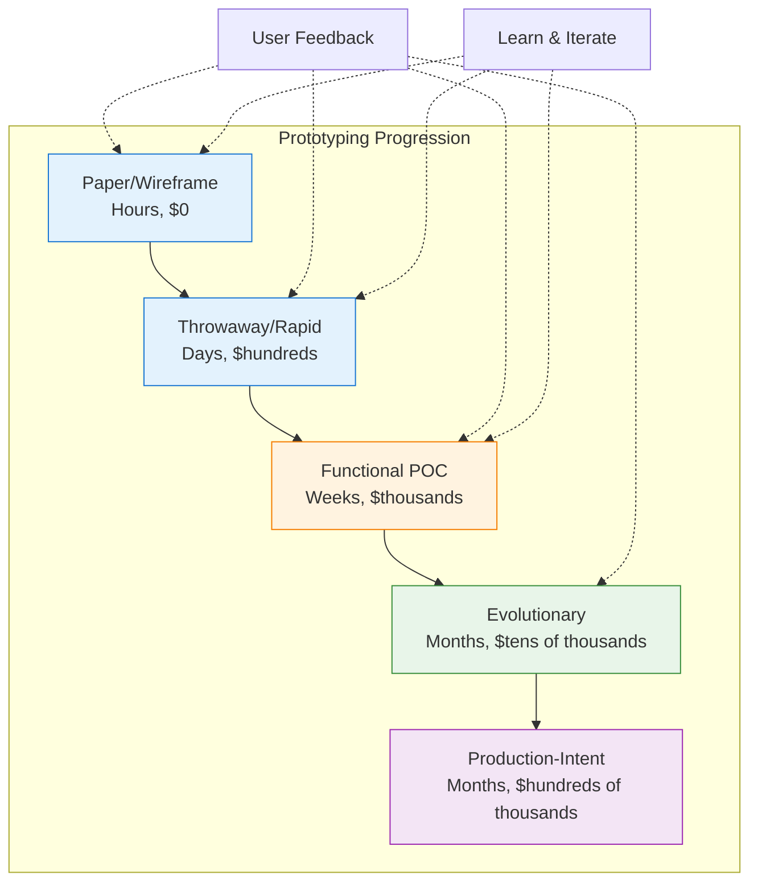
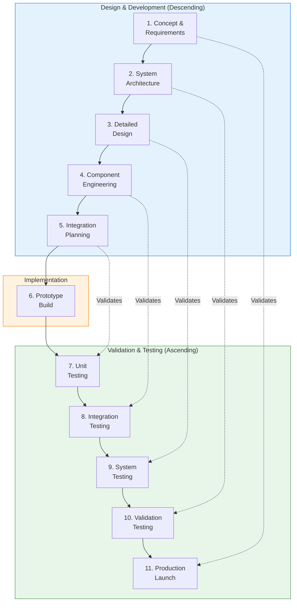
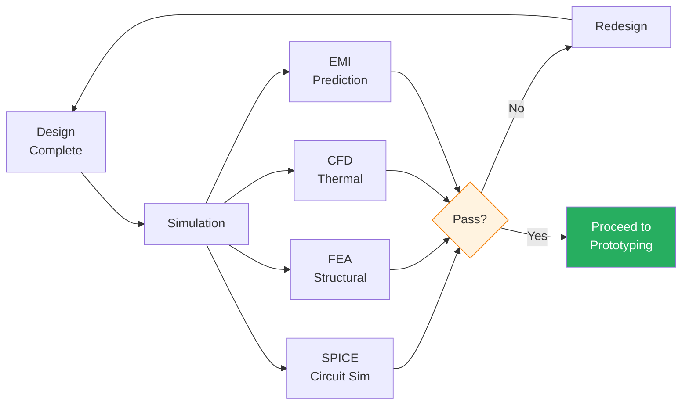
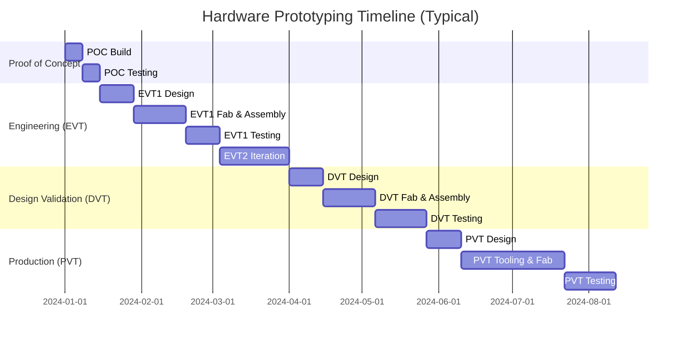
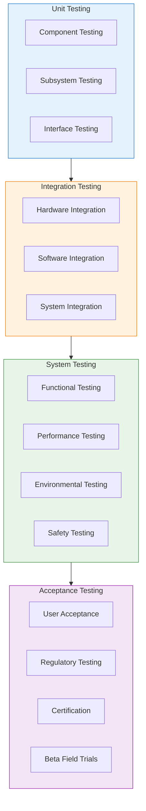
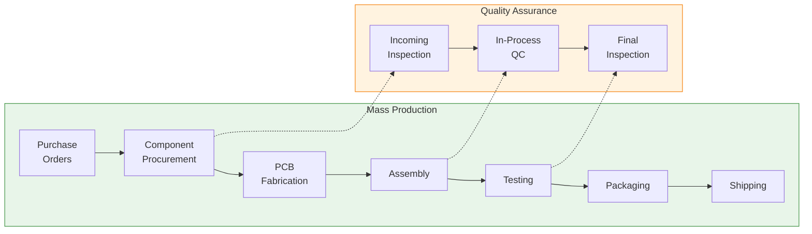
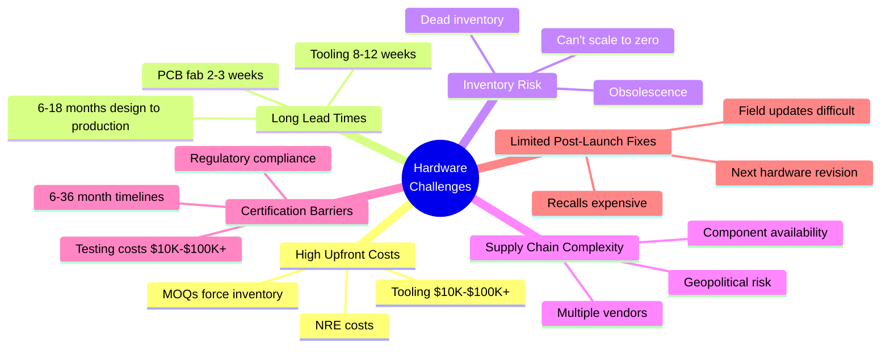
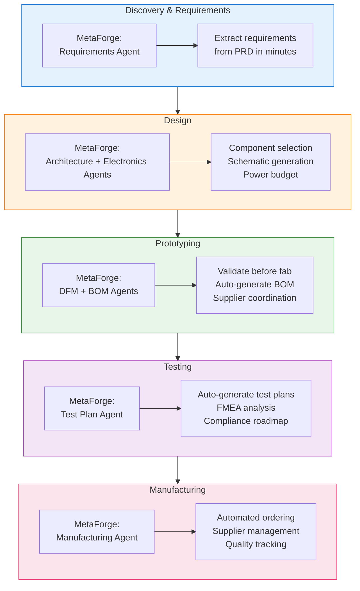
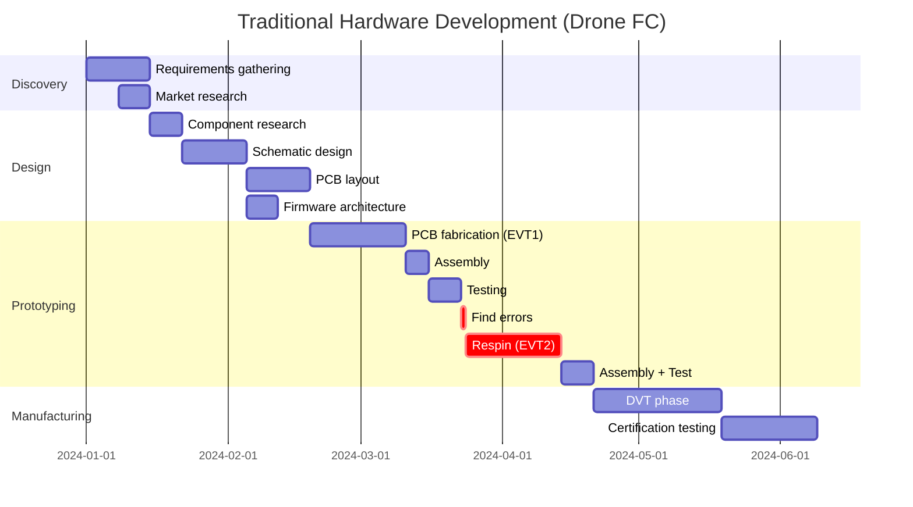
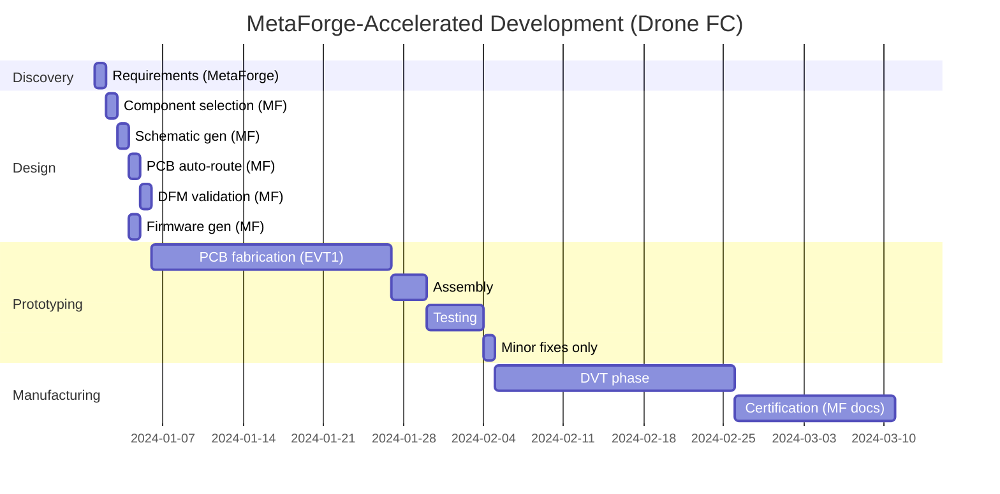

# Hardware Prototyping & Development Phases
{: .no_toc }

Understanding early prototyping for requirement discovery and the typical development phases in hardware vs. software
{: .fs-6 .fw-300 }

## Table of Contents
{: .no_toc .text-delta }

1. TOC
{:toc}

---

## Overview

Early prototyping for requirement discovery is an iterative approach where you build simplified versions of a system to uncover and validate requirements before full-scale development. Unlike software, hardware prototyping involves physical constraints, manufacturing costs, and significantly longer iteration cycles.

**Key Principle**: Build just enough to learn, validate assumptions early, and fail fast if needed—but in hardware, "fast" is measured in weeks, not hours.

---

## Early Prototyping for Requirement Discovery

### Purpose

Early prototyping serves several critical functions in hardware development:

- **Validate assumptions** with stakeholders and users before committing to expensive tooling
- **Uncover hidden requirements** that emerge only when users interact with physical prototypes
- **Test feasibility** of technical approaches before investing in full development
- **Reduce risk** of building the wrong thing and discovering it after $50K in tooling costs
- **Get early feedback** on UX/UI, form factor, and ergonomics

### Types of Prototypes



#### 1. Paper/Wireframe Prototypes
- **Timeline**: Hours to days
- **Cost**: Essentially free
- **Purpose**: Form factor exploration, UI layout
- **Examples**: Sketches, cardboard mockups, foam models
- **Throwaway**: Yes

#### 2. Throwaway/Rapid Prototypes
- **Timeline**: Days to 1 week
- **Cost**: $hundreds
- **Purpose**: Quick validation of concepts, then discarded
- **Examples**: Breadboard circuits, 3D printed enclosures, off-the-shelf modules
- **Throwaway**: Yes
- **Tools**: Arduino, Raspberry Pi, 3D printers

#### 3. Interactive/Functional Prototypes
- **Timeline**: 1-3 weeks
- **Cost**: $thousands
- **Purpose**: Clickable mockups, working but limited feature set
- **Examples**: Custom PCBs, functional firmware, working mechanical assemblies
- **Throwaway**: Maybe
- **Tools**: PCB fab services (JLCPCB, PCBWay), CNC machining

#### 4. Evolutionary Prototypes
- **Timeline**: Months
- **Cost**: $tens of thousands
- **Purpose**: Incrementally refined into final product
- **Examples**: EVT, DVT prototypes with custom components
- **Throwaway**: No - evolves to production
- **Iterations**: 3-5 rounds typical

#### 5. Production-Intent Prototypes
- **Timeline**: Months
- **Cost**: $hundreds of thousands
- **Purpose**: Final validation before mass production
- **Examples**: PVT units using production tooling
- **Throwaway**: No - becomes production
- **Critical**: Manufacturing process validation

---

## Hardware Development Phases

### Overview: The Hardware V-Model



---

## Phase 1: Discovery & Requirements Gathering

### What Happens

- Stakeholder interviews and user research
- Market research and competitive analysis
- Problem space exploration
- **Early prototyping happens here** - paper mockups, foam models
- Initial feasibility studies

### Typical Duration
- **Simple products**: 1-2 weeks
- **Complex products**: 4-8 weeks
- **Medical/Automotive**: 3-6 months (regulatory considerations)

### Key Deliverables

```yaml
deliverables:
  - Product Requirements Document (PRD)
  - User personas and use cases
  - Market analysis report
  - Preliminary feasibility study
  - Concept sketches and mockups
  - Initial cost targets
  - Success criteria definition
```

### Hardware-Specific Considerations

- **Physical constraints**: Size, weight, power, thermal
- **Environmental requirements**: Temperature, humidity, shock, vibration
- **Regulatory landscape**: FCC, CE, UL, FDA, automotive standards
- **Manufacturing constraints**: MOQ, tooling costs, lead times
- **Cost targets**: BOM cost, NRE (non-recurring engineering), manufacturing cost

---

## Phase 2: Design

### Mechanical Design
- Industrial design (aesthetics, ergonomics)
- CAD modeling (SolidWorks, Fusion 360)
- Material selection
- Thermal analysis (CFD simulation)
- Structural analysis (FEA)
- DFM (Design for Manufacturing) review

**Timeline**: 2-6 weeks for simple products, 3-6 months for complex

### Electrical Design
- System architecture
- Schematic design (KiCad, Altium)
- Component selection
- Power budget analysis
- Signal integrity planning
- PCB stackup planning

**Timeline**: 2-4 weeks for simple, 2-4 months for complex

### Embedded Software Design
- Software architecture
- RTOS selection
- Driver requirements
- Communication protocols
- State machine design
- Memory budgeting

**Timeline**: 1-3 weeks for architecture planning

### Design Validation



---

## Phase 3: Prototyping Stages (Critical in Hardware)

### The Prototyping Gauntlet



### a) Proof of Concept (POC)

**Purpose**: Validate core technical feasibility

```yaml
characteristics:
  timeline: "1-2 weeks"
  cost: "$hundreds to $low thousands"
  appearance: "Ugly but functional"
  components:
    - Breadboard circuits
    - Off-the-shelf modules (Arduino, breakout boards)
    - 3D printed enclosures
    - Hand-wired connections
  validation:
    - Core functionality works
    - Key technical risks addressed
    - Proof that physics allows it
```

**Example** (Drone POC):
- STM32 Nucleo board + MPU6050 on breadboard
- Basic PID loop running
- Motors spin, responds to RC input
- No case, just wires everywhere
- **Result**: "Yes, we can build a flight controller"

---

### b) Engineering Validation (EVT)

**Purpose**: First "real" prototype with custom designs

```yaml
characteristics:
  timeline: "6-10 weeks per iteration"
  iterations: "2-5 rounds typical"
  cost: "$thousands to $tens of thousands"
  components:
    - Custom PCBs (from fab house)
    - 3D printed or CNC machined enclosures
    - Production-intent components
    - Professional assembly
  validation:
    - Functionality and basic integration
    - Component selection validated
    - Power budget confirmed
    - Firmware development platform
    - Design issues discovered and fixed
```

**Common EVT Iterations**:
1. **EVT1**: First custom PCB - expect 50% chance of major issues
2. **EVT2**: Fix EVT1 mistakes - power supply, pin conflicts, footprints
3. **EVT3**: Final electrical validation - all features working

**Cost Breakdown** (Drone FC EVT):
```
PCB fabrication (50 units):  $1,200
Components (50 units):        $2,500
Assembly (contract mfg):      $1,800
Enclosure (3D print):         $300
Engineering time:             $15,000 (3 weeks @ $5K/week)
────────────────────────────
Total EVT phase:              $20,800
```

---

### c) Design Validation Test (DVT)

**Purpose**: Validate manufacturability and design margins

```yaml
characteristics:
  timeline: "8-12 weeks"
  cost: "$tens of thousands"
  components:
    - Production-intent PCBs
    - Injection molded enclosures (soft tooling)
    - Full electrical/mechanical integration
    - Manufacturing process validation
  validation:
    - Design for Manufacturing (DFM)
    - Design for Assembly (DFA)
    - Reliability testing (HALT/HASS)
    - Environmental testing
    - Certification testing (FCC, CE)
    - Vendor/supplier qualification
```

**Testing Regimen**:
- **Environmental**: -20°C to +60°C, 95% humidity
- **Mechanical**: Drop test (1.5m), vibration (MIL-STD-810)
- **Electrical**: EMI/EMC, ESD, power supply transients
- **Reliability**: MTBF validation, burn-in testing
- **User**: Beta units with real users

**Key Question**: "Can we manufacture this at scale?"

---

### d) Production Validation Test (PVT)

**Purpose**: Final pre-production validation using actual production tooling

```yaml
characteristics:
  timeline: "12-16 weeks"
  cost: "$hundreds of thousands"
  components:
    - Production tooling (injection molds)
    - Production PCB fab (same vendor as mass production)
    - Full production line setup
    - Production assembly process
    - Final firmware
  validation:
    - Manufacturing yield targets met
    - Quality control procedures validated
    - Production line throughput validated
    - Final regulatory approvals
    - Pilot production run (100-1000 units)
```

**No More Design Changes**: PVT is the point of no return. Changes after this require new tooling = $10K-100K+.

---

## Phase 4: Testing & Validation

### Multi-Level Testing Strategy



### Environmental Testing

**What Gets Tested**:
- **Temperature**: Operating range, storage range, thermal cycling
- **Humidity**: Condensing and non-condensing
- **Vibration**: Sine sweep, random vibration (MIL-STD-810)
- **Shock**: Drop test, impact
- **Salt fog**: Corrosion resistance (for outdoor products)
- **Altitude**: Low pressure testing (for aviation)

**Duration**: 2-4 weeks

### Reliability Testing

**Methods**:
- **HALT** (Highly Accelerated Life Test): Find failure modes quickly
- **HASS** (Highly Accelerated Stress Screening): Screen manufacturing defects
- **Burn-in**: Extended operation at elevated temperature
- **Life testing**: Continuous operation to estimate MTBF

**Duration**: 4-8 weeks minimum

### Regulatory/Certification Testing

**Common Standards**:

| Standard | Product Type | Cost | Duration |
|----------|-------------|------|----------|
| **FCC Part 15** | Unintentional radiators (most electronics) | $5K-15K | 2-4 weeks |
| **FCC Part 18** | Intentional radiators (wireless) | $10K-30K | 4-8 weeks |
| **CE (RED)** | Radio equipment (EU) | $15K-25K | 4-8 weeks |
| **UL/CSA** | Safety certification | $10K-50K | 8-16 weeks |
| **FDA 510(k)** | Medical devices | $50K-200K | 6-12 months |
| **ISO 26262** | Automotive functional safety | $100K-1M+ | 12-36 months |

---

## Phase 5: Manufacturing Ramp

### Pilot Production

**Purpose**: Validate manufacturing process before mass production

```yaml
characteristics:
  quantity: "100-1,000 units"
  timeline: "4-8 weeks"
  purpose:
    - Manufacturing process optimization
    - Supplier qualification
    - Quality control procedure validation
    - Production yield verification
    - Assembly line training
  key_metrics:
    - First-pass yield (target: >95%)
    - Assembly time per unit
    - Test coverage
    - Defect rates by type
```

### Manufacturing Process Optimization

**What Gets Optimized**:
1. **PCB Assembly**:
   - Pick-and-place programming
   - Solder paste stencil optimization
   - Reflow profile tuning
   - AOI (Automated Optical Inspection) programming

2. **Mechanical Assembly**:
   - Assembly sequence optimization
   - Fixture and tooling design
   - Torque specifications
   - Assembly time reduction

3. **Testing**:
   - Functional test fixtures
   - Test coverage validation
   - Test time optimization
   - Calibration procedures

4. **Quality Control**:
   - Incoming inspection criteria
   - In-process inspection points
   - Final inspection checklist
   - Failure mode tracking

**Duration**: 6-12 weeks

---

## Phase 6: Mass Production

### Production Scaling



### Supply Chain Management

**Critical Activities**:
- Component procurement (MOQ, lead times)
- Inventory management
- Vendor management and audits
- Cost reduction (value engineering)
- Alternate sourcing (dual sources)
- Component lifecycle management (EOL tracking)

### Quality Assurance

**Ongoing Activities**:
- Statistical Process Control (SPC)
- CAPA (Corrective and Preventive Action)
- Continuous improvement
- Supplier quality audits
- Field failure analysis

---

## Phase 7: Support & Iteration

### Post-Launch Activities

```yaml
ongoing_support:
  warranty_management:
    - RMA (Return Merchandise Authorization) process
    - Failure analysis
    - Repair vs. replace decisions
    - Warranty cost tracking

  field_failures:
    - Failure mode tracking
    - Root cause analysis
    - Design changes for next revision
    - Field retrofits if needed

  product_iterations:
    - Rev B design improvements
    - Cost reduction initiatives
    - Feature additions
    - Obsolescence management
```

**Limited Ability to Fix**: Unlike software, you can't push an update to fix mechanical or electrical issues. Field failures may require:
- Product recalls ($$$)
- Repair programs
- Next hardware revision (Rev B, Rev C)
- Component changes (if backward compatible)

---

## Key Differences: Hardware vs. Software

### Comparison Table

| Aspect | Software | Hardware |
|--------|----------|----------|
| **Iteration Speed** | Hours to days | Weeks to months |
| **Cost per Iteration** | Near zero | $thousands to $millions |
| **Reversibility** | Easy rollback (`git revert`) | Physical units can't be "unbuilt" |
| **Testing** | Automated unit/integration tests | Physical testing + destruction |
| **Distribution** | Instant updates (OTA) | Physical shipping, recalls expensive |
| **Mistakes** | Fixable with patches | May require recall or new production run |
| **Prototyping** | Runs on any computer | Requires fabrication, assembly |
| **Scale** | Deploy to millions instantly | Manufacturing ramp, supply chain |
| **Validation** | Compile-time, runtime errors | After $10K-100K spent on prototypes |
| **Knowledge Capture** | Code comments, Git history | Scattered across tools, tribal |
| **Parallelization** | Easy (spin up more servers) | Physical constraints limit |

---

## The "Hardware is Hard" Problem

### Why Hardware Development is Fundamentally Different



### Quantified Impact

**Time Multipliers vs. Software**:
- **Simple changes**: 100-1000x slower (weeks vs. minutes)
- **Component swaps**: 6-8 weeks (respin) vs. seconds (dependency update)
- **Bug fixes**: May require hardware revision vs. hotfix patch
- **Testing**: Weeks of physical testing vs. minutes of CI/CD

**Cost Multipliers**:
- **First prototype**: $thousands vs. $0 (software runs on dev machine)
- **Iteration**: $thousands per round vs. $0
- **Manufacturing setup**: $10K-$100K+ tooling vs. $0
- **Distribution**: $5-50/unit shipping vs. $0 (digital download)

---

## Modern Approaches to Accelerate Hardware

### Rapid Prototyping Services

**PCB Fabrication**:
- **JLCPCB, PCBWay**: 2-3 day PCBs, $2-5 for simple boards
- **Assembly services**: Pick-and-place + reflow for $0.10-0.50/joint
- **On-demand manufacturing**: No MOQ for prototypes

**Mechanical**:
- **3D printing**: FDM (hours), SLA (high detail), MJF (functional)
- **CNC on-demand**: Protolabs, Fictiv, Xometry
- **Low-volume injection molding**: Soft tooling, bridge to production

**Benefits**: Reduce prototype iteration from 6-8 weeks to 1-2 weeks

### Modular Design Approaches

**Principles**:
1. **Reusable components** across products (power supply module, MCU board)
2. **Reference designs** from chip vendors (pre-validated circuits)
3. **System-on-Module** (SOM) - Raspberry Pi Compute Module, i.MX8M modules
4. **Standard interfaces** - USB-C, M.2, PCIe

**Benefits**: Reduce NRE, faster validation, lower risk

### Simulation & Virtual Prototyping

**What Can Be Simulated**:
- **Electrical**: SPICE for circuit behavior
- **Mechanical**: FEA for stress, vibration
- **Thermal**: CFD for heat dissipation
- **EMI/EMC**: Pre-compliance prediction
- **Software**: Virtual hardware (QEMU, Renode)

**Benefits**: Catch errors before fabrication, reduce respins from 40-60% to <10%

### Contract Manufacturing & ODM

**Outsource Complexity**:
- **CM (Contract Manufacturer)**: You design, they build (Foxconn model)
- **ODM (Original Design Manufacturer)**: They design + build (white-label)
- **EMS (Electronics Manufacturing Services)**: PCB assembly, testing

**Benefits**: No factory, no assembly line, focus on product

### Crowdfunding Validation

**Kickstarter/Indiegogo Strategy**:
1. Create compelling campaign with renders and videos
2. Validate demand before tooling investment
3. Use pre-orders to fund production
4. Pivot if demand is weak

**Risk**: Over-promise, under-deliver = reputation damage

---

## MetaForge's Role in Accelerating Hardware

### How MetaForge Helps at Each Phase



### Time Savings by Phase

| Phase | Traditional | MetaForge Phase 1 | MetaForge Phase 3 |
|-------|------------|-------------------|-------------------|
| **Discovery** | 1-2 weeks | 1-2 hours | 15 minutes |
| **Design** | 4-6 weeks | 2-3 weeks | 1 week |
| **Prototyping** | 6-8 weeks | 3-4 weeks | 2-3 weeks (includes fab) |
| **Testing** | 2-4 weeks | 1-2 weeks | 3-5 days (planning) |
| **Manufacturing** | 2-3 weeks | 1 week | Automated |
| **Total** | **15-23 weeks** | **7-10 weeks** | **3-5 weeks** |

**Key Insight**: MetaForge can't eliminate PCB fabrication wait times (physics), but it can eliminate the waste **before and after** fabrication.

---

## Practical Example: Drone Flight Controller

### Traditional Waterfall Approach



**Total**: 24 weeks (6 months)

---

### MetaForge-Accelerated Approach



**Total**: 10 weeks (2.5 months) - **60% faster**

**Key Differences**:
- No component research time (automated)
- No manual schematic/layout (auto-generated)
- DFM validation prevents EVT2 respin (biggest savings)
- Test plans auto-generated
- Certification docs pre-generated

---

## Conclusion: Bridging Software Speed to Hardware Reality

### What Can Be Accelerated

✅ **Requirements extraction**: 99% time savings (minutes vs. weeks)
✅ **Component research**: 99% time savings (automated)
✅ **Schematic design**: 95%+ time savings (auto-generated)
✅ **PCB layout**: 90%+ time savings (auto-routing)
✅ **BOM generation**: 99% time savings (auto-generated)
✅ **DFM validation**: Infinite value (prevents $10K-50K respins)
✅ **Firmware scaffolding**: 90%+ time savings (auto-generated)
✅ **Test plan creation**: 95% time savings (auto-generated)

### What Cannot Be Accelerated (Physics)

❌ **PCB fabrication time**: 2-3 weeks (physical process)
❌ **Component lead times**: 2-52 weeks (supply chain)
❌ **Injection mold tooling**: 8-12 weeks (machining)
❌ **Certification testing**: 2-8 weeks (regulatory requirements)
❌ **Environmental testing**: 2-4 weeks (time-based)

### The MetaForge Opportunity

**Focus on automating the 80% that's currently manual waste, accept the 20% that's unavoidable physics.**

By eliminating the waste:
- **Phase 1**: 60% time savings (human-in-loop)
- **Phase 2**: 85% time savings (semi-autonomous)
- **Phase 3**: 90%+ time savings (full autonomous)

**Hardware will never be as fast as software, but it can be 10x faster than it is today.**

---

## Next Steps

- [View Hardware Development Framework →](hardware-development-layers) - Complete 25-discipline breakdown
- [Industry Analysis →](industry-analysis) - Quantified problem validation
- [MetaForge Architecture →](../architecture/) - How the platform solves this
- [Getting Started →](../getting-started/) - Try MetaForge today

---

**MetaForge: Making Hardware Development as Fast as Software Development Allows**

*Built with conviction that hardware engineers deserve better tools and faster iteration cycles.*

[← Back to Research](./index.md) • [Home →](../index.md)
