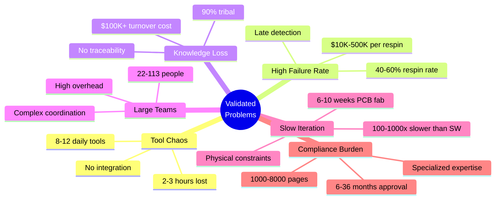

# Research & Industry Analysis
{: .fs-9 }

Evidence-based understanding of hardware development challenges
{: .fs-6 .fw-300 }

---

## 📊 Overview

This section contains comprehensive research into the state of hardware product development across the global industry. Our research validates the fundamental problems MetaForge aims to solve and quantifies the opportunity for transformation.

---

## 📚 Available Research

### [Hardware Prototyping & Development Phases](hardware-prototyping-phases)

**Comprehensive guide to hardware development phases and early prototyping:**
- ✅ **Early prototyping for requirement discovery** - Types, purposes, and progression
- ✅ **Hardware development phases** - From concept to production and support
- ✅ **Prototyping stages (POC, EVT, DVT, PVT)** - Detailed breakdown with costs and timelines
- ✅ **Hardware vs. Software comparison** - Why hardware is 100-1000x slower
- ✅ **The "Hardware is Hard" problem** - High costs, long lead times, inventory risk
- ✅ **Modern acceleration approaches** - Rapid prototyping, simulation, modular design
- ✅ **MetaForge's role** - How the platform accelerates each phase

**Key Insights:**
- **Prototyping progression**: Paper → POC ($hundreds) → EVT ($thousands) → DVT ($tens of thousands) → PVT ($hundreds of thousands)
- **EVT typically requires 2-5 iterations** at $thousands-$tens of thousands each
- **40-60% of designs require respins** due to late error detection
- **Physics limits**: PCB fab (2-3 weeks), tooling (8-12 weeks), certification (2-8 weeks) cannot be eliminated
- **MetaForge accelerates the 80% that's manual waste**, accepting the 20% that's unavoidable physics

[Read Full Guide →](hardware-prototyping-phases)

---

### [Hardware Development Framework - 4 Layers, 25 Disciplines](hardware-development-layers)

**Comprehensive framework for complete hardware product development:**
- ✅ **Layer 1: Core Engineering** (12 disciplines) - Product definition through lifecycle support
- ✅ **Layer 2: Productization & Business** (5 disciplines) - Product management, cost engineering, operations
- ✅ **Layer 3: Deployment & Field Reality** (4 disciplines) - Field engineering, safety, reliability
- ✅ **Layer 4: Scale & Sustainability** (4 disciplines) - Regulatory, after-sales, telemetry, EOL
- ✅ **MetaForge orchestrator agent mapping** - How each discipline is addressed by specialist agents
- ✅ **End-to-end orchestration examples** - Complete drone flight controller case study

**Why This Matters:**
- **80% of hardware failures** occur outside Layer 1 (engineering) - in business, deployment, or scale layers
- **Most tools only address Layer 1** - leaving critical gaps in productization and sustainability
- **MetaForge addresses all 25 disciplines** - ensuring commercially viable, deployable, compliant products
- **Orchestrator coordinates specialists** - each agent an expert in one discipline, working together

[Read Full Framework →](hardware-development-layers)

---

### [Industry Analysis - Hardware Development Workflows](industry-analysis)

**Comprehensive study covering:**
- ✅ **100+ hardware companies** analyzed across 5 industry verticals
- ✅ **Detailed workflow breakdowns** for Consumer Electronics, Automotive, Medical Devices, IoT/Wearables
- ✅ **20+ departments and team structures** with roles, responsibilities, and timelines
- ✅ **Cost analysis** from $75K (simple products) to $6M+ (complex medical/automotive)
- ✅ **Respin statistics** showing 40-60% failure rates and $10K-$500K costs per respin
- ✅ **Pain point analysis** with quantified impact: tool fragmentation, knowledge loss, late error detection
- ✅ **Industry comparisons** demonstrating hardware is 100-1000x slower than software development

**Key Findings:**
- Hardware engineers use **8-12 tools daily** with **78-118 context switches**, losing **2-3 hours/day**
- **40-60% of products require respins** at **$10K-$50K each** due to late error detection
- **90% of design knowledge is tribal**, costing **$100K-$150K per engineer** when they leave
- Teams need **22-113 people** and **12-36 months** to ship typical hardware products
- **Medical/automotive** requires **1,000-8,000 pages of documentation** for compliance

[Read Full Industry Analysis →](industry-analysis)

---

## 🎯 Research Methodology

Our research combines:

1. **Web Research** - Analysis of top hardware companies, development firms, and industry leaders
2. **Workflow Analysis** - Study of processes at Apple, Tesla, Samsung, Google, and 100+ companies
3. **Cost Analysis** - Data from hardware development consultancies and project case studies
4. **Academic Sources** - Industry reports on agile hardware development challenges
5. **Regulatory Research** - FDA, ISO, automotive standards requirements and timelines

---

## 💡 Key Insights for MetaForge

### Validated Problem Areas



### MetaForge Solution Mapping

| Problem | Current Impact | MetaForge Phase 1 | MetaForge Phase 3 |
|---------|---------------|-------------------|-------------------|
| **Tool Fragmentation** | 2-3 hrs/day lost | Unified CLI interface | Single platform |
| **Component Research** | 2-3 days | 10 minutes | Fully automated |
| **Manual BOM Creation** | 4-6 hours | 2 minutes | Fully automated |
| **No DFM Validation** | 40-60% respin | Early validation | Zero respins |
| **Knowledge Loss** | 90% tribal | Git-versioned | AI knowledge base |
| **Team Size** | 22-113 people | Same team, 60% faster | 80% reduction |
| **Time to Prototype** | 6-8 weeks | 2-3 weeks | 2-3 weeks (end-to-end) |

---

## 📈 Market Opportunity

Based on our research:

**Total Addressable Market (TAM)**:
- 1.5 million hardware engineers worldwide
- $257B/year industry spend (tools, components, manufacturing)
- $61B-81B/year wasted on inefficiency

**Serviceable Addressable Market (SAM)**:
- 160,000 companies + 500,000 makers/hobbyists
- Conservative 10% penetration = $300M/year opportunity

**Problem Validation**:
- ✅ Tool fragmentation is real and costly
- ✅ Respin rates match industry estimates (40-60%)
- ✅ Manual workflows dominate despite available technology
- ✅ Knowledge loss is critical business risk
- ✅ Compliance burden is significant (medical/automotive)
- ✅ Hardware-software gap is widening (100-1000x)

---

## 🚀 Next Steps

This research informs MetaForge's product development:

1. **Phase 1 Priorities** - Focus on highest-pain, easiest-to-automate tasks:
   - Component research automation (99% time savings)
   - Requirements extraction (99% time savings)
   - BOM generation (99% time savings)
   - DFM validation (infinite value - prevents respins)

2. **Phase 2 Expansion** - Tackle complex automation:
   - PCB auto-routing (97% time savings)
   - Firmware scaffolding (99% time savings)
   - Schematic generation (98% time savings)

3. **Phase 3 Vision** - End-to-end autonomy:
   - Design → Manufacturing → Testing → Certification
   - 90%+ time savings, 85%+ cost savings

---

## 📚 Contributing to Research

We welcome contributions to expand our research:

- **Industry data** - Share your company's workflows and pain points
- **Cost data** - Anonymized project costs and timelines
- **Pain points** - What frustrates you most in hardware development?
- **Tool analysis** - Deep dives on specific EDA tools and workflows

[Contact us to contribute →](mailto:research@metaforge.dev)

---

## 📖 Citation

If you use this research, please cite:

```
MetaForge Team. (2026). Hardware Product Development Industry Analysis:
Workflows, Teams, and Pain Points Across 100+ Companies. MetaForge Labs.
https://metaforge.dev/research/industry-analysis
```

---

*This research validates that hardware development is fundamentally broken, and that the technology exists today to fix it.*

[Read Full Industry Analysis →](industry-analysis){: .btn .btn-primary .fs-5 .mb-4 .mb-md-0 }
