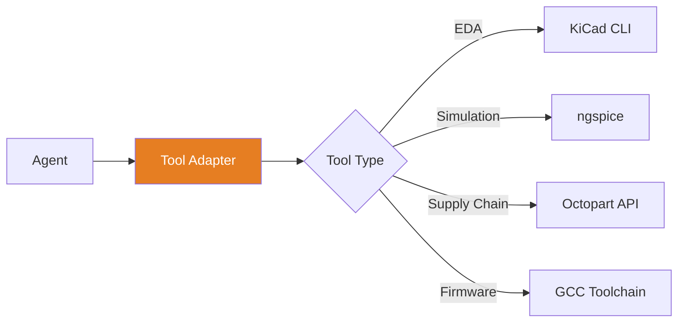

# Tool Adapters
{: .no_toc }

Integrating external EDA tools, simulators, and APIs with MetaForge
{: .fs-6 .fw-300 }

## Table of contents
{: .no_toc .text-delta }

1. TOC
{:toc}

---

## Overview

Tool adapters provide clean interfaces between MetaForge agents and external tools (KiCad, SPICE, supplier APIs, etc.).



---

## Adapter Interface

### Base Adapter

```typescript
interface ToolAdapter {
  // Metadata
  name: string;
  version: string;
  capabilities: Capability[];

  // Lifecycle
  detect(): Promise<ToolInstall | null>;
  initialize(config: ToolConfig): Promise<void>;

  // Operations
  execute(action: Action): Promise<Result>;

  // Health
  healthCheck(): Promise<HealthStatus>;
}
```

### Capability Detection

```typescript
interface Capability {
  name: string;
  supported: boolean;
  version?: string;
  requiredVersion?: string;
}

class KiCadAdapter implements ToolAdapter {
  async detect(): Promise<ToolInstall | null> {
    try {
      const result = await exec('kicad-cli --version');
      const version = this.parseVersion(result.stdout);

      return {
        found: true,
        version,
        path: result.path,
        capabilities: this.getCapabilities(version)
      };
    } catch {
      return null;
    }
  }

  private getCapabilities(version: string): Capability[] {
    return [
      {
        name: 'erc',
        supported: semver.gte(version, '7.0.0')
      },
      {
        name: 'export-netlist',
        supported: true
      },
      {
        name: 'export-bom',
        supported: semver.gte(version, '8.0.0')
      }
    ];
  }
}
```

---

## KiCad Adapter

### Installation Detection

```typescript
class KiCadAdapter implements ToolAdapter {
  name = 'kicad';
  version = '1.0.0';

  async detect(): Promise<ToolInstall | null> {
    const searchPaths = [
      '/usr/bin/kicad-cli',
      '/usr/local/bin/kicad-cli',
      'C:\\Program Files\\KiCad\\bin\\kicad-cli.exe',
      '/Applications/KiCad/kicad.app/Contents/MacOS/kicad-cli'
    ];

    for (const path of searchPaths) {
      if (await exists(path)) {
        const version = await this.getVersion(path);
        return { found: true, version, path };
      }
    }

    return null;
  }
}
```

### Schematic Operations

```typescript
interface KiCadAdapter extends ToolAdapter {
  // ERC (Electrical Rules Check)
  runERC(schematic: string): Promise<ERCResult>;

  // Netlist export
  exportNetlist(schematic: string, format: 'kicad' | 'spice'): Promise<string>;

  // BOM export
  exportBOM(schematic: string, format: 'csv' | 'xml'): Promise<BOMData>;

  // Component info
  getComponents(schematic: string): Promise<Component[]>;

  // Symbol operations
  searchSymbols(query: string): Promise<Symbol[]>;
  addSymbol(schematic: string, symbol: Symbol, position: Position): Promise<void>;
}
```

**Example Implementation**:

```typescript
class KiCadAdapter implements ToolAdapter {
  async runERC(schematic: string): Promise<ERCResult> {
    const result = await exec(`kicad-cli sch erc ${schematic}`);

    return {
      errors: this.parseErrors(result.stdout),
      warnings: this.parseWarnings(result.stdout),
      passed: result.exitCode === 0
    };
  }

  async exportBOM(schematic: string, format: 'csv' | 'xml'): Promise<BOMData> {
    const tempFile = `/tmp/bom.${format}`;

    await exec(`kicad-cli sch export bom --format ${format} ${schematic} -o ${tempFile}`);

    const content = await readFile(tempFile);
    return this.parseBOM(content, format);
  }

  private parseBOM(content: string, format: 'csv' | 'xml'): BOMData {
    if (format === 'csv') {
      return this.parseCSVBOM(content);
    } else {
      return this.parseXMLBOM(content);
    }
  }
}
```

---

## SPICE Adapter

### Simulation Interface

```typescript
interface SPICEAdapter extends ToolAdapter {
  // Simulation
  runSimulation(netlist: string, analysis: AnalysisType): Promise<SimResult>;

  // Analysis types
  runDC(netlist: string, params: DCParams): Promise<DCResult>;
  runAC(netlist: string, params: ACParams): Promise<ACResult>;
  runTransient(netlist: string, params: TransientParams): Promise<TransientResult>;
}
```

**Example**:

```typescript
class NGSpiceAdapter implements SPICEAdapter {
  name = 'ngspice';

  async runTransient(netlist: string, params: TransientParams): Promise<TransientResult> {
    const script = `
      ${netlist}
      .tran ${params.step} ${params.stop}
      .print tran v(out) i(vin)
      .end
    `;

    const result = await exec(`ngspice -b -`, { input: script });

    return this.parseTransientOutput(result.stdout);
  }

  private parseTransientOutput(output: string): TransientResult {
    // Parse ngspice output format
    const lines = output.split('\n');
    const data: DataPoint[] = [];

    for (const line of lines) {
      if (line.startsWith(' ')) {
        const [time, voltage, current] = line.trim().split(/\s+/);
        data.push({
          time: parseFloat(time),
          voltage: parseFloat(voltage),
          current: parseFloat(current)
        });
      }
    }

    return { data };
  }
}
```

---

## Supplier API Adapters

### Octopart Adapter

```typescript
interface SupplierAdapter extends ToolAdapter {
  search(query: ComponentQuery): Promise<SearchResult[]>;
  getPartDetails(mpn: string): Promise<PartDetails>;
  getPricing(mpn: string, quantity: number): Promise<PriceBreakdown>;
  checkStock(mpn: string): Promise<StockInfo>;
}
```

**Implementation**:

```typescript
class OctopartAdapter implements SupplierAdapter {
  private apiKey: string;
  private baseURL = 'https://octopart.com/api/v4';

  async search(query: ComponentQuery): Promise<SearchResult[]> {
    const gqlQuery = `
      query {
        search(q: "${query.keyword}", limit: ${query.limit}) {
          results {
            part {
              mpn
              manufacturer { name }
              short_description
              specs {
                attribute { name }
                value
              }
              sellers {
                company { name }
                offers {
                  sku
                  prices {
                    quantity
                    price
                    currency
                  }
                  inventory_level
                }
              }
            }
          }
        }
      }
    `;

    const response = await fetch(this.baseURL + '/graphql', {
      method: 'POST',
      headers: {
        'Authorization': `Token ${this.apiKey}`,
        'Content-Type': 'application/json'
      },
      body: JSON.stringify({ query: gqlQuery })
    });

    const data = await response.json();
    return this.mapSearchResults(data);
  }

  async getPricing(mpn: string, quantity: number): Promise<PriceBreakdown> {
    const details = await this.getPartDetails(mpn);

    const prices = details.sellers.flatMap(seller =>
      seller.offers.flatMap(offer =>
        offer.prices.map(price => ({
          supplier: seller.company.name,
          quantity: price.quantity,
          unitPrice: price.price,
          currency: price.currency,
          totalPrice: price.price * quantity
        }))
      )
    );

    return {
      mpn,
      quantity,
      prices: prices.sort((a, b) => a.unitPrice - b.unitPrice)
    };
  }
}
```

---

## Creating a Custom Adapter

### Step 1: Define Interface

```typescript
interface CustomToolAdapter extends ToolAdapter {
  name: 'custom-tool';

  // Custom operations
  customOperation(params: CustomParams): Promise<CustomResult>;
}
```

### Step 2: Implement Detection

```typescript
class CustomAdapter implements CustomToolAdapter {
  name = 'custom-tool';
  version = '1.0.0';

  async detect(): Promise<ToolInstall | null> {
    try {
      // Check if tool exists
      const result = await exec('custom-tool --version');

      if (result.exitCode !== 0) {
        return null;
      }

      return {
        found: true,
        version: this.parseVersion(result.stdout),
        path: await which('custom-tool')
      };
    } catch (error) {
      return null;
    }
  }
}
```

### Step 3: Implement Operations

```typescript
class CustomAdapter implements CustomToolAdapter {
  async execute(action: Action): Promise<Result> {
    switch (action.type) {
      case 'custom-operation':
        return await this.customOperation(action.params);

      default:
        throw new Error(`Unknown action: ${action.type}`);
    }
  }

  async customOperation(params: CustomParams): Promise<CustomResult> {
    // Execute tool
    const result = await exec(
      `custom-tool ${params.arg1} ${params.arg2}`
    );

    // Parse output
    return this.parseOutput(result.stdout);
  }

  private parseOutput(output: string): CustomResult {
    // Implement parsing logic
  }
}
```

### Step 4: Add Error Handling

```typescript
class CustomAdapter implements CustomToolAdapter {
  async execute(action: Action): Promise<Result> {
    try {
      return await this.executeInternal(action);
    } catch (error) {
      if (error instanceof ExecError) {
        throw new ToolError(
          `Tool execution failed: ${error.message}`,
          {
            exitCode: error.exitCode,
            stderr: error.stderr,
            stdout: error.stdout
          }
        );
      }
      throw error;
    }
  }
}
```

---

## Testing Adapters

### Unit Tests

```typescript
import { describe, it, expect, vi } from 'vitest';
import { KiCadAdapter } from './kicad-adapter';

describe('KiCadAdapter', () => {
  it('detects KiCad installation', async () => {
    const adapter = new KiCadAdapter();
    const install = await adapter.detect();

    expect(install).toBeDefined();
    expect(install.found).toBe(true);
  });

  it('runs ERC successfully', async () => {
    const adapter = new KiCadAdapter();
    await adapter.initialize({});

    const result = await adapter.runERC('test.kicad_sch');

    expect(result.errors).toHaveLength(0);
    expect(result.passed).toBe(true);
  });
});
```

### Mock Adapter for Testing

```typescript
class MockKiCadAdapter implements KiCadAdapter {
  async detect(): Promise<ToolInstall> {
    return { found: true, version: '8.0.0', path: '/mock/kicad' };
  }

  async runERC(schematic: string): Promise<ERCResult> {
    return {
      errors: [],
      warnings: [],
      passed: true
    };
  }
}
```

---

## Best Practices

### 1. Graceful Degradation

```typescript
class Adapter implements ToolAdapter {
  async execute(action: Action): Promise<Result> {
    const install = await this.detect();

    if (!install) {
      throw new ToolNotFoundError(
        `${this.name} not found. Install from: ${this.installURL}`
      );
    }

    const capability = this.capabilities.find(c => c.name === action.type);

    if (!capability?.supported) {
      throw new UnsupportedOperationError(
        `Operation ${action.type} requires ${this.name} ${capability.requiredVersion}`
      );
    }

    return await this.executeInternal(action);
  }
}
```

### 2. Caching

```typescript
class Adapter implements ToolAdapter {
  private cache = new Map<string, CacheEntry>();

  async execute(action: Action): Promise<Result> {
    const cacheKey = this.getCacheKey(action);

    if (this.cache.has(cacheKey)) {
      const entry = this.cache.get(cacheKey);
      if (!entry.isExpired()) {
        return entry.value;
      }
    }

    const result = await this.executeInternal(action);

    this.cache.set(cacheKey, {
      value: result,
      expiresAt: Date.now() + 5 * 60 * 1000 // 5 min
    });

    return result;
  }
}
```

### 3. Timeout Handling

```typescript
async execute(action: Action): Promise<Result> {
  return await Promise.race([
    this.executeInternal(action),
    this.timeout(30000) // 30 second timeout
  ]);
}

private timeout(ms: number): Promise<never> {
  return new Promise((_, reject) => {
    setTimeout(() => reject(new TimeoutError(
      `Operation timed out after ${ms}ms`
    )), ms);
  });
}
```

---

## Next Steps

- [Agent System](../agents/) - Building agents that use tools
- [API Reference](../api/) - Gateway API
- [Examples](../examples/) - Real adapter implementations

---

[← Agents](../agents/) • [API Reference →](../api/)
