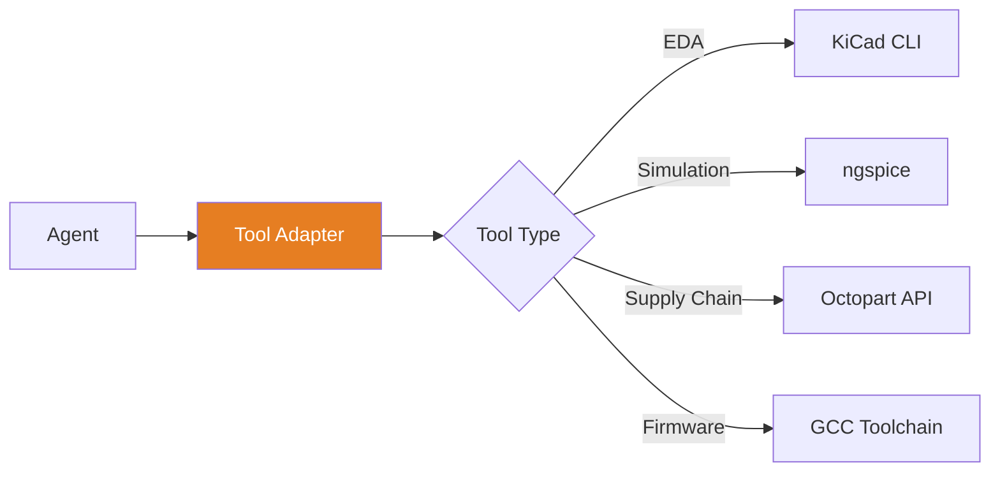

# Tool Adapters
{: .no_toc }

Integrating external EDA tools, simulators, and APIs with MetaForge
{: .fs-6 .fw-300 }

## Table of contents
{: .no_toc .text-delta }

1. TOC
{:toc}

---

## Overview

Tool adapters provide clean interfaces between MetaForge agents and external tools (KiCad, SPICE, supplier APIs, etc.).



---

## Adapter Interface

### Base Adapter

```typescript
interface ToolAdapter {
  // Metadata
  name: string;
  version: string;
  capabilities: Capability[];

  // Lifecycle
  detect(): Promise<ToolInstall | null>;
  initialize(config: ToolConfig): Promise<void>;

  // Operations
  execute(action: Action): Promise<Result>;

  // Health
  healthCheck(): Promise<HealthStatus>;
}
```

### Capability Detection

```typescript
interface Capability {
  name: string;
  supported: boolean;
  version?: string;
  requiredVersion?: string;
}

class KiCadAdapter implements ToolAdapter {
  async detect(): Promise<ToolInstall | null> {
    try {
      const result = await exec('kicad-cli --version');
      const version = this.parseVersion(result.stdout);

      return {
        found: true,
        version,
        path: result.path,
        capabilities: this.getCapabilities(version)
      };
    } catch {
      return null;
    }
  }

  private getCapabilities(version: string): Capability[] {
    return [
      {
        name: 'erc',
        supported: semver.gte(version, '7.0.0')
      },
      {
        name: 'export-netlist',
        supported: true
      },
      {
        name: 'export-bom',
        supported: semver.gte(version, '8.0.0')
      }
    ];
  }
}
```

---

## KiCad Adapter

### Installation Detection

```typescript
class KiCadAdapter implements ToolAdapter {
  name = 'kicad';
  version = '1.0.0';

  async detect(): Promise<ToolInstall | null> {
    const searchPaths = [
      '/usr/bin/kicad-cli',
      '/usr/local/bin/kicad-cli',
      'C:\\Program Files\\KiCad\\bin\\kicad-cli.exe',
      '/Applications/KiCad/kicad.app/Contents/MacOS/kicad-cli'
    ];

    for (const path of searchPaths) {
      if (await exists(path)) {
        const version = await this.getVersion(path);
        return { found: true, version, path };
      }
    }

    return null;
  }
}
```

### Schematic Operations

```typescript
interface KiCadAdapter extends ToolAdapter {
  // ERC (Electrical Rules Check)
  runERC(schematic: string): Promise<ERCResult>;

  // Netlist export
  exportNetlist(schematic: string, format: 'kicad' | 'spice'): Promise<string>;

  // BOM export
  exportBOM(schematic: string, format: 'csv' | 'xml'): Promise<BOMData>;

  // Component info
  getComponents(schematic: string): Promise<Component[]>;

  // Symbol operations
  searchSymbols(query: string): Promise<Symbol[]>;
  addSymbol(schematic: string, symbol: Symbol, position: Position): Promise<void>;
}
```

**Example Implementation**:

```typescript
class KiCadAdapter implements ToolAdapter {
  async runERC(schematic: string): Promise<ERCResult> {
    const result = await exec(`kicad-cli sch erc ${schematic}`);

    return {
      errors: this.parseErrors(result.stdout),
      warnings: this.parseWarnings(result.stdout),
      passed: result.exitCode === 0
    };
  }

  async exportBOM(schematic: string, format: 'csv' | 'xml'): Promise<BOMData> {
    const tempFile = `/tmp/bom.${format}`;

    await exec(`kicad-cli sch export bom --format ${format} ${schematic} -o ${tempFile}`);

    const content = await readFile(tempFile);
    return this.parseBOM(content, format);
  }

  private parseBOM(content: string, format: 'csv' | 'xml'): BOMData {
    if (format === 'csv') {
      return this.parseCSVBOM(content);
    } else {
      return this.parseXMLBOM(content);
    }
  }
}
```

---

## SPICE Adapter

### Simulation Interface

```typescript
interface SPICEAdapter extends ToolAdapter {
  // Simulation
  runSimulation(netlist: string, analysis: AnalysisType): Promise<SimResult>;

  // Analysis types
  runDC(netlist: string, params: DCParams): Promise<DCResult>;
  runAC(netlist: string, params: ACParams): Promise<ACResult>;
  runTransient(netlist: string, params: TransientParams): Promise<TransientResult>;
}
```

**Example**:

```typescript
class NGSpiceAdapter implements SPICEAdapter {
  name = 'ngspice';

  async runTransient(netlist: string, params: TransientParams): Promise<TransientResult> {
    const script = `
      ${netlist}
      .tran ${params.step} ${params.stop}
      .print tran v(out) i(vin)
      .end
    `;

    const result = await exec(`ngspice -b -`, { input: script });

    return this.parseTransientOutput(result.stdout);
  }

  private parseTransientOutput(output: string): TransientResult {
    // Parse ngspice output format
    const lines = output.split('\n');
    const data: DataPoint[] = [];

    for (const line of lines) {
      if (line.startsWith(' ')) {
        const [time, voltage, current] = line.trim().split(/\s+/);
        data.push({
          time: parseFloat(time),
          voltage: parseFloat(voltage),
          current: parseFloat(current)
        });
      }
    }

    return { data };
  }
}
```

---

## Supplier API Adapters

### Octopart Adapter

```typescript
interface SupplierAdapter extends ToolAdapter {
  search(query: ComponentQuery): Promise<SearchResult[]>;
  getPartDetails(mpn: string): Promise<PartDetails>;
  getPricing(mpn: string, quantity: number): Promise<PriceBreakdown>;
  checkStock(mpn: string): Promise<StockInfo>;
}
```

**Implementation**:

```typescript
class OctopartAdapter implements SupplierAdapter {
  private apiKey: string;
  private baseURL = 'https://octopart.com/api/v4';

  async search(query: ComponentQuery): Promise<SearchResult[]> {
    const gqlQuery = `
      query {
        search(q: "${query.keyword}", limit: ${query.limit}) {
          results {
            part {
              mpn
              manufacturer { name }
              short_description
              specs {
                attribute { name }
                value
              }
              sellers {
                company { name }
                offers {
                  sku
                  prices {
                    quantity
                    price
                    currency
                  }
                  inventory_level
                }
              }
            }
          }
        }
      }
    `;

    const response = await fetch(this.baseURL + '/graphql', {
      method: 'POST',
      headers: {
        'Authorization': `Token ${this.apiKey}`,
        'Content-Type': 'application/json'
      },
      body: JSON.stringify({ query: gqlQuery })
    });

    const data = await response.json();
    return this.mapSearchResults(data);
  }

  async getPricing(mpn: string, quantity: number): Promise<PriceBreakdown> {
    const details = await this.getPartDetails(mpn);

    const prices = details.sellers.flatMap(seller =>
      seller.offers.flatMap(offer =>
        offer.prices.map(price => ({
          supplier: seller.company.name,
          quantity: price.quantity,
          unitPrice: price.price,
          currency: price.currency,
          totalPrice: price.price * quantity
        }))
      )
    );

    return {
      mpn,
      quantity,
      prices: prices.sort((a, b) => a.unitPrice - b.unitPrice)
    };
  }
}
```

---

## Digi-Key API Adapter

### Overview

Digi-Key is the largest electronics component distributor (80%+ market share). The adapter provides real-time access to part search, pricing, stock levels, and lifecycle data.

**API Documentation**: https://developer.digikey.com/

### Authentication

```typescript
class DigiKeyAdapter implements SupplierAdapter {
  name = 'digikey';
  private clientId: string;
  private clientSecret: string;
  private baseURL = 'https://api.digikey.com/v1';

  async initialize(config: ToolConfig): Promise<void> {
    this.clientId = config.digikey_client_id;
    this.clientSecret = config.digikey_client_secret;

    // OAuth 2.0 client credentials flow
    await this.authenticate();
  }

  private async authenticate(): Promise<void> {
    const response = await fetch('https://api.digikey.com/v1/oauth2/token', {
      method: 'POST',
      headers: { 'Content-Type': 'application/x-www-form-urlencoded' },
      body: new URLSearchParams({
        client_id: this.clientId,
        client_secret: this.clientSecret,
        grant_type: 'client_credentials'
      })
    });

    const data = await response.json();
    this.accessToken = data.access_token;
  }
}
```

### Part Search

```typescript
interface DigiKeySearchParams {
  keyword: string;
  filters?: {
    category?: string;
    manufacturer?: string;
    in_stock?: boolean;
    rohs_compliant?: boolean;
  };
  limit?: number;
}

class DigiKeyAdapter {
  async search(params: DigiKeySearchParams): Promise<SearchResult[]> {
    const response = await fetch(`${this.baseURL}/Search/v3/Products/Keyword`, {
      method: 'POST',
      headers: {
        'Authorization': `Bearer ${this.accessToken}`,
        'Content-Type': 'application/json',
        'X-DIGIKEY-Client-Id': this.clientId
      },
      body: JSON.stringify({
        Keywords: params.keyword,
        RecordCount: params.limit || 25,
        Filters: {
          StockStatus: params.filters?.in_stock ? 'InStock' : undefined,
          RoHS: params.filters?.rohs_compliant ? 'Compliant' : undefined
        }
      })
    });

    const data = await response.json();
    return this.mapProducts(data.Products);
  }

  private mapProducts(products: any[]): SearchResult[] {
    return products.map(p => ({
      mpn: p.ManufacturerPartNumber,
      manufacturer: p.Manufacturer.Name,
      description: p.DetailedDescription,
      datasheet: p.PrimaryDatasheet,
      category: p.Category.Name,
      pricing: p.StandardPricing.map(tier => ({
        quantity: tier.BreakQuantity,
        unitPrice: tier.UnitPrice,
        currency: 'USD'
      })),
      stock: {
        quantity: p.QuantityAvailable,
        location: 'US'
      },
      lifecycle: p.ProductStatus,
      rohs: p.RohsStatus === 'Compliant'
    }));
  }
}
```

### Pricing & Stock

```typescript
interface DigiKeyPricing {
  mpn: string;
  pricing: PriceTier[];
  stock: number;
  leadTime: string;
  moq: number; // minimum order quantity
}

class DigiKeyAdapter {
  async getPricing(mpn: string): Promise<DigiKeyPricing> {
    const response = await fetch(
      `${this.baseURL}/Search/v3/Products/${encodeURIComponent(mpn)}`,
      {
        headers: {
          'Authorization': `Bearer ${this.accessToken}`,
          'X-DIGIKEY-Client-Id': this.clientId
        }
      }
    );

    const product = await response.json();

    return {
      mpn: product.ManufacturerPartNumber,
      pricing: product.StandardPricing.map(tier => ({
        quantity: tier.BreakQuantity,
        unitPrice: tier.UnitPrice,
        currency: 'USD',
        totalPrice: tier.BreakQuantity * tier.UnitPrice
      })),
      stock: product.QuantityAvailable,
      leadTime: product.ManufacturerLeadWeeks
        ? `${product.ManufacturerLeadWeeks} weeks`
        : 'In stock',
      moq: product.MinimumOrderQuantity
    };
  }
}
```

### Lifecycle Status

```typescript
async getLifecycleStatus(mpn: string): Promise<LifecycleStatus> {
  const product = await this.getProduct(mpn);

  return {
    mpn,
    status: this.mapProductStatus(product.ProductStatus),
    last_time_buy: product.DiscontinuedDate,
    recommended_replacement: product.SuggestedReplacement?.ManufacturerPartNumber
  };
}

private mapProductStatus(status: string): LifecycleStatus['status'] {
  const mapping = {
    'Active': 'active',
    'Not For New Designs': 'nrnd',
    'Obsolete': 'obsolete',
    'Last Time Buy': 'ltb'
  };
  return mapping[status] || 'unknown';
}
```

---

## Mouser API Adapter

### Overview

Mouser Electronics is a major distributor, especially strong in APAC and EMEA regions. Excellent for dual-sourcing strategy.

**API Documentation**: https://www.mouser.com/api-hub/

### Authentication

```typescript
class MouserAdapter implements SupplierAdapter {
  name = 'mouser';
  private apiKey: string;
  private baseURL = 'https://api.mouser.com/api/v1';

  async initialize(config: ToolConfig): Promise<void> {
    this.apiKey = config.mouser_api_key;
  }
}
```

### Part Search

```typescript
interface MouserSearchParams {
  keyword: string;
  records?: number;
  startingRecord?: number;
  searchOptions?: string; // 'Rohs', 'InStock', etc.
}

class MouserAdapter {
  async search(params: MouserSearchParams): Promise<SearchResult[]> {
    const response = await fetch(
      `${this.baseURL}/search/keyword?apiKey=${this.apiKey}`,
      {
        method: 'POST',
        headers: { 'Content-Type': 'application/json' },
        body: JSON.stringify({
          SearchByKeywordRequest: {
            keyword: params.keyword,
            records: params.records || 25,
            startingRecord: params.startingRecord || 0,
            searchOptions: params.searchOptions || ''
          }
        })
      }
    );

    const data = await response.json();
    return this.mapParts(data.SearchResults.Parts);
  }

  private mapParts(parts: any[]): SearchResult[] {
    return parts.map(p => ({
      mpn: p.ManufacturerPartNumber,
      manufacturer: p.Manufacturer,
      description: p.Description,
      datasheet: p.DataSheetUrl,
      category: p.Category,
      pricing: p.PriceBreaks.map(pb => ({
        quantity: pb.Quantity,
        unitPrice: parseFloat(pb.Price.replace('$', '')),
        currency: pb.Currency
      })),
      stock: {
        quantity: p.AvailabilityInStock || 0,
        location: p.AvailabilityOnOrder > 0 ? 'On order' : 'In stock'
      },
      lifecycle: p.LifecycleStatus,
      rohs: p.RohsStatus === 'Compliant',
      leadTime: p.LeadTime
    }));
  }
}
```

### Stock Check (Real-Time)

```typescript
async checkStock(mpns: string[]): Promise<StockInfo[]> {
  const response = await fetch(
    `${this.baseURL}/search/partnumber?apiKey=${this.apiKey}`,
    {
      method: 'POST',
      headers: { 'Content-Type': 'application/json' },
      body: JSON.stringify({
        SearchByPartRequest: {
          mouserPartNumber: mpns.join('|'),
          partSearchOptions: 'Exact'
        }
      })
    }
  );

  const data = await response.json();

  return data.SearchResults.Parts.map(p => ({
    mpn: p.ManufacturerPartNumber,
    stock: p.AvailabilityInStock || 0,
    leadTime: p.LeadTime,
    available: p.AvailabilityInStock > 0,
    alternates: p.AlternatePackagings?.map(alt => alt.APMfrPN) || []
  }));
}
```

---

## GitHub Actions Integration

### Overview

Integrates with GitHub Actions CI/CD to automatically ingest test results, build artifacts, and link them to the digital thread.

### Webhook Listener

```typescript
interface GitHubActionsAdapter extends ToolAdapter {
  name: 'github-actions';

  // Listen for workflow completion
  onWorkflowComplete(event: WorkflowEvent): Promise<void>;

  // Download artifacts
  downloadArtifact(run_id: number, artifact_name: string): Promise<Buffer>;

  // Parse test results
  parseTestResults(artifact: Buffer, format: 'junit' | 'pytest'): Promise<TestResult[]>;
}

class GitHubActionsAdapter implements GitHubActionsAdapter {
  private webhookSecret: string;
  private token: string;

  async initialize(config: ToolConfig): Promise<void> {
    this.webhookSecret = config.github_webhook_secret;
    this.token = config.github_token;

    // Register webhook endpoint
    this.registerWebhook();
  }

  private registerWebhook(): void {
    // Express.js webhook handler
    app.post('/webhooks/github', async (req, res) => {
      // Verify signature
      const signature = req.headers['x-hub-signature-256'];
      if (!this.verifySignature(req.body, signature)) {
        return res.status(401).send('Invalid signature');
      }

      const event = req.body;

      if (event.action === 'completed') {
        await this.onWorkflowComplete(event);
      }

      res.status(200).send('OK');
    });
  }

  async onWorkflowComplete(event: WorkflowEvent): Promise<void> {
    const { repository, workflow_run } = event;

    console.log(`Workflow ${workflow_run.name} completed with status: ${workflow_run.conclusion}`);

    // Download test artifacts
    const artifacts = await this.listArtifacts(workflow_run.id);

    for (const artifact of artifacts) {
      if (artifact.name.includes('test-results')) {
        const data = await this.downloadArtifact(workflow_run.id, artifact.name);
        const testResults = await this.parseTestResults(data, 'junit');

        // Link to digital thread
        await this.linkToDigitalThread({
          commit: workflow_run.head_sha,
          workflow: workflow_run.name,
          results: testResults,
          timestamp: workflow_run.updated_at
        });
      }
    }
  }

  async downloadArtifact(run_id: number, artifact_name: string): Promise<Buffer> {
    const response = await fetch(
      `https://api.github.com/repos/${this.repo}/actions/runs/${run_id}/artifacts`,
      {
        headers: {
          'Authorization': `Bearer ${this.token}`,
          'Accept': 'application/vnd.github+json'
        }
      }
    );

    const data = await response.json();
    const artifact = data.artifacts.find(a => a.name === artifact_name);

    // Download artifact zip
    const downloadResponse = await fetch(artifact.archive_download_url, {
      headers: { 'Authorization': `Bearer ${this.token}` }
    });

    return Buffer.from(await downloadResponse.arrayBuffer());
  }

  async parseTestResults(artifact: Buffer, format: 'junit'): Promise<TestResult[]> {
    // Unzip artifact
    const zip = await JSZip.loadAsync(artifact);
    const xmlFile = await zip.file('test-results.xml').async('string');

    // Parse JUnit XML
    const parser = new XMLParser();
    const junit = parser.parse(xmlFile);

    return junit.testsuites.testsuite.flatMap(suite =>
      suite.testcase.map(tc => ({
        name: tc.$.name,
        className: tc.$.classname,
        time: parseFloat(tc.$.time),
        status: tc.failure ? 'failed' : tc.skipped ? 'skipped' : 'passed',
        failure: tc.failure?.[0]?._ || null,
        requirement_id: this.extractRequirementId(tc.$.name)
      }))
    );
  }

  private async linkToDigitalThread(data: TestEvidence): Promise<void> {
    // Create nodes in Neo4j
    await neo4j.run(`
      MATCH (req:Requirement {id: $requirement_id})
      CREATE (test:TestExecution {
        commit: $commit,
        workflow: $workflow,
        timestamp: $timestamp,
        status: $status
      })
      CREATE (req)-[:VERIFIED_BY]->(test)
    `, {
      requirement_id: data.requirement_id,
      commit: data.commit,
      workflow: data.workflow,
      timestamp: data.timestamp,
      status: data.status
    });
  }
}
```

---

## Neo4j Integration

### Overview

Neo4j is the graph database powering MetaForge's digital thread. It links requirements → design → BOM → tests → compliance evidence.

**Why Graph DB**: Traditional relational databases struggle with multi-hop traceability queries. Neo4j excels at "Which requirements are at risk due to component EOL?" style questions.

### Graph Schema

```typescript
interface Neo4jAdapter extends ToolAdapter {
  name: 'neo4j';

  // Node operations
  createNode(type: NodeType, properties: any): Promise<Node>;
  getNode(type: NodeType, id: string): Promise<Node>;

  // Relationship operations
  createRelationship(from: Node, to: Node, type: RelType): Promise<Relationship>;

  // Queries
  traceRequirement(req_id: string): Promise<TraceGraph>;
  findRisks(criteria: RiskCriteria): Promise<Risk[]>;
}

// Node types
type NodeType =
  | 'Requirement'
  | 'Component'
  | 'Design'
  | 'Test'
  | 'Build'
  | 'Compliance'
  | 'Issue';

// Relationship types
type RelType =
  | 'IMPLEMENTS'
  | 'USES'
  | 'VERIFIED_BY'
  | 'BLOCKS'
  | 'DEPENDS_ON'
  | 'COMPLIES_WITH';
```

### Schema Definition

```cypher
// Requirements
CREATE CONSTRAINT req_id IF NOT EXISTS
FOR (r:Requirement) REQUIRE r.id IS UNIQUE;

// Components
CREATE CONSTRAINT component_mpn IF NOT EXISTS
FOR (c:Component) REQUIRE c.mpn IS UNIQUE;

// Indexes for fast lookup
CREATE INDEX req_status IF NOT EXISTS
FOR (r:Requirement) ON (r.status);

CREATE INDEX component_lifecycle IF NOT EXISTS
FOR (c:Component) ON (c.lifecycle_status);
```

### Example Queries

**Traceability Query** - "Trace REQ-001 from requirement to test":

```cypher
MATCH path = (req:Requirement {id: 'REQ-001'})-[:IMPLEMENTS]->(design:Design)
             -[:USES]->(component:Component)
             -[:VERIFIED_BY]->(test:Test)
RETURN path
```

**Risk Query** - "Which requirements are at risk due to EOL components?":

```cypher
MATCH (req:Requirement)-[:IMPLEMENTS]->(design)
      -[:USES]->(component:Component)
WHERE component.lifecycle_status IN ['NRND', 'Obsolete']
RETURN req.id AS requirement,
       component.mpn AS at_risk_component,
       component.lifecycle_status AS status,
       component.last_time_buy AS deadline
ORDER BY component.last_time_buy ASC
```

**Coverage Query** - "What % of requirements have tests?":

```cypher
MATCH (req:Requirement)
OPTIONAL MATCH (req)-[:VERIFIED_BY]->(test:Test)
WITH count(DISTINCT req) AS total_reqs,
     count(DISTINCT test) AS tested_reqs
RETURN (tested_reqs * 100.0 / total_reqs) AS test_coverage_percent
```

### Adapter Implementation

```typescript
import neo4j from 'neo4j-driver';

class Neo4jAdapter implements ToolAdapter {
  private driver: neo4j.Driver;
  private session: neo4j.Session;

  async initialize(config: ToolConfig): Promise<void> {
    this.driver = neo4j.driver(
      config.neo4j_uri || 'bolt://localhost:7687',
      neo4j.auth.basic(config.neo4j_user, config.neo4j_password)
    );

    this.session = this.driver.session();

    // Create schema
    await this.createSchema();
  }

  async createNode(type: NodeType, properties: any): Promise<Node> {
    const result = await this.session.run(
      `CREATE (n:${type} $props) RETURN n`,
      { props: properties }
    );

    return result.records[0].get('n').properties;
  }

  async traceRequirement(req_id: string): Promise<TraceGraph> {
    const result = await this.session.run(`
      MATCH path = (req:Requirement {id: $req_id})
                   -[:IMPLEMENTS*1..3]->()
      RETURN path
    `, { req_id });

    return this.buildGraph(result.records);
  }

  async findComponentRisks(): Promise<ComponentRisk[]> {
    const result = await this.session.run(`
      MATCH (req:Requirement)-[:IMPLEMENTS]->(design)
            -[:USES]->(component:Component)
      WHERE component.lifecycle_status IN ['NRND', 'Obsolete']
         OR component.stock < 100
         OR component.lead_time_weeks > 12
      RETURN req.id AS requirement,
             component.mpn AS component,
             component.lifecycle_status AS lifecycle,
             component.stock AS stock,
             component.lead_time_weeks AS lead_time
      ORDER BY component.lifecycle_status DESC, component.stock ASC
    `);

    return result.records.map(r => ({
      requirement_id: r.get('requirement'),
      component_mpn: r.get('component'),
      risk_type: this.classifyRisk(r),
      severity: this.calculateSeverity(r)
    }));
  }

  async cleanup(): Promise<void> {
    await this.session.close();
    await this.driver.close();
  }
}
```

---

## Creating a Custom Adapter

### Step 1: Define Interface

```typescript
interface CustomToolAdapter extends ToolAdapter {
  name: 'custom-tool';

  // Custom operations
  customOperation(params: CustomParams): Promise<CustomResult>;
}
```

### Step 2: Implement Detection

```typescript
class CustomAdapter implements CustomToolAdapter {
  name = 'custom-tool';
  version = '1.0.0';

  async detect(): Promise<ToolInstall | null> {
    try {
      // Check if tool exists
      const result = await exec('custom-tool --version');

      if (result.exitCode !== 0) {
        return null;
      }

      return {
        found: true,
        version: this.parseVersion(result.stdout),
        path: await which('custom-tool')
      };
    } catch (error) {
      return null;
    }
  }
}
```

### Step 3: Implement Operations

```typescript
class CustomAdapter implements CustomToolAdapter {
  async execute(action: Action): Promise<Result> {
    switch (action.type) {
      case 'custom-operation':
        return await this.customOperation(action.params);

      default:
        throw new Error(`Unknown action: ${action.type}`);
    }
  }

  async customOperation(params: CustomParams): Promise<CustomResult> {
    // Execute tool
    const result = await exec(
      `custom-tool ${params.arg1} ${params.arg2}`
    );

    // Parse output
    return this.parseOutput(result.stdout);
  }

  private parseOutput(output: string): CustomResult {
    // Implement parsing logic
  }
}
```

### Step 4: Add Error Handling

```typescript
class CustomAdapter implements CustomToolAdapter {
  async execute(action: Action): Promise<Result> {
    try {
      return await this.executeInternal(action);
    } catch (error) {
      if (error instanceof ExecError) {
        throw new ToolError(
          `Tool execution failed: ${error.message}`,
          {
            exitCode: error.exitCode,
            stderr: error.stderr,
            stdout: error.stdout
          }
        );
      }
      throw error;
    }
  }
}
```

---

## Testing Adapters

### Unit Tests

```typescript
import { describe, it, expect, vi } from 'vitest';
import { KiCadAdapter } from './kicad-adapter';

describe('KiCadAdapter', () => {
  it('detects KiCad installation', async () => {
    const adapter = new KiCadAdapter();
    const install = await adapter.detect();

    expect(install).toBeDefined();
    expect(install.found).toBe(true);
  });

  it('runs ERC successfully', async () => {
    const adapter = new KiCadAdapter();
    await adapter.initialize({});

    const result = await adapter.runERC('test.kicad_sch');

    expect(result.errors).toHaveLength(0);
    expect(result.passed).toBe(true);
  });
});
```

### Mock Adapter for Testing

```typescript
class MockKiCadAdapter implements KiCadAdapter {
  async detect(): Promise<ToolInstall> {
    return { found: true, version: '8.0.0', path: '/mock/kicad' };
  }

  async runERC(schematic: string): Promise<ERCResult> {
    return {
      errors: [],
      warnings: [],
      passed: true
    };
  }
}
```

---

## Best Practices

### 1. Graceful Degradation

```typescript
class Adapter implements ToolAdapter {
  async execute(action: Action): Promise<Result> {
    const install = await this.detect();

    if (!install) {
      throw new ToolNotFoundError(
        `${this.name} not found. Install from: ${this.installURL}`
      );
    }

    const capability = this.capabilities.find(c => c.name === action.type);

    if (!capability?.supported) {
      throw new UnsupportedOperationError(
        `Operation ${action.type} requires ${this.name} ${capability.requiredVersion}`
      );
    }

    return await this.executeInternal(action);
  }
}
```

### 2. Caching

```typescript
class Adapter implements ToolAdapter {
  private cache = new Map<string, CacheEntry>();

  async execute(action: Action): Promise<Result> {
    const cacheKey = this.getCacheKey(action);

    if (this.cache.has(cacheKey)) {
      const entry = this.cache.get(cacheKey);
      if (!entry.isExpired()) {
        return entry.value;
      }
    }

    const result = await this.executeInternal(action);

    this.cache.set(cacheKey, {
      value: result,
      expiresAt: Date.now() + 5 * 60 * 1000 // 5 min
    });

    return result;
  }
}
```

### 3. Timeout Handling

```typescript
async execute(action: Action): Promise<Result> {
  return await Promise.race([
    this.executeInternal(action),
    this.timeout(30000) // 30 second timeout
  ]);
}

private timeout(ms: number): Promise<never> {
  return new Promise((_, reject) => {
    setTimeout(() => reject(new TimeoutError(
      `Operation timed out after ${ms}ms`
    )), ms);
  });
}
```

---

## Next Steps

- [Agent System](../agents/) - Building agents that use tools
- [API Reference](../api/) - Gateway API
- [Examples](../examples/) - Real adapter implementations

---

[← Agents](../agents/) • [API Reference →](../api/)
